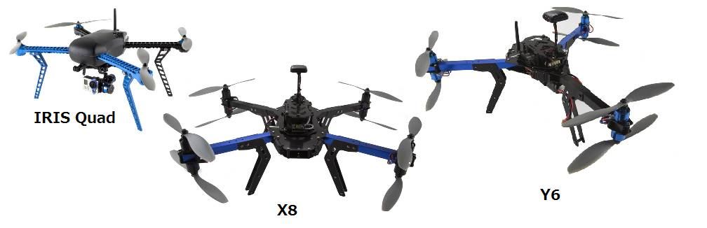

.. _choosing-a-frame:

============================
Choosing a MultiCopter Frame
============================

One of the first steps in using Copter is to decide on the frame.  Shown
below are three options from
`3DRobotics <http://store.3drobotics.com/>`__ but there are hundreds of
other choices.  This page will hopefully give some guidance on the
choices available.

ArduPilot is capable of controlling :ref:`many different vehicles <common-all-vehicle-types>`.

.. note::

   This section of the wiki is a work-in-progress.

Decide what you want it for
===========================

Some common uses of multi-copters include:

-  Taking :ref:`aerial videos <common-cameras-and-gimbals>`
-  :ref:`FPV (first person view) <common-fpv-first-person-view>`
-  Sport & Social (racing, aerobatics, impressing your friends)
-  More professional uses such as :ref:`3D mapping <common-3d-mapping>`,
   package delivery, agriculture
-  For research or personal robotics :ref:`development <dev:home>`

Ready-To-Fly, Kits or Build your Own
====================================

The choice of Ready-to-fly (RTF) vs Build-your-Own mostly comes down to
how much time you are happy to spend building up your copter and how
personalised you wish it to be.  With the growing number of low-cost RTF
copters on the market, there is likely little cost advantage to building
your own, especially for the smaller copters and if you factor in some
missteps along the way (like buying the wrong parts).

Continued Reading
=================

Below are more work-in-progress pages with general information that may
be useful when selecting or building a frame.

-  :ref:`Build your own multicopter <build-your-own-multicopter>`
-  :ref:`Improving the capabilities of your multicopter <improving-the-capabilities-of-your-multicopter>`
-  :ref:`Advanced multicopter design <advanced-multicopter-design>`
