.. _connect-escs-and-motors:

=======================
Connect ESCs and Motors
=======================

This article explains how to connect the ESCs, motors and propellers to a autopilot.  The Pixhawk is used as an example but other autopilots are connected in a similar way.

Connect the power (+), ground (-), and signal (s) wires for each ESC to
the autopilot's main output pins by motor number. Find your frame type
below to determine the assigned order of the motors.

.. figure:: ../images/Pixhwak_outputs.jpg
   :target: ../_images/Pixhwak_outputs.jpg

   Pixhawk Outputpins (numbered). First 4 pins are colour-coded for connecting a Quadframe

Motor order diagrams
====================

The diagrams below show motor order for each frame type.
The numbers indicate which output pin from the autopilot shoould be connected to each motor/propeller.
The propeller direction is shown in green (clockwise, CW) or blue (counter-clockwise, CCW)

.. figure:: ../images/MOTORS_CW_CCWLegend.jpg
   :target: ../_images/MOTORS_CW_CCWLegend.jpg

   Legend for motor-order diagrams

Quadcopter
----------

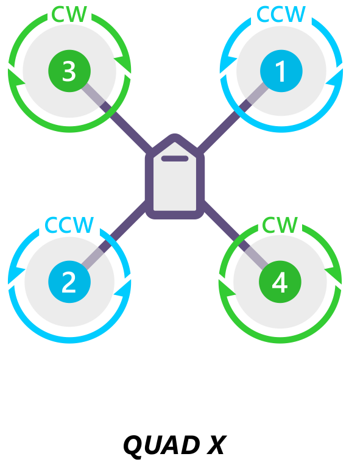

.. image:: ../images/motororder-quad-plus-2d.png
    :target: ../_images/motororder-quad-plus-2d.png
    :scale: 40%

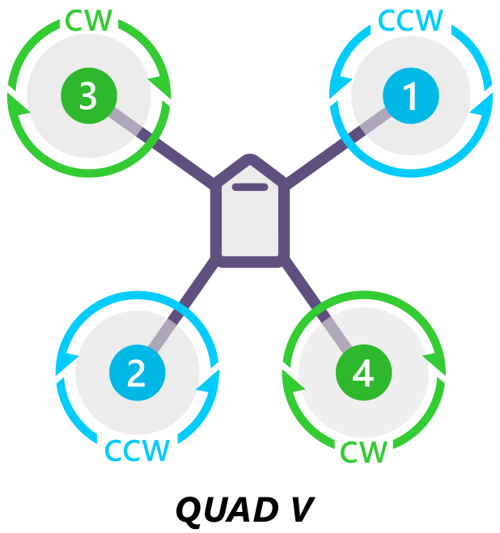

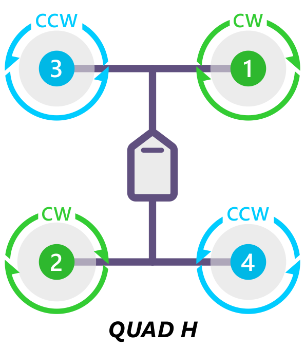

.. image:: ../images/motororder-quad-vtail-2d.png
    :target: ../_images/motororder-quad-vtail-2d.png
    :scale: 35%

.. image:: ../images/motororder-quad-atail-2d.png
    :target: ../_images/motororder-quad-atail-2d.png
    :scale: 35%

Tricopter
---------

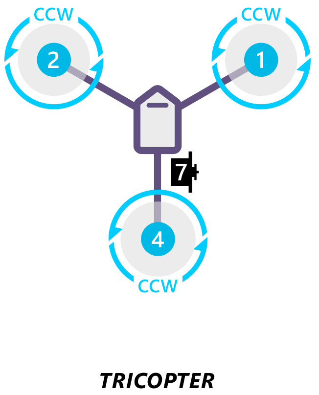

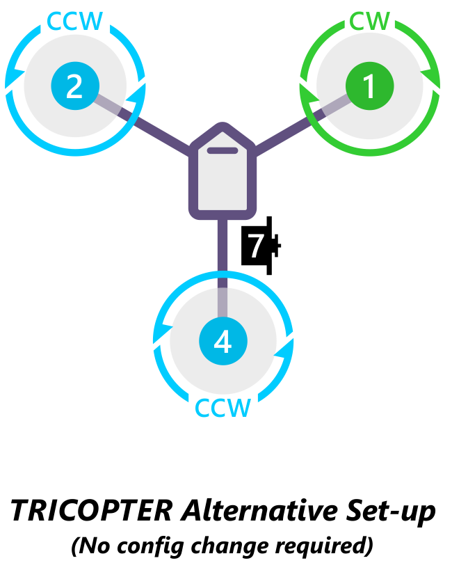

.. note::

   If the direction of your tail servo is going the wrong way in
   response to yaw then either the ``RCn_REVERSE`` RC input direction or the tilt servo's ``SERVOn_REVERSE`` parameter should be set to 1 (from 0), See :ref:`TriCopter setup page <tricopter>` for
   details.)

Bicopter
---------

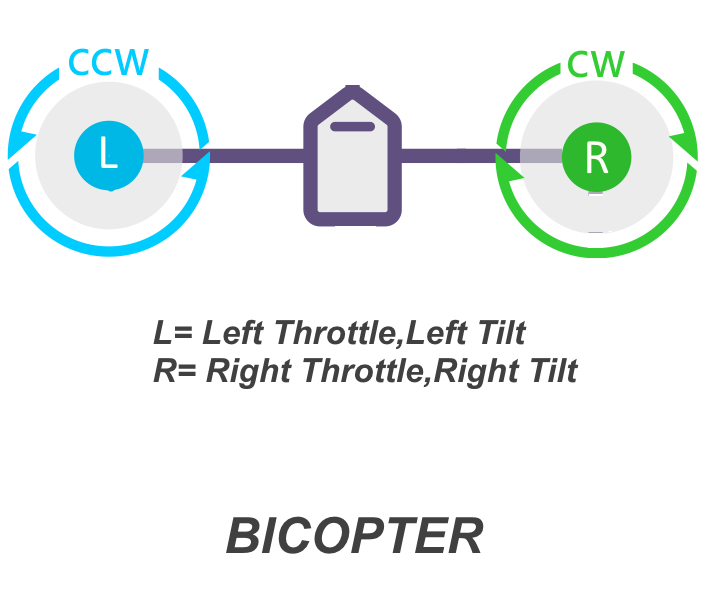

Hexacopter
----------

.. image:: ../images/motororder-hexa-x-2d.png
    :target: ../_images/motororder-hexa-x-2d.png
    :scale: 40%

.. image:: ../images/motororder-hexa-plus-2d.png
    :target: ../_images/motororder-hexa-plus-2d.png
    :scale: 40%

Y6
--

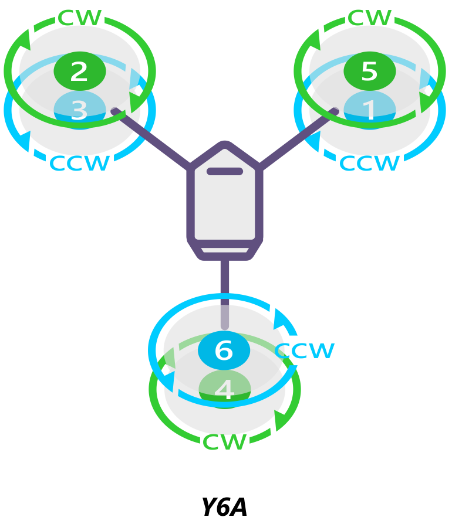

.. image:: ../images/motororder-y6b-2d.png
    :target: ../_images/motororder-y6b-2d.png
    :scale: 35%

.. image:: ../images/motororder-y6f-2d.png
    :target: ../_images/motororder-y6f-2d.png
    :scale: 35%

Octocopter
----------

.. image:: ../images/motororder-octo-x-2d.png
    :target: ../_images/motororder-octo-x-2d.png
    :scale: 40%

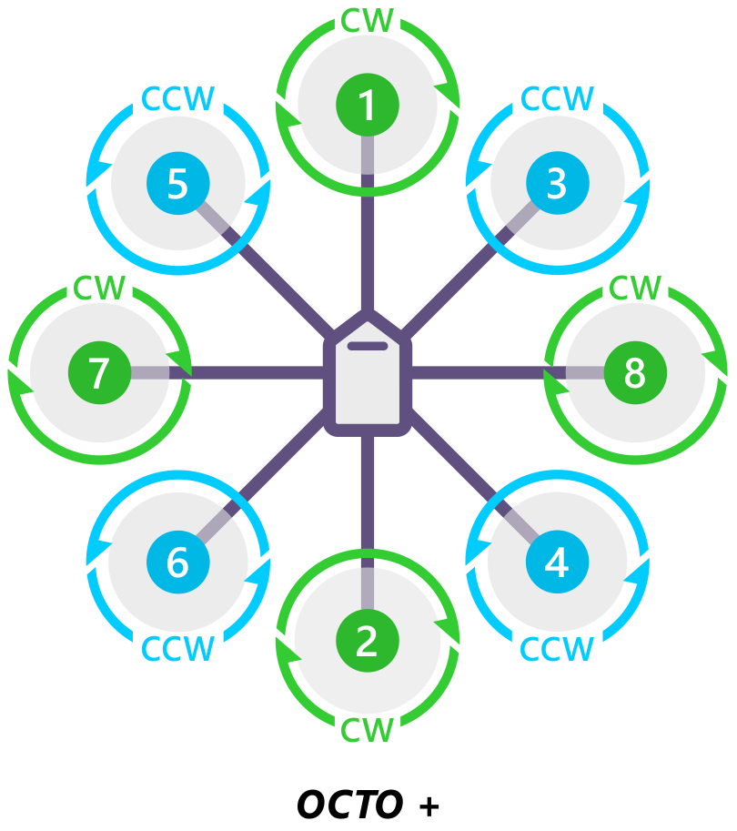

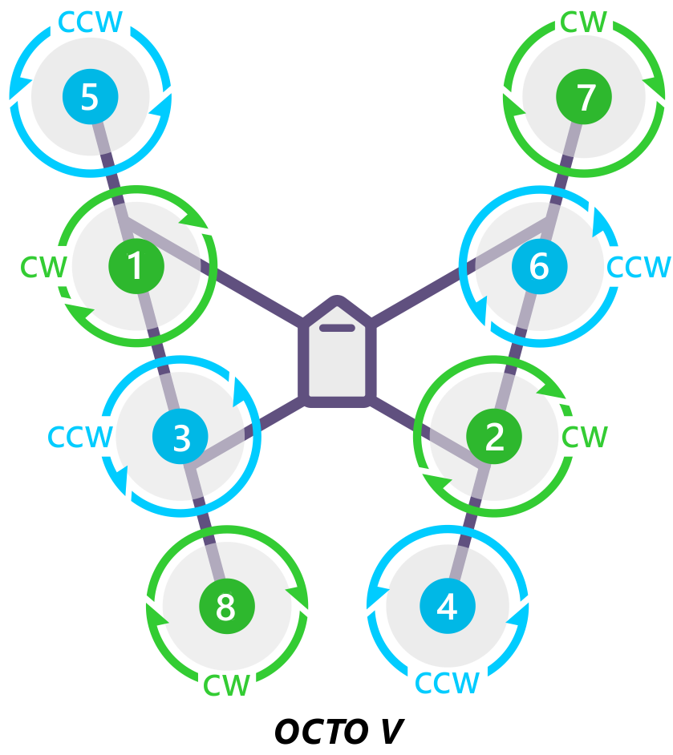

.. image:: ../images/motororder-octo-h-2d.png
    :target: ../_images/motororder-octo-h-2d.png
    :scale: 40%

OctoQuad
--------

.. image:: ../images/motororder-octoquad-x-2d.png
    :target: ../_images/motororder-octoquad-x-2d.png
    :scale: 35%

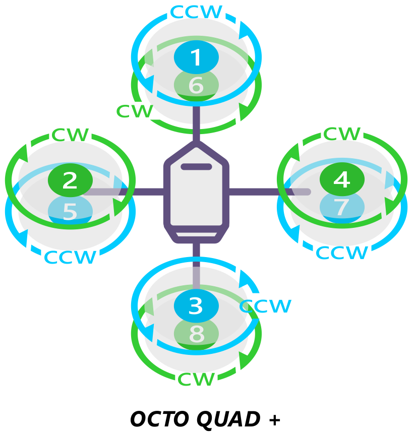

.. image:: ../images/motororder-octoquad-v-2d.png
    :target: ../_images/motororder-octoquad-v-2d.png
    :scale: 35%

.. image:: ../images/motororder-octoquad-h-2d.png
    :target: ../_images/motororder-octoquad-h-2d.png
    :scale: 35%

DodecaHexacopter
----------------

.. image:: ../images/motororder-dodecahexa-x-2d.png
    :target: ../_images/motororder-dodecahexa-x-2d.png
    :scale: 35%

.. image:: ../images/motororder-dodecahexa-plus-2d.png
    :target: ../_images/motororder-dodecahexa-plus-2d.png
    :scale: 35%

.. _connect-escs-and-motors_attach_propellers:

Recognizing clockwise and counterclockwise propellers
-----------------------------------------------------

The diagrams above show two types of propellers: clockwise (called pushers) and counterclockwise (called pullers). The most reliable to recognize the correct propeller type by its shape as shown below. The thicker edge is the leading edge which moves in the direction of rotation. The trailing edge is more radical scalloped and usually thinner. |prop_direction|

.. _connect-escs-and-motors_testing_motor_spin_directions:

Testing motor spin directions
=============================

If you have completed the :ref:`Radio <common-radio-control-calibration>`
and :ref:`ESC calibration <esc-calibration>`, you can check that your
motors are spinning in the correction direction:

#. Make sure there are no propellers on your copter!
#. Turn transmitter on and ensure the flight mode switch is set to
   Stabilize.
#. Connect battery.
#. Arm copter by holding the throttle down and rudder right for five
   seconds.
#. If it fails to Arm with the throttle down and to the right and the
   motors will not spin, it has probably failed the  Pre-Arm Safety
   Check.

   -  Pre-Arm safety check failure is also indicated by the red arming
      light double flashing and then repeating.
   -  If the Pre-Arm check fails go to the :ref:`Prearm Safety Check Page <common-prearm-safety-checks>` and correct the problem or disable
      the check before continuing.

#. When you can Arm successfully, apply a small amount of throttle, and
   observe and note spin direction of each motor. They should match
   directions shown in the images above for the frame you've chosen.
#. Reverse any motor spinning in the wrong direction.

   .. tip::

      Motor Direction is reversed simply by interchanging two of the
         three ESC to motor power leads.

Checking the motor numbering with the Mission Planner Motor test
================================================================

An alternative way to check that the motors have been hooked up
correctly is to use the "Motors" test in the Mission Planner Initial
Setup menu.

.. figure:: ../images/MissionPlanner_MotorTest.png
   :target: ../_images/MissionPlanner_MotorTest.png

   Mission Planner: Motor Test

When connected to the vehicle via MAVLink, you can click on the green
buttons shown above and the corresponding motor should spin for five
seconds. Letters correspond to motor numbers as shown in the example
below.

-  Take off your props first!
-  If no motors turn, raise the "Throttle %" to 10% and try again. If
   that doesn't work, try 15%

The first motor to spin will be the one located directly forward in the
case of + configuration, or the first motor to the right of straight
forward in the case of X configuration. The motor test will then proceed
in a clockwise rotation.

.. image:: ../images/APM_2_5_MOTORS_QUAD_enc.jpg
    :target: ../_images/APM_2_5_MOTORS_QUAD_enc.jpg

In the case of X8, it will spin the top front-right motor first, then
the bottom front-right, and proceed around with the same pattern.

OctoV will spin the front-right motor first, and then again, proceed
clock-wise until reaching the front left motor.

Using a Power Distribution Board
================================

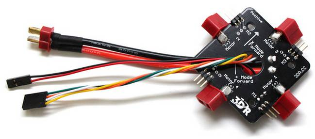

There are two methods of connecting the motor outputs.  Either connect the
electronic speed controllers (ESCs) directly to the autopilot OR use a power distribution board (PDB).

When using a PDB, connect the power (+), ground (-), and signal (s)
wires for each ESC to the PDB according to motor number. Find your frame
type below to determine the assigned order of the motors. Then connect
the signal wires from the PDB to the main output signal pins on the
autopilot  (ensuring that the motor order numbers match the
main output pin numbers on the controller). If you are using a power
module, it is optional to connect the power and ground wires from the
PDB to the autopilot board. If you would like to use these
cables in addition to or instead of the power module or as a common
point for low current servos, connect the ground (-) wire to a main
output ground (-) pin and the power (+) wire to a main output power (+) pin.

KDE (and other) Opto Isolated ESCs
==================================

The KDEXF-UAS and KDEF-UASHV Series are opto-isolated and do not provide
BEC power output for the peripheral equipment. They require +5V to power
the opto-isolator and while the Pixhawk can be powered from the servo
rail, it does not provide +5V to the servo rail. The ESCs must be
powered by a BEC or with a jumper from an unused connector on the board.
It is strongly recommended that you use a BEC to power the rail rather
than a jumper.

.. image:: ../images/Pixhawk-Correction-to-KDE-ESC2.png
    :target: ../_images/Pixhawk-Correction-to-KDE-ESC2.png

The KDE ESCs have fixed PWM ranges so you must manually set the output
range of each PWM signal so that RCx_MIN is 1100 and RCx_MAX is 1900us
using the Advanced Parameter or Full Parameter Settings Page in the
planner.

Pixhawk ESC issues
==================

Some ESCs have been reported as not working with Pixhawk.

The Pixhawk should work with every ESC that works with a normal RC
receiver (because it sends the same type of signal) but there is `one known exception, the EMAX ESC <https://github.com/ArduPilot/ardupilot/issues/2094>`__.

In most cases problems are due to incorrect wiring. Always connect signal and ground. 
Check your ESC type to decide how to connect the +5V line. 
For Pixhawk you must connect both the signal and the signal ground in order to make the ESC work.

For more information see `this video <https://youtu.be/6C1YG1e2aTo>`__.

.. |prop_direction| image:: ../images/prop-direction.png
    :target: ../_images/prop-direction.png
    :width: 450px
