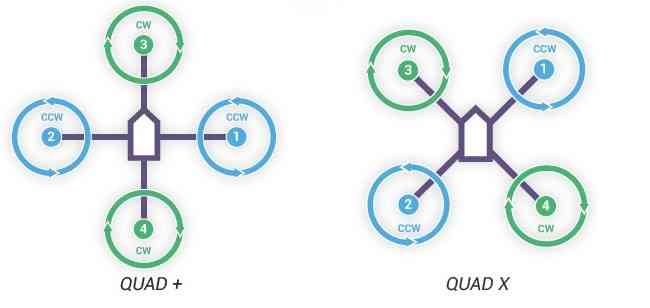
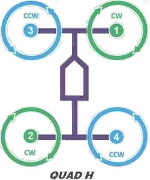

.. _connect-escs-and-motors:

=======================
Connect ESCs and Motors
=======================

This article explains how to connect the ESCs, Motors and Propellers for Pixhawk, APM 2.x. and Erle-Brain2.

Connect motor PWM signal outputs (Pixhawk)
==========================================

Connect the power (+), ground (-), and signal (s) wires for each ESC to
the controller main output pins by motor number. Find your frame type
below to determine the assigned order of the motors.

.. figure:: ../images/Pixhwak_outputs.jpg
   :target: ../_images/Pixhwak_outputs.jpg

   Pixhawk Outputpins (numbered). First 4 pins are colour-coded for connecting a Quadframe

Connect motor PWM signal outputs (Erle-Brain2)
==============================================

When connecting the ESCs directly to autopilot board, connect the power
(+), ground (-), and signal (s) wires for each ESC to the controller
main output pins by motor number. Find your frame type below to
determine the assigned order of the motors.

.. image:: ../images/3dr_power_distribution_board.jpg
    :target: ../_images/3dr_power_distribution_board.jpg

.. note::

   Be sure you connect the ESC connector in the right way. Signal
   goes on the top of the rail (white or orange color wire) and ground at
   the bottom (black or brown color wire)

Connect motor PWM signal outputs (APM2)
=======================================

There are two methods of connecting the motor outputs: connect the
electronic speed controllers (ESCs) to autopilot controller board
directly or use a power distribution board (PDB).

.. warning::

   The APM power distribution board PDB described here is not
   compatible with the Pixhawk, PX4 or Erle.

When using a PDB, connect the power (+), ground (-), and signal (s)
wires for each ESC to the PDB according to motor number. Find your frame
type below to determine the assigned order of the motors. Then connect
the signal wires from the PDB to the main output signal pins on the
flight controller board (ensuring that the motor order numbers match the
main output pin numbers on the controller). If you are using a power
module, it is optional to connect the power and ground wires from the
PDB to the flight controller board. If you would like to use these
cables in addition to or instead of the power module or as a common
point for low current servos, connect the ground (-) wire to a main
output ground (-) pin and the power (+) wire to a main output power (+) pin.

.. note::

   Information on assembling PDB is found `here for Quad <https://3dr.com/wp-content/uploads/2013/06/PDB-Assembly-Instructions-Quad.pdf>`__\ and
   `here for Hexa <https://3dr.com/wp-content/uploads/2013/06/PDB-Assembly-Instructions-Hexa.pdf>`__.

.. image:: ../images/3dr_power_distribution_board.jpg
    :target: ../_images/3dr_power_distribution_board.jpg

When connecting the ESCs directly to autopilot board, connect the power
(+), ground (-), and signal (s) wires for each ESC to the controller
main output pins by motor number. Find your frame type below to
determine the assigned order of the motors.

   APM Output Pins (numbered)

Motor order diagrams
====================

The sections below show motor order for each frame type (the numbers
indicates the connected autopilot output pin) and the propeller
direction (clockwise (CW) motors are shown in green and take pusher
propellers,counterclockwise motors (CCW) are shown in blue and take
puller propellers.

Use the diagram for your frame type, and wire the motors as shown.

.. figure:: ../images/MOTORS_CW_CCWLegend.jpg
   :target: ../_images/MOTORS_CW_CCWLegend.jpg

   Legend for motor-order diagrams

Quad
----

Hexa, Octo, Y6
--------------

.. image:: ../images/MOTORS_Hexa-octo-y6.jpg
    :target: ../_images/MOTORS_Hexa-octo-y6.jpg

X8
--

Tricopter
---------

.. note::

   If the direction of your tail servo is going the wrong way in
   response to yaw then either the RC7_REV or MOT_YAW_SV_REV parameter
   should be set to -1 (from 1), See :ref:`TriCopter setup page <tricopter>` for
   details.)

.. _connect-escs-and-motors_attach_propellers:

Attach propellers
=================

Find your frame in the motor order diagrams above. Clockwise motors are
shown in green, marked CW, and take pusher propellers. Counterclockwise
motors are shown in blue, marked CCW, and take puller propellers. Use
the diagram for your frame type, and attach propellers to your vehicle
as shown. For copters, attach propellers with the writing facing towards
the sky. For more information on recognizing the different types of
propellers, see the next section.

Recognizing clockwise and counterclockwise propellers
-----------------------------------------------------

The diagrams above show two types of propellers: clockwise (called
pushers) and counterclockwise (called pullers). Pusher propellers are
often marked with a P. However not all propellers are marked and both
types are often available in either rotational direction. Therefore, it
is most reliable to recognize the correct propeller type by its shape as
shown below. Note that the propellers below have the edge with the
shallow consistent curve at the leading edge in direction of rotation
and the more radical scalloped (and usually thinner edge) as the
trailing edge. You can use these features to recognize propellers of the
correct direction of rotation. |prop_direction|

Choosing propellers
===================

Propellers come in many varieties and are suited to different needs.

.. note::

   Have experience choosing propellers? Help us by editing this
   section!
   
   
.. _connect-escs-and-motors_testing_motor_spin_directions:

Testing motor spin directions
=============================

If you have completed the :ref:`Radio <common-radio-control-calibration>`
and :ref:`ESC calibration <esc-calibration>`, you can check that your
motors are spinning in the correction direction:

#. Make sure there are no propellers on your copter!
#. Turn transmitter on and ensure the flight mode switch is set to
   Stabilize.
#. Connect battery.
#. Arm copter by holding the throttle down and rudder right for five
   seconds.
#. If it fails to Arm with the throttle down and to the right and the
   motors will not spin, it has probably failed the  Pre-Arm Safety
   Check.

   -  Pre-Arm safety check failure is also indicated by the red arming
      light double flashing and then repeating.
   -  If the Pre-Arm check fails go to the :ref:`Prearm Safety Check Page <prearm_safety_check>` and correct the problem or disable
      the check before continuing.

#. When you can Arm successfully, apply a small amount of throttle, and
   observe and note spin direction of each motor. They should match
   directions shown in the images above for the frame you've chosen.
#. Reverse any motor spinning in the wrong direction.

   .. tip::

      Motor Direction is reversed simply by interchanging two of the
         three ESC to motor power leads.

Checking the motor numbering with the Mission Planner Motor test
================================================================

An alternative way to check that the motors have been hooked up
correctly is to use the "Motors" test in the Mission Planner Initial
Setup menu.

   Mission Planner: Motor Test

When connected to the vehicle via MAVLink, you can click on the green
buttons shown above and the corresponding motor should spin for five
seconds. Letters correspond to motor numbers as shown in the example
below.

-  Take off your props first!
-  If no motors turn, raise the "Throttle %" to 10% and try again. If
   that doesn't work, try 15%

The first motor to spin will be the one located directly forward in the
case of + configuration, or the first motor to the right of straight
forward in the case of X configuration. The motor test will then proceed
in a clockwise rotation.

.. image:: ../images/APM_2_5_MOTORS_QUAD_enc.jpg
    :target: ../_images/APM_2_5_MOTORS_QUAD_enc.jpg

In the case of X8, it will spin the top front-right motor first, then
the bottom front-right, and proceed around with the same pattern.

OctoV will spin the front-right motor first, and then again, proceed
clock-wise until reaching the front left motor.

KDE (and other) Opto Isolated ESCs
==================================

The KDEXF-UAS and KDEF-UASHV Series are opto-solated and do not provide
BEC power output for the peripheral equipment. They require +5V to power
the opto-isolator and while the Pixhawk can be powered from the servo
rail, it does not provide +5V to the servo rail. The ESCs must be
powered by a BEC or with a jumper from an unused connector on the board.
It is strongly recommended that you use a BEC to power the rail rather
than a jumper.

.. image:: ../images/Pixhawk-Correction-to-KDE-ESC2.png
    :target: ../_images/Pixhawk-Correction-to-KDE-ESC2.png

The KDE ESCs have fixed PWM ranges so you must manually set the output
range of each PWM signal so that RCx_MIN is 1100 and RCx_MAX is 1900us
using the Advanced Parameter or Full Parameter Settings Page in the
planner.

Pixhawk ESC issues
==================

Some ESCs have been reported as not working with Pixhawk.

The Pixhawk should work with every ESC that works with a normal RC
receiver (because it sends the same type of signal) but there is `one known exception, the EMAX ESC <https://github.com/ArduPilot/ardupilot/issues/2094>`__.

In most cases problems are due to incorrect wiring. Always connect
signal and ground. Check your ESC type to decide how to connect the +5V
line. On APM2.x you could get away with using the power ground as the
signal return with the APM but for Pixhawk you must connect both the
signal and the signal ground in order to make the ESC work.

For more information `see this page <https://pixhawk.org/users/actuators/pwm_escs_and_servos>`__ and
the `video here <https://youtu.be/6C1YG1e2aTo>`__.

.. |prop_direction| image:: ../images/prop_direction.jpg
    :target: ../_images/prop_direction.jpg
