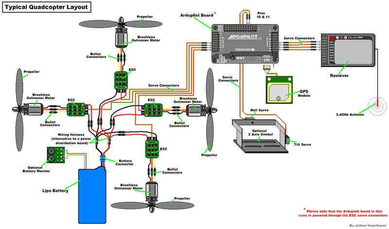
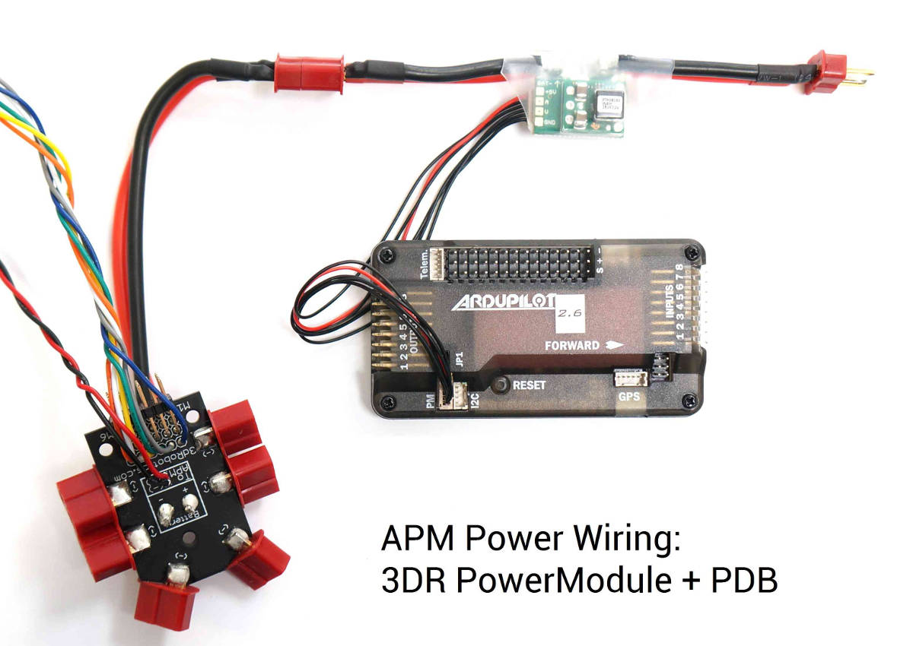
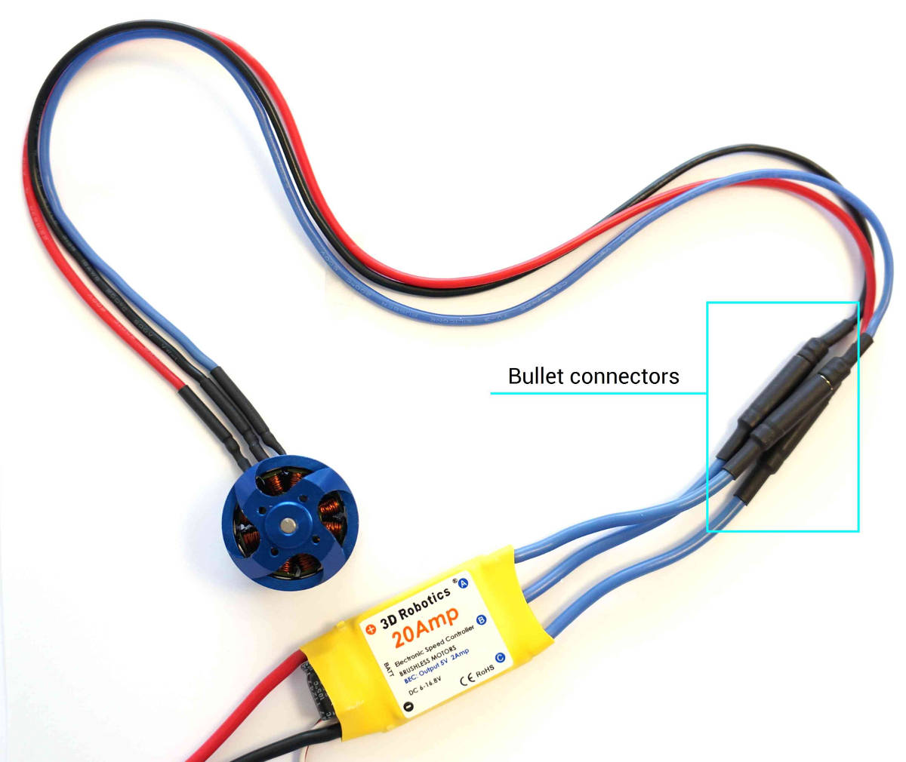
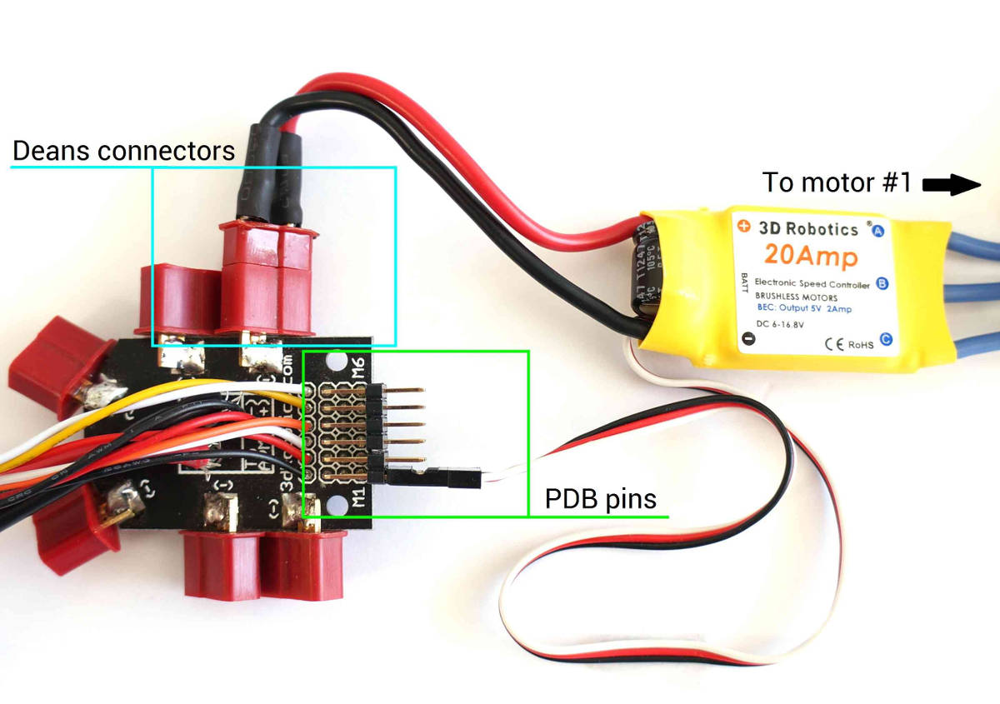

.. _connecting-the-apm2:

=================================
Archived:APM2.x Wiring QuickStart
=================================

.. warning::

    **ARCHIVED**
    
    The APM2.x is end of life for use with ArduPilot. 
    This article is made available for existing users.
    
This article provides high level information about how to power APM2.x
and connect its most important peripherals.

APM Wiring Diagram
==================

The diagram below is an overview of how an APM2 can be connected to a
receiver, ESC, GPS and even a camera gimbal.

Powering the autopilot
==============================

The easiest way to power the APM2.x is using a :ref:`3DR Power Module <common-3dr-power-module>` with
a LiPo battery.

To wire a power module, connect the red-and-black two wire cable on the
power module to the PDB red and black two-wire. Connect the power module
to the APM PM port using a 6-position cable. Connect the PDB multi-wire
cable to APM Output Signal pins with the M1 wire connecting to the
signal pin labeled 1, M6 and signal pin 6, etc. See the above link for
additional detail.

The Power Module will not power servos and other peripherals. For more
information/alternatives see :ref:`Powering the APM2 <common-powering-the-apm2>`.

Connect ESCs and motors
=======================

:ref:`Connecting the ESCs and Motors <connect-escs-and-motors>`
explains how to set up the connections, and the motor configuration
setup for each frame.

You will need to connect motor cables to electronic speed controller
(ESC) bullet connectors (each motor must connect to only one ESC).

Connect ESC Deans connectors to Power Distribution Board (PDB) Deans
connectors. Connect three-wire cables from the ESCs to the PDB signal
pins according to motor number (see link above to find the motor number
configuration for your frame). Connect the ESC for motor 1 to the PDB
pins marked M1, motor 6's ESC to the pins marked M6, etc.

