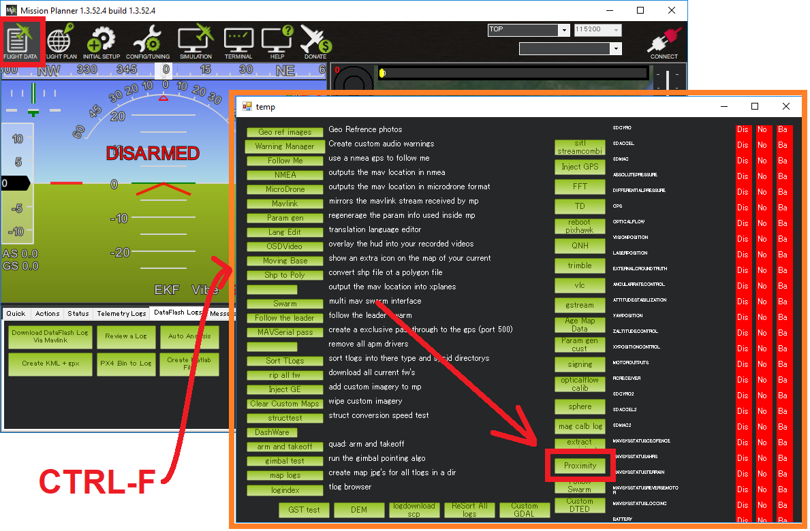

.. _copter-object-avoidance:

================
Object Avoidance
================

Copter 3.5 (and higher) supports object avoidance horizontally and upwards using:

- 360 degree lidar including the :ref:`Lightware SF40C <copter:common-lightware-sf40c-objectavoidance>`, :ref:`TeraRanger Tower <copter:common-teraranger-tower-objectavoidance>` or :ref:`RPLidarA2/A3 <copter:common-rplidar-a2>`
- Any two of the other supported :ref:`lidars <common-rangefinder-landingpage>` (up to 4 lidar can be used if you are comfortable compiling the code yourself after changing `this definition to "4" <https://github.com/ArduPilot/ardupilot/blob/master/libraries/AP_RangeFinder/RangeFinder.h#L24>`__)
- Sensors capable of providing `MAVLink Distance Sensor <https://mavlink.io/en/messages/common.html#DISTANCE_SENSOR>`__ messages (like `OpenKai with a 3D camera <https://www.youtube.com/watch?v=qk_hEtRASqg>`__)

..  youtube:: BDBSpR1Dw_8
    :width: 100%

Horizontal object avoidance works in :ref:`AltHold <altholdmode>` and :ref:`Loiter <loiter-mode>` modes.  Upward object avoidance works in all modes except Stabilize and Acro.

Details on how object avoidance is implemented can be found :ref:`here in the developer wiki <dev:code-overview-object-avoidance>`

Setup the Lidar
---------------

For 360 lidar follow the instructions corresponding to the lidar on the vehicle

  - :ref:`Lightware SF40C <common-lightware-sf40c-objectavoidance>`
  - :ref:`TeraRanger Tower <common-teraranger-tower-objectavoidance>`
  - :ref:`RPLidarA2/A3 <common-rplidar-a2>`

For other lidar follow the instructions found :ref:`here <common-rangefinder-objectavoidance>`

Configuring Avoidance
---------------------

- set :ref:`AVOID_ENABLE <AVOID_ENABLE>` = 7 ("All") to use all sources of barrier information including "Proximity" sensors
- in :ref:`Loiter <loiter-mode>`

  - :ref:`AVOID_MARGIN <AVOID_MARGIN>` controls how many meters from the barrier the vehicle will attemp to stop
  - :ref:`AVOID_BEHAVE <AVOID_BEHAVE>` allows setting whether the vehicle should simply Stop in front of the barrier or Slide around it

- in :ref:`AltHold <altholdmode>`

  - :ref:`AVOID_DIST_MAX <AVOID_DIST_MAX>` controls how far from a barrier the vehicle start leaning away from the barrier
  - :ref:`AVOID_ANGLE_MAX <AVOID_ANGLE_MAX>` controls how far back the vehicle will lean away from the barrier

Real-time view
--------------

Real-time distances can be seen in the Mission Planner's proximity viewer

This window can be opened by moving to the MP's Flight Data screen, press Ctrl-F and push the Proximity button.

DataFlash logging
-----------------

Upward and downward facing range finder distances can be seen in the DataFlash Log's RFND message.

The distance to the nearest object in 8 quadrants around the vehicle is recorded in the DataFlash log's PRX messages.

Limitations
-----------

Copter's object avoidance feature has the following limitations.  Future versions will likely resolve these.

- Object avoidance only works in Loiter and AltHold modes
- The vehicle should stop before hitting objects but will never back away from objects that approach the vehicle (a slow backing away will be added in future firmware versions)
- Avoidance is "sensor based" meaning it is **not** building up a 3D map and thus has no "memory" of where barriers were once they are out of view of the lidar

Links
-----

.. toctree::
    :maxdepth: 1

    1D Lidar Setup <common-rangefinder-objectavoidance>