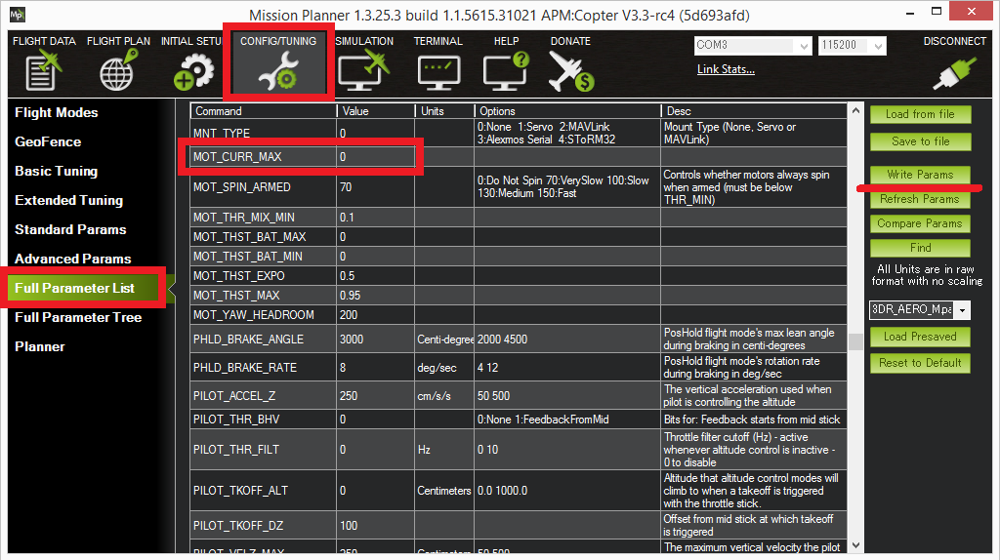
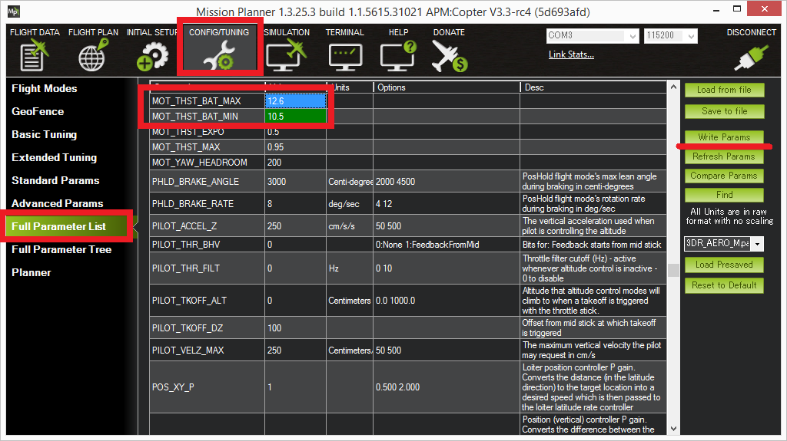

.. _current-limiting-and-voltage-scaling:

====================================
Current Limiting and Voltage Scaling
====================================

Copter includes *current limiting* in order to protect the battery from
damage and *voltage scaling* to compensate for the voltage drop as the
battery is depleted.  Both of these features require the vehicle to have
a :ref:`Power Module or other voltage and current monitor <common-powermodule-landingpage>`.

.. note::

   Current limiting and voltage scaling were introduced in Copter
   3.3.

Current Limiting
================

This protection automatically drops the throttle to as low as 60% of
full throttle in order to limit the current requested from the battery. 
This can be useful to protect the battery from damage.

To enable the feature, set the :ref:`MOT_BAT_CURR_MAX<MOT_BAT_CURR_MAX>` parameter to the desired
limit in amps (or "0" to disable this feature).

If the measured current exceeds this limit the maximum throttle will be
reduced to a safe level in 1 to 5 seconds (depending upon how far over
the limit it is).  Because the limit can be exceeded for short periods
of time, the limit should be set somewhere between the battery's burst
limit and its absolute upper limit.

Voltage scaling
===============

If enabled, this feature will increase the roll, pitch and yaw control
gains to compensate for the voltage drop as a battery is depleted.  This
is helpful in that it helps ensure the vehicle's attitude controls do
not degrade as the battery weakens.

To enable set the :ref:`MOT_BAT_VOLT_MAX<MOT_BAT_VOLT_MAX>` to the battery's full charge
voltage (i.e. 12.6 for a 3S battery).  Gains will be scaled to attempt
to maintain the attitude control response seen at full charge.

Set :ref:`MOT_BAT_VOLT_MIN<MOT_BAT_VOLT_MIN>` to the minimum battery voltage the vehicle would
normally experience.  The gains will not be scaled up any more as the
voltage falls below this level.  Setting this to the :ref:`battery failsafe voltage <failsafe-battery>` is a good start.

