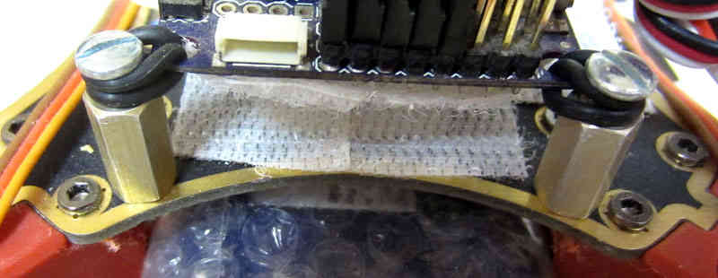

.. _dji-f330-flamewheel:

=================================================
Archived: DJI F330 FlameWheel QuadCopter Assembly
=================================================

This article provides and overview of the DJI F330 FlameWheel
QuadCopter, and instructions for how it may be assembled.

The DJI F330 FlameWheel is inexpensive, sturdy and small.
=========================================================

-  It can be flown indoors or out.
-  Even though it is compact, the F330 is substantial and can easily
   carry a battery that will permit 15 minute flights.
-  The F330 can carry a GoPro type camera or FPV system if desired.
-  The ARF (Almost Ready to Fly) kit is a super bargain and includes
   motors, ESCs (Electronic Speed Controls) and Propellers.
-  The DJI Motors and ESCs provided in the ARF kit are of high quality,
   very durable and long lasting.
-  The frame is extremely rugged and all replacement parts are readily
   available and inexpensive.

The DJI F450 Flamewheel is an excellent larger alternative to the F330
======================================================================

-  The F450 FlameWheel ARF kit has a larger frame, 30 amp ESCs and 10"
   props for only $10.00 more than the F330.
-  The F450 is well suited to carrying a GoPro camera, brushless gimbal,
   landing gear and a larger battery for longer flights.
-  The F330 and F450 FlameWheel are excellent platforms for the PX4 and
   PixHawk autopilots as well as the APM.

   -  I  have, in fact, converted my personal F330 to use the PX4 autopilot with great success.

-  I strongly recommend the F330 and F450 ARF kits, they are reliable,
   rugged and inexpensive and are suitable for many uses.

   -  The quality is excellent, the components provide long trouble free
      service, and replacement parts are cheap and available.
   -  I genuinely don't think you can find a better deal in an APM / PX4
      / Pixhawk compatible MultiCopter.

Components required in addition to the Flamewheel ARF kit
=========================================================

-  An autopilot (APM 2.6, PX4FMU + PX4IO or Pixhawk) with
   UBlox GPS module and power supply module.
-  RC equipment: RC transmitter and a 5+ channel radio receiver (PPM-SUM
   compatible for PX4 or Pixhawk).
-  A 3 cell 1800mah to 2650mah LiPo battery and an appropriate battery
   Charger.
-  Miscellaneous: female to female 3 wire receiver / servo cables, a
   battery strap, tie wraps and some assorted hardware.
-  You will also need an adjustable soldering iron, rosin cored solder,
   blue thread locker and some small Metric Allen wrenches.

.. image:: ../images/Flamewheel330Start800.jpg
    :target: ../_images/Flamewheel330Start800.jpg

Frame and Motor Assembly
========================

-  Get the "manual": `F330_User_Manual_v1.6_en.pdf <http://dl.djicdn.com/downloads/flamewheel/en/F330_User_Manual_v1.6_en.pdf>`__.
   (If there is a more recent version, you may find it in the 
   `DJI website Flamewheel support section <https://www.dji.com/flame-wheel-arf/download>`__).

   -  It is more of an assembly diagram than a manual, but the pictures
      are definitely useful.

-  The DJI instructions show soldering the ESCs to the Power
   Distribution Board (bottom frame plate) first.

   -  In our example they were put in after frame assembly because it
      makes it possible to fit things more closely.
   -  But it does require a bit of creativity when soldering the ESC
      leads to the bottom plate / power distribution board.
   -  Your choice.

-  Use Blue or purple removable thread locker very sparingly on the
   threads of the Allen screws when you assemble the frame.

   -  Try to keep excess thread locker off of the plastic. This is not
      actually achievable, but do the best you can.

-  Motor and frame screws have a shoulder on them and you need to
   tighten them all sufficiently so that the shoulder fully seats.

   -  A good method is to install all screws (with Locktite) loosely
      then tighten all the screws on each frame arm one at a time.
   -  Do this in one sitting.

-  When installing the motors, pre-bend the motor leads upward where
   they exit the motor bottom so that the motor can sit flat.

   -  Have the leads exit towards the center of the copter.
   -  Motor bottom screws are off set and it can only be installed 2 ways, toward the center is correct.
   -  The motor screws are short and it is tricky to start the first screw on the motor bottom.
   -  Ensure that the motor leads are not pushing the motor up.
   -  Use blue Locktite on each screw and install all 4 screws for a motor loosely and then tighten them.

-  Thread the motor leads down through the first 2 large frame member holes.

   -  Or you can run them around the frame member if you prefer.

      .. image:: ../images/QuadHookUp800B.jpg
          :target: ../_images/QuadHookUp800B.jpg

-  Be careful to wire motors to the PixHawk using the ArduPilot numbering convention for QuadX below. 
   The numbering convention in the DJI FlameWheel F450 instructions are different, and incorrect writing leads to attitude instability.

   .. image:: ../images/MOTORS_QuadX_QuadPlus.jpg
      :target: ../_images/MOTORS_QuadX_QuadPlus.jpg

ESC Installation and Soldering the Power Distribution Board
===========================================================

-  Install the ESCs with tie wraps.

   -  Thread the Tie Wraps from front to back through the frame members and between the motor bullet connector sockets.
   -  Install the ESC power leads through the slot under the bottom of the frame member.
   -  Then trim and solder them to the power distribution board.
   -  This is a little harder than going around the outside of the frame but is neater and provides a little more battery clearance.

-  The above illustration shows a power distribution "Y" connector which functions the same as the FlameWheel's built in power distribution
   board.
-  When you solder the ESC and Battery power leads to the power distribution board.

   -  Flux and preheat both the pads and the wire in order to get a properly tinned (wet) solder joint.
   -  The board can soak up quite a bit of heat so set your soldering iron sufficiently hot.

-  The DJI ARF FlameWheel kits have Opto ESCs which do not include a BEC so you will need an external power supply.

   -  The APM, PX4 and Pixhawk are now available with a power supply you can use, other wise you will need to buy a BEC.
   -  Castle Creations makes an excellent and very reliable 10/5 amp BEC for about $20.00.
   -  Use a switching BEC in any case, they are more reliable and a lot more efficient than linear ones.

-  You do not need to and in fact can't balance the DJI ESCs as shown elsewhere in the Copter Wiki.

   -  DJI ESCs are digital, optically isolated, are completely pre-balanced at the factory and work fine out of the box.

Reduced Vibration Installation of the Autopilot
===============================================

-  The autopilots require special attention be paid to removing
   as much vibration from the autopilot as possible.

   -  This F330 FlameWheel has a special anti-vibration suspension
      mounting of the APM autopilot.
   -  It uses a folded over 1/16" O-ring at each corner of the autopilot around a screw sticking out of a small standoff.
   -  If you choose to use this method leave 1/10" to 1/8" clearance
      from each board corner for proper short coupled spacing.
   -  The F330 requires minor surgery with a Dremel tool on each frame
      arm to achieve proper hole spacing in the top plate.

-  Kyosho Zeal Gel is an easy to install and fully satisfactory
   alternative to the O-ring suspension method.

   -  Simply put a 3/4 inch square of adhesive backed Kyosho Zeal Gel
      under each corner of the autopilot.
   -  And secure the autopilot with a Velcro strap over 1/2" of
      soft foam in light tension. (Do NOT over tighten!).

-  Either the Kyosho Zeal Gel or the O-ring suspension method will allow
   you to limit vibration to about 1/10 G which is fine.
-  Anti-vibration techniques, methods and "tuning" are covered in
   greater detail in the :ref:`Anti-Vibration section of the Wiki <common-vibration-damping>`
-  Compensation for compass interference from the motors is :ref:`covered here! <common-magnetic-interference>`
-  Correct wiring of the autopilot and configuration
   for flight are covered extensively elsewhere in the Wiki.

.. note::

   \*The Velcro on the board and frame above is not in use and is not
   actually touching\*

Getting Ready to Fly
====================

-  Our construction method allows the battery to be inserted between the
   two frame plates.

   -  This is an optimal location regarding the QuadCopter's center of
      gravity.
   -  The 2650mah LiPo Turnigy Nano battery used here is as large as
      will comfortably fit, but it will permit 15 minute plus flights.
   -  Cover bottom frame power distribution solder joints with liquid
      electrical tape or silicone to prepare for the battery.
   -  Wrap the battery in bubble wrap and tape it in place to provide
      additional electrical isolation from the solder joints.
   -  This will also provide cushioning from vibration and sub-optimal
      "landings".
   -  Use a Velcro battery strap through the frames bottom slots to
      retain the battery.

-  The stock 8" DJI props that are supplied with the F330 ARF kit work
   fine.

   -  However the F330 FlameWheel can definitely benefit from a 9" prop
      (10" will not fit on the F330).
   -  GemFan 9" multirotor "Carbon Filled" props are only $2.00 each and
      are superior to the stock 8" props.
   -  These GemFans are almost impossible to break and the 9" ones are
      considerably more efficient than the stock 8" props.
   -  9" GemFan propellers are not made to fit the oval hubs of the DJI
      Motors.
   -  But you can carefully bore them out to about .31" with an ordinary
      drill and they will fit perfectly.
   -  On My F450 Flamewheel, I use 11" GemFan propellers bored out the
      same way.
   -  Generally a larger prop diameter is better so long as you don't
      exceed motor or ESC maximums or cause over heating.
   -  Make sure the propellers are right side up (printing on top), this
      won't fly worth a damn if they are upside down.

-  The ESCs and motors automatically disarm after 10 seconds without the
   motor turning.

   -  So anytime you have remained stationary (on the ground) for over
      10 seconds you will need to rearm.
   -  This is an excellent safety feature.

-  You will need to Install Mission Planner software on your PC as
   instructed elsewhere in this Wiki.

   -  You will then need to use Mission Planner to load the QuadCopter
      firmware to your autopilot.
   -  And you will then need to set up various flight parameters for
      your FlameWheel in the Mission Planner.
   -  (Do Not Attempt to Calibrate the DJI Opto ESCs and Do Not install
      the propellers until directed to do so).

-  To prepare to fly place your copter on your takeoff location, turn
   your transmitter on and plug in the copter's battery.

   -  (If you have a PX4 or Pixhawk autopilot depress the start
      button for five seconds).
   -  The ESC's should emit a short series of musical notes and then be
      quiet.
   -  You are then ready to arm by holding the throttle stick down and
      to the right for 5 seconds.
   -  After arming you must throttle up the motors within 10 seconds or
      you will need to re-arm.
   -  When you are done flying disarm by holding the throttle down and
      to the left for 5 seconds and disconnect the battery.
   -  A good set of initial PIDs for flying the FlameWheel F330 or F450
      in Stabilize Mode (as of Copter version 3.0.1) are:
   -  Rate (Roll & Pitch) P = .09 and I = .045 and Stabilize (Roll &
      Pitch) P = 4.0
