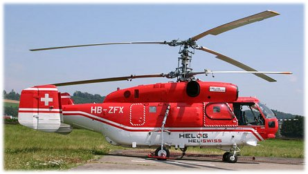

.. _dual-helicopter:

===============
Dual Helicopter
===============

.. note:: Dual Heli Frame requires a :ref:`traditional helicopter <traditional-helicopters>` as the base firmware. It is available for download from the `firmware server <https://firmware.ardupilot.org/>`__. When Copter is generated for the firmware server, it generates both multirotor and traditional helicopter (with -heli suffix) firmware.

Connecting and Configuring
==========================

- the motor's ESC should be connected to the autopilot's channel 8 output
- :ref:`traditional helicopter firmware <traditional-helicopters>` should be loaded onto the vehicle.

- :ref:`FRAME_CLASS <FRAME_CLASS>` to 11 (Heli_Dual)
- :ref:`H_DUAL_MODE <H_DUAL_MODE>`

Similar to a :ref:`traditional helicopter <traditional-helicopters>` an :ref:`auxiliary switch <common-auxiliary-functions>` should be set to "Motor Interlock" to turn on/off the motor.  Normally this is channel 8 so you could set :ref:`RC8_OPTION<RC8_OPTION>` to 32.

.. note:: See :ref:`traditional-helicopter-swashplate-setup` for basic information on how to setup each swashplate using the parameters below.

Tandem (Longitudinal)
---------------------

.. image:: ../images/dual_heli_chinook.jpeg
    :target: ../_images/dual_heli_chinook.jpeg

This setup assumes that the forward rotor swashplate is controlled by servo output 1, 2, and 3 and the aft rotor swashplate is controlled by servo output 4, 5 and 6.

Parameter Settings:

- :ref:`H_DUAL_MODE<H_DUAL_MODE>` - Set to 0 for the longitudinal configuration
- :ref:`H_DCP_SCALER<H_DCP_SCALER>` - Scales the differential collective output to the rotors for a pitch axis input
- :ref:`H_DCP_YAW<H_DCP_YAW>` - Feedforward input to yaw axis for pitch axis (DCP) inputs
- :ref:`H_YAW_SCALER<H_YAW_SCALER>` - Scales the differential lateral cyclic based on yaw axis input.  This is a positive number for this setup.
- :ref:`H_COL_MAX<H_COL_MAX>`- PWM for maximum collective pitch on forward rotor head that corresponds to :ref:`H_COL_ANG_MAX<H_COL_ANG_MAX>`
- :ref:`H_COL_MIN<H_COL_MIN>` - PWM for minimum collective pitch on forward rotor head that corresponds to :ref:`H_COL_ANG_MIN<H_COL_ANG_MIN>`
- :ref:`H_SW_TYPE<H_SW_TYPE__AP_MotorsHeli_Dual>` - Swashplate type for forward rotor head
- :ref:`H_SW_COL_DIR<H_SW_COL_DIR__AP_MotorsHeli_Dual>` - Swashplate collective direction for forward rotor head
- :ref:`H_SW_LIN_SVO<H_SW_LIN_SVO__AP_MotorsHeli_Dual>` - Enables linear servo feature for forward rotor head
- :ref:`H_COL2_MIN<H_COL2_MIN>` - PWM for minimum collective pitch on aft rotor head that corresponds to :ref:`H_COL_ANG_MIN<H_COL_ANG_MIN>`
- :ref:`H_COL2_MAX<H_COL2_MAX>`- PWM for maximum collective pitch on aft rotor head that corresponds to :ref:`H_COL_ANG_MAX<H_COL_ANG_MAX>`
- :ref:`H_SW2_TYPE<H_SW2_TYPE>` - Swashplate type for aft rotor head
- :ref:`H_SW2_COL_DIR<H_SW2_COL_DIR>` - Swashplate collective direction for aft rotor head
- :ref:`H_SW2_LIN_SVO<H_SW2_LIN_SVO>` - Enables linear servo feature for aft rotor head
- :ref:`H_DCP_TRIM<H_DCP_TRIM>` - Removes pitch I term bias due to center of gravity offsets or discrepancies between rotors in swashplate setup. If pitch axis has I term bias while hovering in calm winds, use value of bias in DCP_TRIM to re-center I term.

These are only needed for the forward swashplate if :ref:`H_SW_TYPE<H_SW_TYPE__AP_MotorsHeli_Dual>` is set to H3 Generic.

- :ref:`H_SW_H3_ENABLE<H_SW_H3_ENABLE__AP_MotorsHeli_Dual>` - Do Not Set Manually!  This is set automatically once :ref:`H_SW_TYPE<H_SW_TYPE__AP_MotorsHeli_Dual>` is set to H3 Generic
- :ref:`H_SW_H3_SV1_POS<H_SW_H3_SV1_POS__AP_MotorsHeli_Dual>`
- :ref:`H_SW_H3_SV2_POS<H_SW_H3_SV2_POS__AP_MotorsHeli_Dual>`
- :ref:`H_SW_H3_SV3_POS<H_SW_H3_SV3_POS__AP_MotorsHeli_Dual>`
- :ref:`H_SW_H3_PHANG<H_SW_H3_PHANG__AP_MotorsHeli_Dual>`

These are only needed for the aft swashplate if :ref:`H_SW2_TYPE<H_SW2_TYPE>` is set to H3 Generic.

- :ref:`H_SW2_H3_ENABLE<H_SW2_H3_ENABLE>` - Do Not Set Manually!  This is set automatically once :ref:`H_SW2_TYPE<H_SW2_TYPE>` is set to H3 Generic
- :ref:`H_SW2_H3_SV1_POS<H_SW2_H3_SV1_POS>`
- :ref:`H_SW2_H3_SV2_POS<H_SW2_H3_SV2_POS>`
- :ref:`H_SW2_H3_SV3_POS<H_SW2_H3_SV3_POS>`
- :ref:`H_SW2_H3_PHANG<H_SW2_H3_PHANG>`

This parameter is not used for the longitudinal configuration
- :ref:`H_YAW_REV_EXPO<H_YAW_REV_EXPO>`

Side-by-Side (Transverse)
-------------------------

This setup assumes that the left rotor swashplate is controlled by servo output 1, 2, and 3 and the right rotor swashplate is controlled by servo output 4, 5 and 6.

Parameter Settings:

- :ref:`H_DUAL_MODE<H_DUAL_MODE>` - Set to 1 for the transverse configuration
- :ref:`H_DCP_SCALER<H_DCP_SCALER>` - Scales the differential collective output to the rotors for a roll axis input
- :ref:`H_DCP_YAW<H_DCP_YAW>` - Feedforward input to yaw axis for roll axis (DCP) inputs
- :ref:`H_YAW_SCALER<H_YAW_SCALER>` - Scales the differential longitudinal cyclic based on yaw axis input.  This is a positive number for this setup.
- :ref:`H_COL_MAX<H_COL_MAX>`- PWM for maximum collective pitch on left rotor head that corresponds to :ref:`H_COL_ANG_MAX<H_COL_ANG_MAX>`
- :ref:`H_COL_MIN<H_COL_MIN>` - PWM for minimum collective pitch on left rotor head that corresponds to :ref:`H_COL_ANG_MIN<H_COL_ANG_MIN>`
- :ref:`H_SW_TYPE<H_SW_TYPE__AP_MotorsHeli_Dual>` - Swashplate type for left rotor head
- :ref:`H_SW_COL_DIR<H_SW_COL_DIR__AP_MotorsHeli_Dual>` - Swashplate collective direction for left rotor head
- :ref:`H_SW_LIN_SVO<H_SW_LIN_SVO__AP_MotorsHeli_Dual>` - Enables linear servo feature for left rotor head
- :ref:`H_COL2_MIN<H_COL2_MIN>` - PWM for minimum collective pitch on right rotor head that corresponds to :ref:`H_COL_ANG_MIN<H_COL_ANG_MIN>`
- :ref:`H_COL2_MAX<H_COL2_MAX>`- PWM for maximum collective pitch on right rotor head that corresponds to :ref:`H_COL_ANG_MAX<H_COL_ANG_MAX>`
- :ref:`H_SW2_TYPE<H_SW2_TYPE>` - Swashplate type for right rotor head
- :ref:`H_SW2_COL_DIR<H_SW2_COL_DIR>` - Swashplate collective direction for right rotor head
- :ref:`H_SW2_LIN_SVO<H_SW2_LIN_SVO>` - Enables linear servo feature for right rotor head
- :ref:`H_DCP_TRIM<H_DCP_TRIM>` - Removes roll I term bias due to center of gravity offsets or discrepancies between rotors in swashplate setup. If roll axis has I term bias while hovering in calm winds, use value of bias in DCP_TRIM to re-center I term.

These are only needed for the left swashplate if :ref:`H_SW_TYPE<H_SW_TYPE__AP_MotorsHeli_Dual>` is set to H3 Generic.

- :ref:`H_SW_H3_ENABLE<H_SW_H3_ENABLE__AP_MotorsHeli_Dual>` - Do Not Set Manually!  This is set automatically once :ref:`H_SW_TYPE<H_SW_TYPE__AP_MotorsHeli_Dual>` is set to H3 Generic
- :ref:`H_SW_H3_SV1_POS<H_SW_H3_SV1_POS__AP_MotorsHeli_Dual>`
- :ref:`H_SW_H3_SV2_POS<H_SW_H3_SV2_POS__AP_MotorsHeli_Dual>`
- :ref:`H_SW_H3_SV3_POS<H_SW_H3_SV3_POS__AP_MotorsHeli_Dual>`
- :ref:`H_SW_H3_PHANG<H_SW_H3_PHANG__AP_MotorsHeli_Dual>`

These are only needed for the right swashplate if :ref:`H_SW2_TYPE<H_SW2_TYPE>` is set to H3 Generic.

- :ref:`H_SW2_H3_ENABLE<H_SW2_H3_ENABLE>` - Do Not Set Manually!  This is set automatically once :ref:`H_SW2_TYPE<H_SW2_TYPE>` is set to H3 Generic
- :ref:`H_SW2_H3_SV1_POS<H_SW2_H3_SV1_POS>`
- :ref:`H_SW2_H3_SV2_POS<H_SW2_H3_SV2_POS>`
- :ref:`H_SW2_H3_SV3_POS<H_SW2_H3_SV3_POS>`
- :ref:`H_SW2_H3_PHANG<H_SW2_H3_PHANG>`

This parameter is not used for the longitudinal configuration

- :ref:`H_YAW_REV_EXPO<H_YAW_REV_EXPO>`

Intermeshing
------------

This setup assumes that the left rotor swashplate is controlled by servo output 1, 2, and 3 and the right rotor swashplate is controlled by servo output 4, 5 and 6.

Parameter Settings:

- :ref:`H_DUAL_MODE<H_DUAL_MODE>` - Set to 2 for the intermeshing configuration
- :ref:`H_DCP_SCALER<H_DCP_SCALER>` - Scales the differential collective output to the rotors for a yaw axis input. For a positive value the left rotor would spin counter clockwise to give the proper yaw response.
- :ref:`H_YAW_SCALER<H_YAW_SCALER>` - Scales the differential longitudinal cyclic based on yaw axis input.  This is a positive number for this setup.
- :ref:`H_COL_MAX<H_COL_MAX>`- PWM for maximum collective pitch on left rotor head that corresponds to :ref:`H_COL_ANG_MAX<H_COL_ANG_MAX>`
- :ref:`H_COL_MIN<H_COL_MIN>` - PWM for minimum collective pitch on left rotor head that corresponds to :ref:`H_COL_ANG_MIN<H_COL_ANG_MIN>`
- :ref:`H_SW_TYPE<H_SW_TYPE__AP_MotorsHeli_Dual>` - Swashplate type for left rotor head
- :ref:`H_SW_COL_DIR<H_SW_COL_DIR__AP_MotorsHeli_Dual>` - Swashplate collective direction for left rotor head
- :ref:`H_SW_LIN_SVO<H_SW_LIN_SVO__AP_MotorsHeli_Dual>` - Enables linear servo feature for left rotor head
- :ref:`H_COL2_MIN<H_COL2_MIN>` - PWM for minimum collective pitch on right rotor head that corresponds to :ref:`H_COL_ANG_MIN<H_COL_ANG_MIN>`
- :ref:`H_COL2_MAX<H_COL2_MAX>`- PWM for maximum collective pitch on right rotor head that corresponds to :ref:`H_COL_ANG_MAX<H_COL_ANG_MAX>`
- :ref:`H_SW2_TYPE<H_SW2_TYPE>` - Swashplate type for right rotor head
- :ref:`H_SW2_COL_DIR<H_SW2_COL_DIR>` - Swashplate collective direction for right rotor head
- :ref:`H_SW2_LIN_SVO<H_SW2_LIN_SVO>` - Enables linear servo feature for right rotor head
- :ref:`H_YAW_REV_EXPO<H_YAW_REV_EXPO>` - Yaw revereser smoothing exponent, smoothen transition near zero collective region. Increase this parameter to shink smoothing range. Set to -1 to disable reverser.

These are only needed for the left swashplate if :ref:`H_SW_TYPE<H_SW_TYPE__AP_MotorsHeli_Dual>` is set to H3 Generic.

- :ref:`H_SW_H3_ENABLE<H_SW_H3_ENABLE__AP_MotorsHeli_Dual>` - Do Not Set Manually!  This is set automatically once :ref:`H_SW_TYPE<H_SW_TYPE__AP_MotorsHeli_Dual>` is set to H3 Generic
- :ref:`H_SW_H3_SV1_POS<H_SW_H3_SV1_POS__AP_MotorsHeli_Dual>`
- :ref:`H_SW_H3_SV2_POS<H_SW_H3_SV2_POS__AP_MotorsHeli_Dual>`
- :ref:`H_SW_H3_SV3_POS<H_SW_H3_SV3_POS__AP_MotorsHeli_Dual>`
- :ref:`H_SW_H3_PHANG<H_SW_H3_PHANG__AP_MotorsHeli_Dual>`

These are only needed for the right swashplate if :ref:`H_SW2_TYPE<H_SW2_TYPE>` is set to H3 Generic.

- :ref:`H_SW2_H3_ENABLE<H_SW2_H3_ENABLE>` - Do Not Set Manually!  This is set automatically once :ref:`H_SW2_TYPE<H_SW2_TYPE>` is set to H3 Generic
- :ref:`H_SW2_H3_SV1_POS<H_SW2_H3_SV1_POS>`
- :ref:`H_SW2_H3_SV2_POS<H_SW2_H3_SV2_POS>`
- :ref:`H_SW2_H3_SV3_POS<H_SW2_H3_SV3_POS>`
- :ref:`H_SW2_H3_PHANG<H_SW2_H3_PHANG>`

These parameters are not used for the intermeshing configuration

- :ref:`H_DCP_YAW<H_DCP_YAW>`
- :ref:`H_DCP_TRIM<H_DCP_TRIM>`

Coaxial
-------

This setup assumes that the counter clockwise rotor swashplate is controlled by servo output 1, 2, and 3 and the clockwise rotor swashplate is controlled by servo output 4, 5 and 6.

Parameter Settings:

- :ref:`H_DUAL_MODE<H_DUAL_MODE>` - Set to 2 for the intermeshing configuration
- :ref:`H_DCP_SCALER<H_DCP_SCALER>` - Scales the differential collective output to the rotors for a yaw axis input.
- :ref:`H_YAW_SCALER<H_YAW_SCALER>` - This parameter is set to zero for the coaxial configuration.
- :ref:`H_COL_MAX<H_COL_MAX>`- PWM for maximum collective pitch on counter clockwise rotor head that corresponds to :ref:`H_COL_ANG_MAX<H_COL_ANG_MAX>`
- :ref:`H_COL_MIN<H_COL_MIN>` - PWM for minimum collective pitch on counter clockwise rotor head that corresponds to :ref:`H_COL_ANG_MIN<H_COL_ANG_MIN>`
- :ref:`H_SW_TYPE<H_SW_TYPE__AP_MotorsHeli_Dual>` - Swashplate type for counter clockwise rotor head
- :ref:`H_SW_COL_DIR<H_SW_COL_DIR__AP_MotorsHeli_Dual>` - Swashplate collective direction for counter clockwise rotor head
- :ref:`H_SW_LIN_SVO<H_SW_LIN_SVO__AP_MotorsHeli_Dual>` - Enables linear servo feature for counter clockwise rotor head
- :ref:`H_COL2_MIN<H_COL2_MIN>` - PWM for minimum collective pitch on clockwise rotor head that corresponds to :ref:`H_COL_ANG_MIN<H_COL_ANG_MIN>`
- :ref:`H_COL2_MAX<H_COL2_MAX>`- PWM for maximum collective pitch on clockwise rotor head that corresponds to :ref:`H_COL_ANG_MAX<H_COL_ANG_MAX>`
- :ref:`H_SW2_TYPE<H_SW2_TYPE>` - Swashplate type for clockwise rotor head
- :ref:`H_SW2_COL_DIR<H_SW2_COL_DIR>` - Swashplate collective direction for clockwise rotor head
- :ref:`H_SW2_LIN_SVO<H_SW2_LIN_SVO>` - Enables linear servo feature for clockwise rotor head
- :ref:`H_YAW_REV_EXPO<H_YAW_REV_EXPO>` - Yaw revereser smoothing exponent, smoothen transition near zero collective region. Increase this parameter to shink smoothing range. Set to -1 to disable reverser.

These are only needed for the counter clockwise swashplate if :ref:`H_SW_TYPE<H_SW_TYPE__AP_MotorsHeli_Dual>` is set to H3 Generic.

- :ref:`H_SW_H3_ENABLE<H_SW_H3_ENABLE__AP_MotorsHeli_Dual>` - Do Not Set Manually!  This is set automatically once :ref:`H_SW_TYPE<H_SW_TYPE__AP_MotorsHeli_Dual>` is set to H3 Generic
- :ref:`H_SW_H3_SV1_POS<H_SW_H3_SV1_POS__AP_MotorsHeli_Dual>`
- :ref:`H_SW_H3_SV2_POS<H_SW_H3_SV2_POS__AP_MotorsHeli_Dual>`
- :ref:`H_SW_H3_SV3_POS<H_SW_H3_SV3_POS__AP_MotorsHeli_Dual>`
- :ref:`H_SW_H3_PHANG<H_SW_H3_PHANG__AP_MotorsHeli_Dual>`

These are only needed for the clockwise swashplate if :ref:`H_SW2_TYPE<H_SW2_TYPE>` is set to H3 Generic.

- :ref:`H_SW2_H3_ENABLE<H_SW2_H3_ENABLE>` - Do Not Set Manually!  This is set automatically once :ref:`H_SW2_TYPE<H_SW2_TYPE>` is set to H3 Generic
- :ref:`H_SW2_H3_SV1_POS<H_SW2_H3_SV1_POS>`
- :ref:`H_SW2_H3_SV2_POS<H_SW2_H3_SV2_POS>`
- :ref:`H_SW2_H3_SV3_POS<H_SW2_H3_SV3_POS>`
- :ref:`H_SW2_H3_PHANG<H_SW2_H3_PHANG>`

These parameters are not used for the coaxial configuration

- :ref:`H_DCP_YAW<H_DCP_YAW>`
- :ref:`H_DCP_TRIM<H_DCP_TRIM>`

