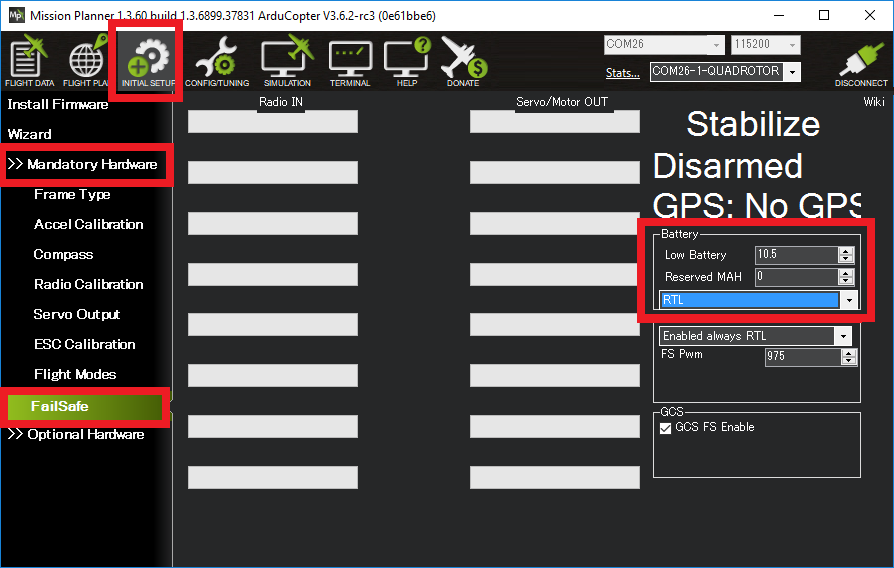

.. _failsafe-battery:

================
Battery Failsafe
================

The battery failsafe can be configured to automatically switch the vehicle into :ref:`RTL <rtl-mode>`, :ref:`SmartRTL <smartrtl-mode>` or :ref:`Land <land-mode>` mode if the vehicle battery voltage drops below a specified voltage for 10 seconds or the estimated remaining capacity has dropped below a configurable threshold.

.. note::

    This failsafe requires the vehicle have a working :ref:`Power Module <common-powermodule-landingpage>`.

.. note:: ArduPilot firmware versions 4.0 and later support up to 10 batteries/power monitors. All the  discussion below applies to those optional batteries also. Each can trigger a failsafe and each can have different actions and setup values. In addition, a group of batteries can be treated as a single unit, see ``BATTx_MONITOR`` = 10.

When the failsafe will trigger
------------------------------

If enabled and set-up correctly the battery failsafe will trigger if the main battery's

-  voltage drops below the voltage held in the :ref:`BATT_LOW_VOLT <BATT_LOW_VOLT>` parameter (or FS_BATT_VOLTAGE in older versions) for more than 10 seconds.  The default voltage is 10.5 volts.  If set to zero the voltage based trigger will be disabled.
-  remaining capacity falls below the :ref:`BATT_LOW_MAH <BATT_LOW_MAH>` parameter (or FS_BATT_MAH in older versions) 20% of the battery's full capacity is a good choice (i.e. "1000" for a 5000mAh battery).  If set to zero the capacity based trigger will be disabled (i.e. only voltage will be used)

What will happen
----------------

When the failsafe is triggered:

-  Buzzer will play a loud low-battery alarm
-  LEDs will flash yellow
-  "Low Battery!" will be displayed on the ground stations HUD (if telemetry is connected)

Then one of the following will happen:

-  **Nothing** if the vehicle is already disarmed or executing RTL or Land
-  **Disarm motors** if the vehicle is in Stabilize or Acro mode and the throttle is at zero OR the vehicle is landed
-  The user configurable action held in the :ref:`BATT_FS_LOW_ACT <BATT_FS_LOW_ACT>` parameter from Copter-3.6 or higher (for Copter-3.5 and lower use the FS_BATT_ENABLE parameter)

  - **0** : None - no action will be taken
  - **1** : Land - the vehicle will switch to :ref:`Land <land-mode>` mode
  - **2** : RTL - the vehicle will switch to :ref:`Return-to-Launch <rtl-mode>` mode if possible but if not possible (because of no good position estimate) the vehicle will :ref:`Land <land-mode>` (**Recommended**)
  - **3** : SmartRTL or RTL - the vehicle will switch to :ref:`SmartRTL <smartrtl-mode>` mode if possible, if not possible (because SmartRTL's position buffer is full) the vehicle will switch to :ref:`RTL <rtl-mode>`.  If RTL is also not possible (because of no good position estimate) the vehicle will switch to :ref:`Land <land-mode>`
  - **4** : SmartRTL or Land - the vehicle will switch to :ref:`SmartRTL <smartrtl-mode>` mode if possible, if not possible (because SmartRTL's position buffer is full) the vehicle will switch to :ref:`Land <land-mode>`
  - **5** : Terminate - the vehicle will disarm the motors.  This is a dangerous option that should not be used in most cases

As with all failsafes, the user can re-take control of the vehicle by changing the flight mode switch to another mode.  The battery failsafe will not trigger again unless the two-layer failsafe is setup (see below)

The :ref:`FS_OPTIONS<FS_OPTIONS>` parameter (Copter 4.0 and later) is a bitmask parameter to select one or more options that modify the standard actions of the radio, GCS, and battery failsafe.  In the Mission Planner full parameter list or full parameter tree, the handy checkbox popup window is an easy what to set this (and any other bitmask) parameter. Be sure to go to Help > Check Beta Updates to pull the latest parameter definitions first while connected to the internet. The :ref:`FS_OPTIONS<FS_OPTIONS>` bits are as follows:

- bit 0 set: Continue if in auto mode on :ref:`Radio Failsafe <radio-failsafe>`
- bit 1 set: Continue if in auto mode on :ref:`Ground Control Station Failsafe<gcs-failsafe>`
- bit 2 set: Continue if in guided mode :ref:`Radio Failsafe <radio-failsafe>`
- bit 3 set: Continue if landing on any failsafe
- bit 4 set: Continue in pilot control on :ref:`Ground Control Station Failsafe<gcs-failsafe>`
- if none of the above are set, then execute the :ref:`BATT_FS_LOW_ACT <BATT_FS_LOW_ACT>` or :ref:`BATT_FS_CRT_ACT <BATT_FS_CRT_ACT>` options as configured.

.. note:: Only bitmask bit 3 affects actions taken during Battery failsafe. This parameter also works in conjunction with the GCS and radio failsafe, so ensure you are taking all options into account when setting this parameter.

.. note::

    Even if the failsafe action is set to "None" (i.e. :ref:`BATT_FS_LOW_ACT <BATT_FS_LOW_ACT>` = 0) the buzzer will buzz and the LEDs will flash yellow.  To completely disable the battery failsafe set :ref:`BATT_LOW_VOLT <BATT_LOW_VOLT>` and :ref:`BATT_LOW_MAH <BATT_LOW_MAH>` to zero.

.. note::

    Once the battery failsafe has triggered, it cannot be reset until the autopilot is rebooted.

Setting up using Mission Planner
--------------------------------

-  On the **INITIAL SETUP \| Mandatory Hardware \| Failsafe** page:

   - If the Battery section parmeters are greyed out follow instructions to setup the :ref:`Power Module <common-powermodule-landingpage>`
   - Set the "Low Battery" threshold voltage (i.e. 10.5 volts)
   - Set the "Reserved MAH" or leave as "0" if the failsafe should never trigger based on estimated current consumed.
   - Select the desired behavior (Land, RTL, SmartRTL, etc) from the drop-down list

Two-Layer failsafe
------------------

Copter-3.6 (and higher) includes a two-layer battery failsafe.  This allows setting up a follow-up action if the battery voltage or remaining capacity falls below an even lower threshold.

- :ref:`BATT_CRT_VOLT <BATT_CRT_VOLT>` - holds the secondary (lower) voltage threshold.  Set to zero to disable.
- :ref:`BATT_CRT_MAH <BATT_CRT_MAH>` - holds the secondary (lower) capacity threshold.  Set to zero to disable.
- :ref:`BATT_FS_CRT_ACT <BATT_FS_CRT_ACT>` - holds the secondary action to take.  A reasonable setup would be to have :ref:`BATT_FS_LOW_ACT <BATT_FS_LOW_ACT>` = 2 (RTL) and :ref:`BATT_FS_CRT_ACT <BATT_FS_CRT_ACT>` = 1 (Land)

Advanced Settings
-----------------

- :ref:`BATT_FS_VOLTSRC <BATT_FS_VOLTSRC>` allows configuring whether the raw battery voltage or a sag corrected voltage is used
- :ref:`BATT_LOW_TIMER <BATT_LOW_TIMER>` can configure how long the voltage must be below the threshold for the failsafe to trigger
- ``BATTx_`` parameters can be setup to trigger the failsafe on other batteries
