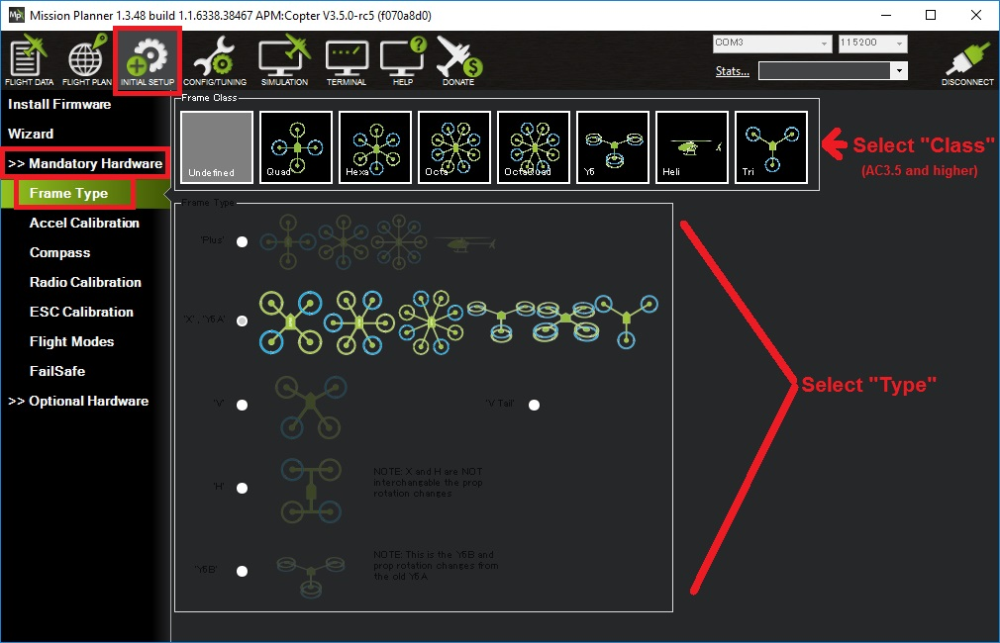

.. _frame-type-configuration:

==================================
Frame Class and Type Configuration
==================================

MultiCopters
============

The :ref:`FRAME_CLASS <FRAME_CLASS>` and :ref:`FRAME_TYPE <FRAME_TYPE>` parameters should be set to match the physical frame being used.  See the :ref:`Connect ESCs and Motors <connect-escs-and-motors>` page for the list of supported multicopter frames

If using the mission planner select Initial Setup, **Mandatory Hardware \| Frame Type**.  If you are using another Ground Station it should be possible to set the :ref:`FRAME_CLASS <FRAME_CLASS>` and :ref:`FRAME_TYPE <FRAME_TYPE>` parameters directly through a parameter update screen.

.. note::

   For Traditional Helicopters, "Heli" should already be selected and it should not be changed.
   For :ref:`Single Copter and Coax Copter <singlecopter-and-coaxcopter>` the :ref:`FRAME_CLASS <FRAME_CLASS>` parameter should be set directly from the Full Parameter List until `this issue <https://github.com/ArduPilot/MissionPlanner/issues/1552>`__ is resolved.

Next select the frame "Type" for your vehicle. The default type is **X**.

For Tricopters, Y6, Traditional Helicopters, Bicopters, SingleCopters and CoaxCopters the frame type is ignored.

Motor Order Diagrams
--------------------

See the :ref:`Connect ESCs and Motors <connect-escs-and-motors>` page for the list of supported multicopter frames

Traditional Helicopters
=======================

Traditional Helicopters run a different version of firmware. See :ref:`traditional-helicopters` for setup and tuning information. 

HeliQuads are a hybrid frame using Traditional Helicopter firmware but four motors.

.. toctree::
   :maxdepth: 1

   HeliQuads <heliquads>

Other Configurations
====================

.. toctree::
   :maxdepth: 1

   Tricopter <tricopter>
   SingleCopter and CoaxCopter <singlecopter-and-coaxcopter>
