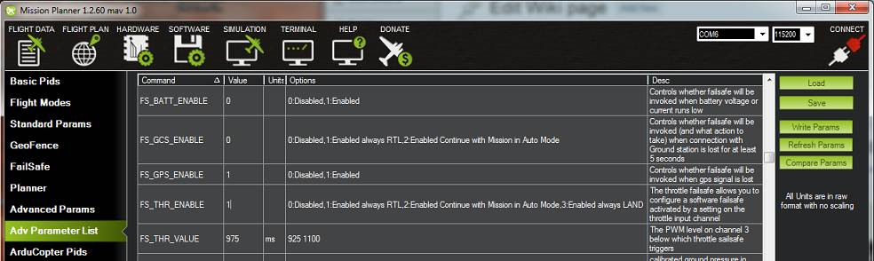

.. _gcs-failsafe:

============
GCS Failsafe
============
Significant improvements have been made in Copter-4.0 and later for Ground Control Failsafe .

The Ground Station Control (GCS) failsafe controls how Copter will behave if contact with the GCS is lost.  The GCS failsafe monitors the time since the last MAVLink heartbeat from the GCS.  If no heartbeat is received in over 5 seconds, the GCS failsafe event will trigger based on your parameter settings. Note that if no GCS is ever connected, the GCS failsafe will remain inactive regardless of parameter settings.

.. note::

   Copter also supports other failsafes: :ref:`Radio <radio-failsafe>`, :ref:`Battery <failsafe-battery>`, and :ref:`EKF / DCM Check <ekf-inav-failsafe>`.

When the failsafe will trigger
==============================

The following situations can cause a loss of GCS MAVLink heartbeat, triggering a GCS failsafe event after 5 seconds:

-  The operator turns off or otherwise disconnects the GCS
-  The copter travels beyond the range of the  GCS telemetry radios
-  The GCS telemetry radio on either end loses power
-  Wires connecting the GCS telemetry radio to the autopilot or ground equipment become disconnected

What will happen
================

When a GCS failsafe is triggered, the copter can be configured via parameters to do nothing, land immediately, RTL, or SmartRTL.  It can also be configured to bypass the failsafe in an Auto Mode mission, bypass the failsafe in pilot controlled modes, or to continue landing if already in a landing phase.

- If the copter is disarmed, no failsafe will take place.
- If the copter is armed but has landed, the copter will immediately disarm.
- If the copter is armed in Stabilize or Acro modes, and the throttle input is at minimum, the copter will immediately disarm.
- Otherwise, the copter will take the actions as configured in the parameters described below.

If the failsafe clears (i.e. GCS reconnects and MAVLink heartbeat is restored) the copter will remain in its failsafe mode. It will **not** automatically return to the flight mode that was active before the failsafe was triggered. This means that if, for example, the vehicle was in Loiter when the failsafe occurred and the flight mode was automatically changed to RTL, even after the GCS reconnects, the vehicle would remain in RTL.  If the pilot wished to re-take control in Loiter he/she would need to change the flight mode switch to another position and then back to Loiter. This can be done via the re-connected GCS also.

Setting the failsafe
====================

In Mission Planner's  full parameter list or full parameter tree, set the :ref:`FS_GCS_ENABLE <FS_GCS_ENABLE>` parameter to:

-  **Disabled** (Value 0) will disable the GCS failsafe entirely.
-  **Enabled Always RTL** (Value 1) will switch the copter to RTL Mode.  If the GPS position is not usable, the copter will change to Land Mode instead.
-  **Enabled Continue with Mission in Auto Mode (Deprecated in 4.0+)** (Value 2) will ignore the failsafe in an Auto Mode mission. Otherwise, it will behave the same as *Enabled Always RTL*. This option no longer exists in Copter 4.0 and later. Instead, see the :ref:`FS_OPTIONS<FS_OPTIONS>` parameter for this function. Setting this value in Copter 4.0 and later version will automatically be converted and set to Value 1 (Always RTL) and the :ref:`FS_OPTIONS<FS_OPTIONS>` bitmask will be modified to include bit (1) for "Continue auto mode mission on GCS failsafe".
-  **Enabled SmartRTL or RTL** (Value 3) will switch the copter to SmartRTL mode. If SmartRTL is not available, the copter will switch to RTL Mode instead.  If the GPS position is not usable, the copter will change to Land Mode instead.
-  **Enabled SmartRTL or Land** (Value 4) will switch the copter to SmartRTL mode. If SmartRTL is not available, the copter will switch to Land Mode instead.
-  **Enabled Always Land** (Value 5) will switch the copter to Land Mode.
-  Any invaild value (Such as accidentally enter 99 as a parameter value) will will behave the same as **Enabled Always RTL**

The :ref:`FS_OPTIONS<FS_OPTIONS>` parameter (Copter 4.0 and later) is a bitmask parameter to select one or more options that modify the standard actions of the radio, GCS, and battery failsafe. In the Mission Planner full parameter list or full parameter tree, the handy checkbox popup window is an easy what to set this (and any other bitmask) parameter. Be sure to go to Help > Check Beta Updates to pull the latest parameter definitions first while connected to the internet. The :ref:`FS_OPTIONS<FS_OPTIONS>` bits are as follows:

- bit 0 set: Continue if in auto mode on :ref:`Radio Failsafe <radio-failsafe>`
- bit 1 set: Continue if in auto mode on :ref:`Ground Control Station Failsafe<gcs-failsafe>`
- bit 2 set: Continue if in guided mode :ref:`Radio Failsafe <radio-failsafe>`
- bit 3 set: Continue if landing on any failsafe
- bit 4 set: Continue in pilot control on :ref:`Ground Control Station Failsafe<gcs-failsafe>`
- If none of the above are set, then execute the :ref:`FS_GCS_ENABLE <FS_GCS_ENABLE>` option as configured.

.. note:: Only bitmask bits 1, 3, & 4 affect actions taken during GCS failsafe. This parameter also works in conjunction with the battery and radio failsafe, so ensure you are taking all options into account when setting this parameter.

.. note::

   All Failsafe Parameters can be observed or set from the Advanced Parameter List in Mission Planner.
