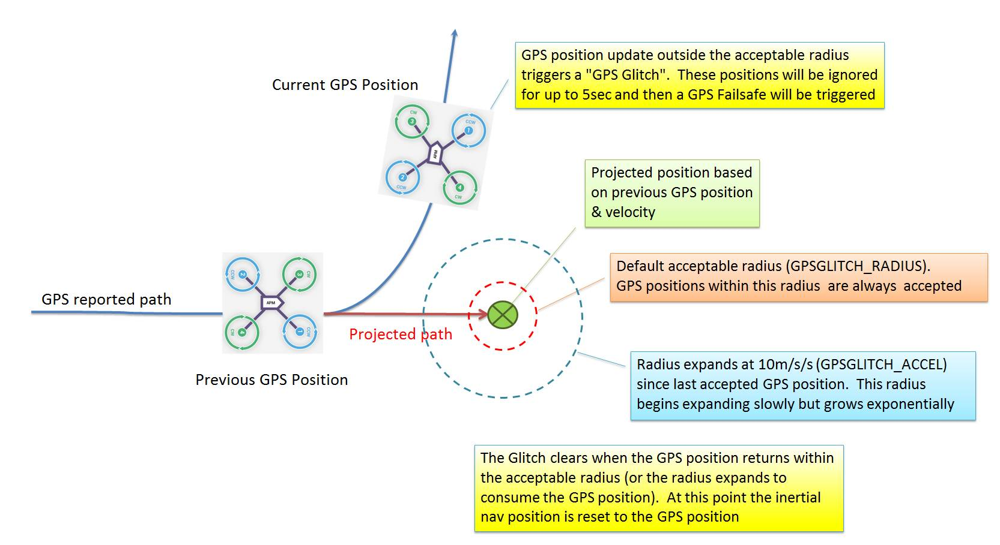

.. _gps-failsafe-glitch-protection:

==================================
GPS Failsafe and Glitch Protection
==================================

This article describes the glitch protection mechanisms used to trigger
GPS Failsafe.

Overview
========

GPS Systems can occasionally drop the signal or provide significantly
inaccurate position information (aka "glitches"). While errors are more
likely in conditions where the GPS signal can bounce off multiple paths
before reaching the receiver (multipathing), errors can occasionally
occur even with clear sky.

A *GPS failsafe* event will occur if GPS 3D
lock or the position "Glitches" for at least 5 seconds while Copter is
in a mode that requires the GPS (RTL, Auto, Loiter, Circle, Position,
Guided or Drift).  The GPS failsafe response can be set to Land or
switch to AltHold mode (in AC3.1 and higher) so that you can retake
manual control.

Without GPS updates, the inertial sensors allow approximately 10 seconds
of accurate position information but after this the horizontal position
drift becomes so large that the horizontal position cannot be maintained
at all.  At this point if you still have RC radio control it is
recommended to take back control using Stabilize, Acro or AltHold as
soon as possible.

This article describes two forms of GPS glitch logic. The first is used
by the default navigation algorithm for AC3.1 and 3.2. The second (EKF)
can be used in AC3.2, and is mandatory in AC3.3 and later.

Glitch Protection - Default
===========================

AC3.1 and AC3.2 include GPS glitch protection which can help alert the
pilot to a bad GPS position, trigger a failsafe and reduce the incidents
of fly-aways.  Glitches are detected by comparing the each new position
update received from the GPS with a position projected out from the
previous update's position and velocity.

The new position is accepted as "good" if:

#. the two positions are within the ``GPSGLITCH_RADIUS`` (defaults to
   5m).
#. the new position is within a radius that is 10m/s/s
   (``GPSGLITCH_ACCEL``) \* dt \* dt.  Where "dt" is the time difference
   between the two samples.

During a glitch, "Bad Position" will be written on the ground station's
HUD

Glitch Protection - EKF
=======================

AC3.2 introduced a new form of glitch protection, the :ref:`ArduPilot Extended Kalman Filter (EKF) <common-apm-navigation-extended-kalman-filter-overview>`.

.. note::

   AC3.3 Enables EKF by default, and it cannot be turned off. On
   AC3.2 EKF is turned off by default - but you can enable it to run on the
   faster boards (using 32 bit micros) by setting ``AHRS_EKF_USE = 1``.

Glitch protection using the EKF works as follows:

#. When new GPS position measurements are received, they are compared to
   a position predicted using IMU measurements.
#. If the difference exceeds a statistical confidence level set by
   ``EKF_POS_GATE``, then the measurement won't be used.
#. While GPS measurements aren't being used, a circle defined by an
   uncertainty radius grows around the predicted position. The rate at
   which this radius grows is controlled by ``EKF_GLITCH_ACCEL``. This
   is similar to the circle defined by ``GPSGLITCH_ACCEL``, the
   difference being it is centered around the trajectory predicted by
   the IMU rather than previous GPS measurements. Because this allows
   for deviations in trajectory due to maneuvers, the default value for
   ``EKF_GLTCH_ACCEL`` is smaller at 1.5 m/s/s. The acceleration growth
   of the circle is also increased when the vehicle is accelerating or
   turning to allow for the increase in IMU errors during maneuvers.
#. If subsequent GPS measurements fall inside the circle, they will be
   accepted and the circle is reset back to the minimum radius
   controlled by ``EKF_POS_GATE``.
#. If the GPS glitch is large enough and lasts long enough, the GPS
   measurements will continue to be rejected until the circle radius
   exceeds a value set by ``EKF_GLITCH_RAD``. When this happens, an
   offset is applied to the GPS position so that it matches the
   estimated vehicle position and the GPS positions are used again. The
   GPS offset is then reduced to zero at 1 m/s. This means that large
   long duration glitches will cause the vehicle to drift at a 1 m/s
   rate. This is slow enough to give the operator plenty of time to
   react.
