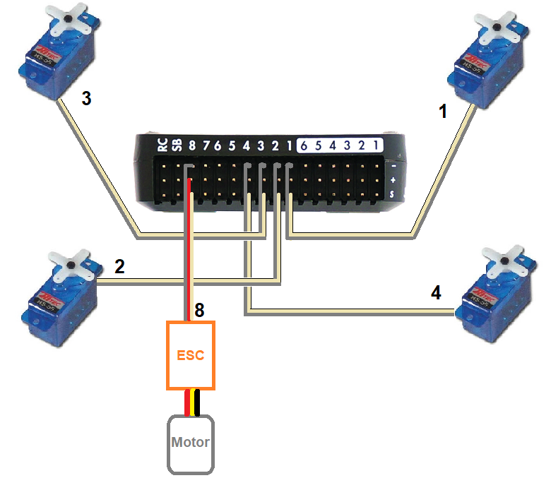
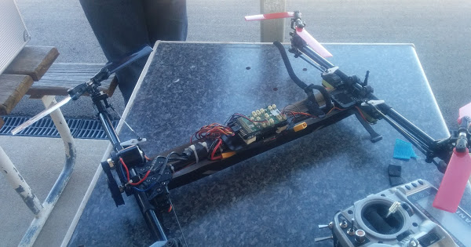

.. _heliquads:

=======================================
HeliQuads (Variable Pitch Multicopters)
=======================================

..  youtube:: J6WJSXm7zWQ
    :width: 100%

Copter-3.6 (and higher) supports HeliQuads, also called Collective Pitch Quadcopters or Variable Pitch Multicopters.

.. note:: Heli quad requires a :ref:`traditional helicopter <traditional-helicopters>` as the base firmware. It is available for download from the `firmware server <https://firmware.ardupilot.org/>`__. When Copter is compiled, it now generates both traditional helicopter and multirotor firmware.

These vehicles use independently controlled collective pitch on each of 4 rotors, with a single electric motor that powers all 4 rotors at the same speed via belts and a torque tube.
It is highly aerobatic, capable of inverted flight but can suffer from :ref:`high vibration levels <common-measuring-vibration>`.

Where to Buy
============

- WLtoys Assassin V383 is available from retailers including `WLtoys.eu <https://wltoys.eu/wltoys-v383>`__

Connecting and Configuring
==========================

- each servo should be connected using the same outputs that would be used for motors on a regular multicopter (:ref:`see order here <connect-escs-and-motors>`)
- the motor's ESC should be connected to the autopilot's channel 8 output
- :ref:`traditional helicopter firmware <traditional-helicopters>` should be loaded onto the vehicle.

If using the `WLToys Assassin V383 a parameter file is available here <https://github.com/ArduPilot/ardupilot/blob/master/Tools/Frame_params/WLToys_V383_HeliQuad.param>`__ and can be used to set all parameters immediately.
For other builds these are the standard params that should be set:

- :ref:`FRAME_CLASS <FRAME_CLASS>` to 13 (HeliQuad)
- :ref:`FRAME_TYPE <FRAME_CLASS>` to 1 ("X" if front right motors spins counter clockwise) or 3 ("H" if front right motor spins clockwise)

Similar to a :ref:`traditional helicopter <traditional-helicopters>` an :ref:`auxiliary switch <common-auxiliary-functions>` should be set to "Motor Interlock" to turn on/off the motor.  Normally this is channel 8 so you could set :ref:`RC8_OPTION<RC8_OPTION>` to 32.

Videos
======

Inverted flight test

..  youtube:: 1yEWhOULeGM

Picture of CanberraUAV vehicle

