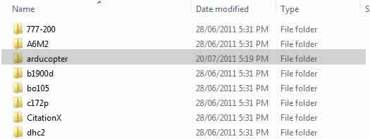
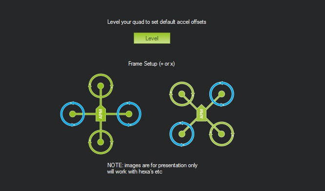

.. _hil-quad:

============================
Archived: HIL Quad Simulator
============================

.. warning::

   **ARCHIVED ARTICLE**

   HIL does not work since inertial navigation was introduced
   with Copter 2.9.  The closest alternative we have is
   :ref:`SITL <dev:setting-up-sitl-on-windows>`.

This article explains how to setup Quad HIL in the mission planner.

What you need
-------------

#. `Download Flightgear 2.x.x here <http://www.flightgear.org/Downloads/>`__

#. `Download the latest APM Mission Planner here <http://firmware.ardupilot.org/Tools/MissionPlanner/MissionPlanner-latest.msi>`__.

#. In the Mission Planner > 'Configuration tab \| Adv Parameter List'
   save your current parameters so you can reload them after the
   simulation.

How to make it work
-------------------

Safety First: Remove your quad's props, the motors will be live during the simulation!
~~~~~~~~~~~~~~~~~~~~~~~~~~~~~~~~~~~~~~~~~~~~~~~~~~~~~~~~~~~~~~~~~~~~~~~~~~~~~~~~~~~~~~

1. Upload the quad hil firmware

.. image:: ../images/ac2hilfirmware.jpg
    :target: ../_images/ac2hilfirmware.jpg

2. Copy quadhil.xml (included with planner) to your FlightGear directory
eg

``C:Program Files (x86)FlightGeardataProtocol``

.. image:: https://ardupilot-mega.googlecode.com/svn/ArduPilotMegaImages/ac2fgprotocol.jpg
    :target: ../_images/ac2fgprotocol.jpg

3. Copy the whole 'arducopter' folder from

``C:Program Files (x86)Mission Planneraircraft``

 to your FlightGear Aircraft directory eg

``C:Program Files (x86)FlightGearAircraft``

4. Start the Mission Planner

5. Connect as usual

6. Setup the radio/modes as required. Setup frame to +.

7. Goto simulation.

8. Check Quad, and FlightGear.

.. image:: ../images/ac2simulator.jpg
    :target: ../_images/ac2simulator.jpg

9. Click start fg quad and wait for FlightGear to start.

10. Click start sim link.

For those that want to start FlightGear themselves
--------------------------------------------------

This is the bat file used to start FlightGear

::

    "C:Program Files (x86)FlightGear v20110705binWin32fgfs" ^
      "--fg-root=C:Program Files (x86)FlightGear v20110705data" ^
         "--geometry=400x300"  ^
         "--aircraft=arducopter" ^
         "--native-fdm=socket,out,50,127.0.0.1,49005,udp" ^
         "--generic=socket,in,50,127.0.0.1,49000,udp,quadhil" ^
         "--fdm=external" ^
         "--prop:/logging/log/filename=fg_record.csv" ^
         "--log-level=info" ^
         "--roll=0"  ^
         "--pitch=0"  ^
         "--wind=0@0"  ^
         "--turbulence=0.0"  ^
         "--prop:/sim/frame-rate-throttle-hz=30"  ^
         "--timeofday=noon"  ^
         "--shading-flat"  ^
         "--fog-disable"  ^
         "--disable-specular-highlight"  ^
         "--disable-skyblend"  ^
         "--disable-random-objects"  ^
         "--disable-panel"  ^
         "--disable-horizon-effect"  ^
         "--disable-clouds"  ^
         "--disable-anti-alias-hud"

