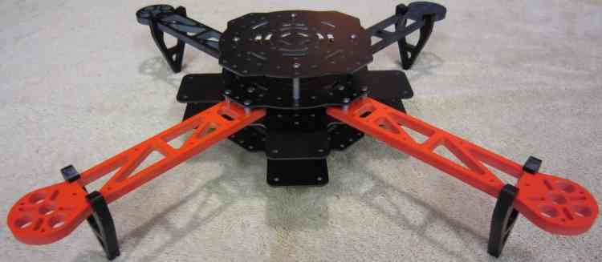
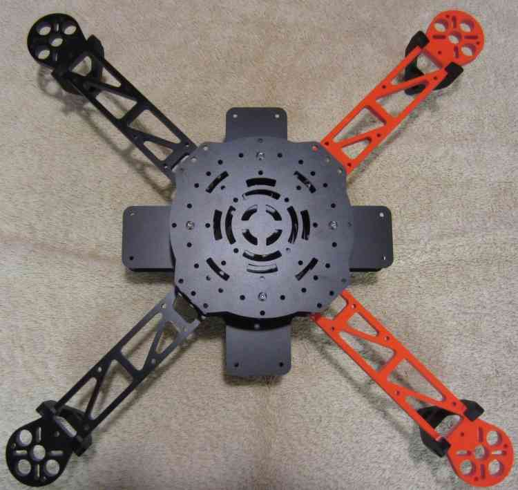
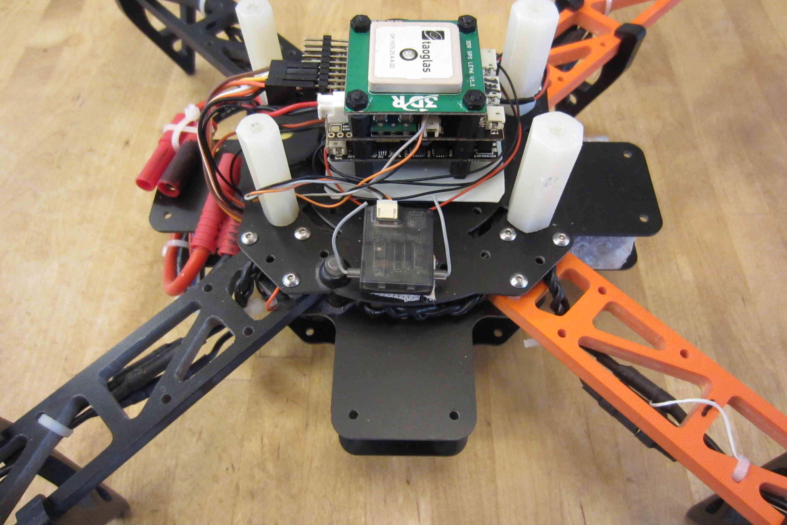
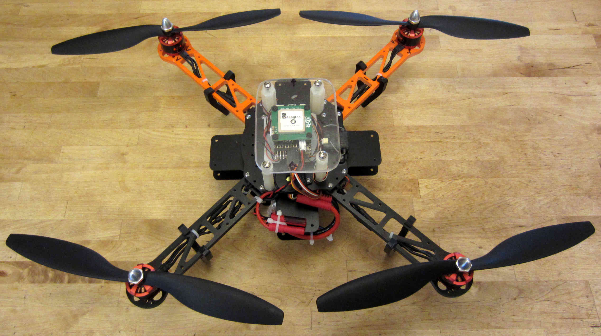

.. _hoverthings-flip-sport-quadcopter:

===========================================
Archived: Hoverthings Flip Sport Quadcopter
===========================================

.. warning::

   **ARCHIVED ARTICLE**

   The frame is no longer in production/available for purchase.
   Some of the instructions cover PX4FMU/PX4IO, which is no longer supported.

The Hoverthings FLIP Sport is very easy to build resulting in a
remarkably sturdy and very high performance little quadcopter. The FLIP
Sport is well suited to FPV and GoPro photography and videography and
can even incorporate a brushless gimbal.

Why a FLIP Sport?
=================

-  The easiest inexpensive high quality build your own project is either
   the F330 or 450 DJI FlameWheel QuadCopter.
-  The F330 build is detailed elsewhere and the F450 is pretty much
   identical.
-  I really love those little FlameWheels for delivering many hours of
   fun and resisting my every effort to destroy them.
-  This time I thought I'd try and kick it up a notch, something even
   more indestructible and maybe even more fun.
-  The Flip frame kit is $89.00 from Hoverthings.
-  In addition to the standard Sport frame kit I also purchased an
   extended tab pair of center frame pieces and some extra 7/8" stand
   offs.
-  It is billed as being nearly indestructible and short of direct
   Nuclear blast effects, they are probably right.
-  The frame arms on these Flips are billed as being incredibly stiff
   and incredibly strong.
-  The arms are CNC milled high density 1/4" thick fiberglass and are
   very stiff, they should be able to withstand a lot of punishment.
-  The frame centers are also very strong and stiff fiberglass and it it
   seems likely all of it is G10.
-  This is a small 380 size frame and will accommodate 10" propellers
   (Right between the Flamewheel F330 and F450.)

.. image:: ../images/FlipLeg1.jpg
    :target: ../_images/FlipLeg1.jpg

What to get
===========

#. A `Hoverthings Flip Sport Frame <https://www.amazon.com/HoverThings-Flip-Frame-Black-Orange/dp/B00HZTN6GO/>`__ (approx $89.00 USD).

   .. image:: ../../../images/3281_dimg2.jpg
       :target: ../_images/3281_dimg2.jpg
   
#. `Two tabbed center sections <hhttp://www.hoverthings.com/flip4tabblack>`__ and *eight 7/8" standoffs* (e.g. `similar to these <http://hoverthings.com/standoff-nylon-f-f/>`__).
#. Four DJI motors for Flamewheel from `Amain Hobby <https://www.amainhobbies.com/dji-multirotor-replacement-brushless-motor-dji-motor01/p235238>`__
   for $24.00 each.
#. A 20 or 25 Amp four in one ESC from `Off the Grid Water <http://mymobilemms.com/OFFTHEGRIDWATER.CA/ESC/4-in-1-Speed-Control-Quad-HOBBYWING-Quattro-Skywalker-25A-X-41?cPath=2_4>`__
   for $40.00.
#. A :ref:`Pixhawk <common-pixhawk-overview>` compatible autopilot.
#. A :ref:`GPS and Compass Module <common-positioning-landing-page>` module.
#. Two `normal <https://www.rcdude.com/product-p/gf-1045-c.htm>`__
   and two `reverse <https://www.rcdude.com/product-p/gf-1045r-blk.htm>`__
   rotation DJI compatible Gemfan 10" carbon filled propellers from RC Dude.

#. A 2600 to `4000mah LiPo battery <https://hobbyking.com/en_us/turnigy-battery-nano-tech-4000mah-3s-25-50c-lipo-pack-xt-60.html?___store=en_us>`__
   that fits between the 2 bottom plates.
#. PPM-Sum compatible receiver that works with your RC transmitter:
   `FRSky <http://www.valuehobby.com/radio-systems-servos/receivers/frsky-receiver-telemetry.html>`__\ `(Delta
   8) <http://www.valuehobby.com/frysky-delta-8.html>`__, Futaba SBus or
   Spektrum satellite recommended.
#. For a PX4 system: A `Pad of Kyousho Zeal Antivibration gel <https://www.amainhobbies.com/kyosho-zeal-vibration-absorption-gyro-reciever-mounting-gel-1-sheet-kyoz8006/p19713>`__
   and four nylon or aluminum 1 1/2" threaded standoffs.

Assembling the frame
====================

#. There are two different construction methods depending on whether you
   are using a Pixhawk or a PX4FMU/PX4IO.
#. For the Pixhawk you will use the second untabbed center plate on top
   as shown above, for a PX4FMU/PX4IO you will not.
#. Construction procedure is as follows (Use blue Locktite on all
   machine screws.)
#. Assemble the 2 tabbed center sections with four 7/8" standoffs on the
   2 holes an inch apart 2" in from the end on 2 opposing sides.
#. Mount the arms to the top of one of the tabbed center frames using
   the short standoffs above the arm and use locktite.

   #. Ensure that the standoffs mounting the two tabbed frame sections
      are on either side of your copter, not front to back.
   #. Put the longer screws up through the tabbed plate and arms (2 on
      the outside 1 in the middle towards the middle) into the short
      standoffs.

#. Insert and your four in one ESC in between the arms with the excess
   Motor wire wrapped around the ESC

   #. Leave about 3 inches of the 3 ESC motor wires sticking out under
      each arm (I also braided each motors wires on mine.)
   #. Leave the ESC signal wires and power leads sticking out the back
      (between the 2 black arms on mine.).

#. Put an untabbed frame plate on top of your frame and secure with 12
   screws to the top of the standoffs.
#. Install your DJI motors onto the frame arms with the supplied screws
   (use Locktite) with the motor wires facing the copter.
#. Thread the motor wires through the top frame arm opening and connect
   to the ESC wires (tuck excess lead into frame).

.. image:: ../images/FlipSportMotProp.jpg
    :target: ../_images/FlipSportMotProp.jpg

Installing the Pixhawk autopilot
========================================

#. If you are using a Pixhawk, mount the 4 remaining 7/8" long
   standoffs, directly over the ones securing the bottom frame plates.
#. Place a 1" square of the Double-sided foam tape that came with the
   Pixhawk on the bottom of it at each corner.
#. Adhere the Pixhawk to the top of the frame with the arrow pointing to
   the front (between the 2 orange arms on mine).
#. Drill a hole through the top 2 frame plates near a frame arm near the
   edge on one side to accommodate the "safety" button.
#. Also mount the buzzer on the top frame member on one side where it
   will not interfere with a receiver installation.
#. Connect the 3DR power module to the Pixhawk connector and attach the
   power module out of the way also.
#. Solder the other end of the power module wires into a battery
   connector along with the ESC battery leads.
#. Install the ESC's signal leads into the Pixhawk (Main Out) servo
   connectors (signal wire on top).

   #. Red wire into 1, Orange into 2, White into 3 (with red and black
      below) and Brown into 4.

#. Install the GPS and compass wires into the GPS/Compass module and the
   Pixhawk.
#. Mount your receiver with double sided tape or Velcro on the top frame
   member to one side of (and not touching) the Pixhawk.

   #. Run a single servo lead from the PPM-Sum output of the receiver to
      the left side (RC) input of the Pixhawk.
   #. Or if it is a Spektrum Satellite run the Spektrum receiver lead to
      the Spektrum socket on top of the Pixhawk.

#. Mount the top untabbed frame member over the Pixhawk to the 7/8"
   standoffs you already installed above.
#. Mount the GPS module to the top center of the top frame plate using
   double sided tape.

Installing the PX4FMU/PX4IO autopilot
=============================================

#. If you are using a PX4 we can't use the top frame plate but can
   construct a little hard top if desired.
#. Cut a 2" by 2" rectangle from scrap plastic or fiberglass to support
   the PX4FMU/PX4IO.
#. Drill 4 holes in the rectangle that line up with the mounting hole in
   the PX4 board (roughly centered)
#. using 4 of the supplied black screws, mount 4 standoffs to the
   rectangle.
#. Insert the PX4FMU board (connector side up) over the 4 standoff studs
   and (carefully) screw 4 more standoffs over them.
#. Carefully fasten 4 nuts over the exposed studs securing the PX4FMU/PX4IO
   modules to the rectangle you made.
#. Place the PX4IO board over the PX4FMU board so that the connector is
   aligned and push down over the studs.
#. Place a 3/4" square piece of the Kyosho zeal at each edge of the
   "rectangle" between the standoff screws.
#. Adhere the rectangle to the center of the top of the frame with the
   servo connector facing to the rear (between the black frame arms).
#. Drill a hole through the top 2 frame plates near a frame arm near the
   edge on one side to accommodate the "safety" button.
#. Also mount the buzzer on the top frame member behind the PX4FMU/PX4IO stack
   such that it does not touch the "rectangle".
#. Insert the power connector into the PX4IO board and solder the power
   leads and the ESC power leads to a battery connector.
#. Connect the buzzer and "Safety" button leads to the PX4FMU/PX4IO boards.
#. Install the ESC's signal leads into the PX4IO board servo connectors
   (signal wire on top).
#. 

   #. Red wire = right pins, Orange = 2nd from right, White = 3rd from
      right (with red and black below) and Brown = 4 from right.

#. Mount your receiver with double sided tape or Velcro on the top frame
   member to one side of (and not touching) the "rectangle".

   #. Ensure that your receiver does not block the USB connector on the
      side of the PX4FMU board (put it on the other side).
   #. Run a single servo lead from the PPM-Sum output of the receiver to
      the far left side of the PX4IO servo connector.
   #. Or if it is a Spektrum Satellite receiver run the Spektrum
      receiver lead to the Spektrum socket on top of the Pixhawk.

#. To use the remaining frame plate as a top cover screw the 4 standoffs
   to the top of the frame using existing holes near the edge.

   #. Screw the plate to the 4 standoffs.

#. You can make your own top cover from a rectangle of plastic or
   fiberglass (I used Plexiglass, transparent is useful).

   #. Ensure that the rectangle is of appropriate size and shape to
      permit you to secure the standoffs to the top plate.
   #. Drill holes in the rectangle at the appropriate locations and if
      needed into the top frame member as well.
   #. Attach the standoffs to the top frame member and to the
      Rectangular top you have made.

#. Adhere the GPS/Compass module to the center of the top of the top
   cover (it doesn't matter which way it is facing).

   #. Connect the GPS / Compass module to the PX4IO with the supplied
      wiring cables.
   #. Note my setup uses an older style UBlox standalone GPS which I
      have mounted directly to the PX4 stack.

.. image:: ../images/hoverthings_assembly_gps_etc.jpg
    :target: ../_images/hoverthings_assembly_gps_etc.jpg

Final assembly
==============

#. Mount the battery between the lower frame sections and secure it with
   a Velcro strap inserted through the bottom frame plate slots.
#. Route and secure the wires and cables with Zip Ties as shown to
   prevent snagging on the propellers or anything else.
#. Ensure that the battery cable is secure but accessible to be plugged
   in when needed.

Setup and additions
===================

#. Your Flip can now be configured as described elsewhere in this wiki
   for Pixhawk.
#. There is space for a 3DR telemetry radio and / or an OSD and FPV
   transmitter between the 2 side tabs.

   #. An FPV camera may easily be mounted in front of the battery
      between the 2 front tabs.
   #. If you use FPV keep its transmitter and antenna well away from
      the GPS.

#. The Flip has more than adequate power to support a GoPro camera with
   a brushless gimbal and the necessary extended landing gear.
#. I have had several crashes and only managed to break 2 props while
   trying (unsuccessfully) to cut down a 80' bull pine tree with them.
#. This little copter is very high performance, fully acrobatic,
   surprisingly efficient and nearly indestructible and it is a blast to fly.

