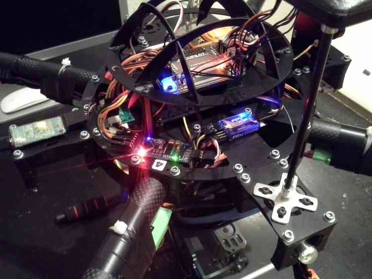
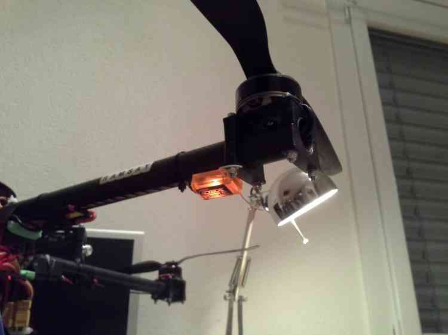
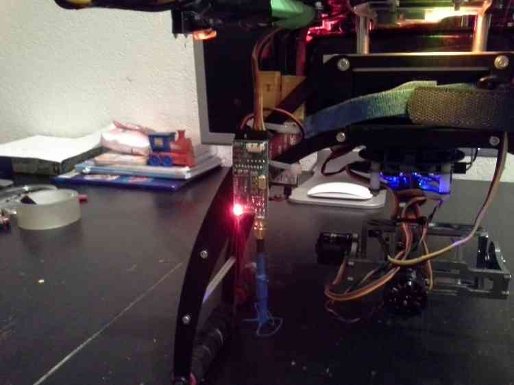
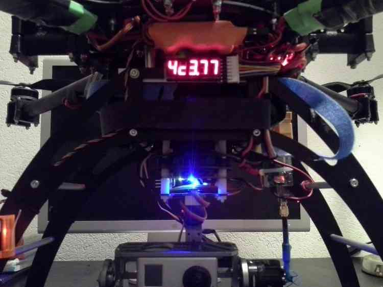
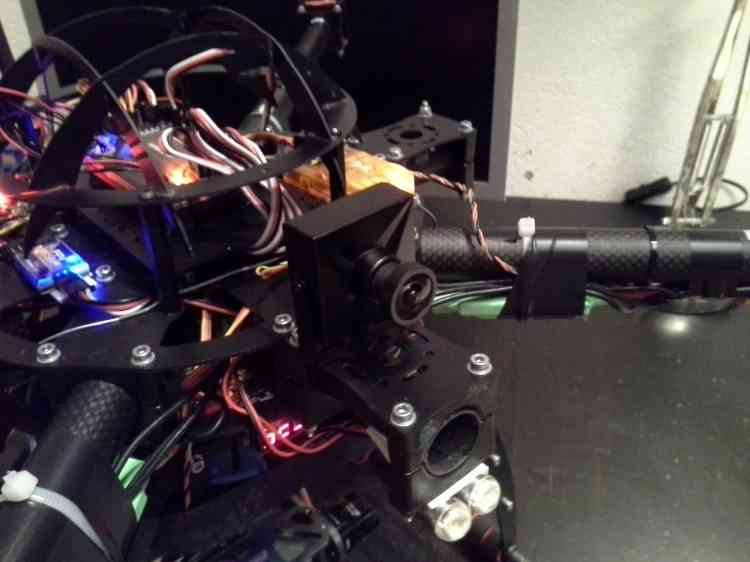

.. _improving-the-capabilities-of-your-multicopter:

========================================================
Archived: Improving the Capabilities of Your Multicopter
========================================================

This page describes one of our members (Euan Ramasy's) highly advanced
photographic quadcopter. It illustrates the incremental improvements he
has been and is making to better optimize its performance and
usefulness and serves as an excellent example for how to properly
undertake development and improvement of your own copter for your own
uses.

.. note::

   If you are just starting and this is your first MulitiCopter you
   are in the wrong place, go here: :ref:`Build Your Own Multicopter <build-your-own-multicopter>`.

Copter Upgrading Goals
======================

-  Well it's been a year since I built my first quad (selecting APM,
   naturally), and I've decided to do a bit of an upgrade in the off
   season.
-  There were four objectives to the exercise:

   -  better reliability
   -  simplify
   -  reduce weight
   -  improve performance

Better reliability
------------------

-  Added 40A ESC's, giving me 15A overhead (formally 30A on a 25A max
   draw)
-  Replaced 5V BEC with a 5.5V, after getting occasion chirp from
   Spektrum telemetry about low volts.
-  Re-wired the PDB and the ESC's for better RF
-  Replaced 1 motor that sounded less than optimal
-  ESC's now uprated (if you can "uprate "to HobbyKing...:-)) and
   outboard for cooling and better security.

Simplicity
----------

-  Number of battery circuits reduced from 3 to one.
-  New 5.5V and 12V BEC's used
-  Unnecessary LED's dumped.

   -  Only retained 4 for orientation on the odd occasion I don't FPV.
   -  But they are Braincube's and are **very** bright!
   -  Labeled everything.
   -  Here is the controller:

.. image:: ../images/lights.jpg
    :target: ../_images/lights.jpg

Reduce weight
-------------

-  Reduced battery circuits from 3 to 1.
-  EzOSD replaced with minimOSD.
-  Also in picture: an FPV camera switcher and the Telemetry junction
   box.

- LED circuits dumped

-  Spektrum telemetry TM1000 dumped
-  GPS finder dumped
-  Leg components replaced with Carbon Fibre
-  And did it work?

   -  Starting weight: 3.65kg -> Final weight: 3.62kg - so savings
      mostly consumed by improved brushless gimbal.
   -  If I'd stayed with the quadframe brushless (refused to tune with
      Martinez board!) and dumped the Braincube as well, I would have
      saved over 200g.

Performance
-----------

-  Moongel replaced with zeal. Unfortunately vibes actually went up! I
   now hit the +/-5 "safe" limits in high power flight and maneuvers.

   -  However, it does seem to respond to very small commands much
      better.
   -  The zeal is firmer than moongel so I might expect that.

-  PID's retuned after 3.0.1, to increase YAW control, and to decrease
   pitch/roll (only by 7%) to improve video footage.

   -  It still handles well, but it's now more "Transit" than "Cosworth"
      .
   -  For our american cousins, this translates to: "it's more light
      truck than corvette").

-  6S Current sensor added. Means

   -  Compassmot can now be run in CURRENT not THROTTLE.
   -  Flight is noticeably more accurate, especially in RTL, Loiter.

-  Higher GPS pole added.

   -  Compassmot reduced from 4% to 1%.

-  Quadframe gimbal replaced with RCTimer.

   -  Video quality immediately improved.
   -  The original Quadframe brushless gimbal just refused to take a
      tune, and never performed well.

Receiver with 2 Satellites
==========================

-  Radio diversity added via Orangerx 800 (DSMX) + 2 satellites.
-  Each satellite has a 30cm cable, one mounted far out under one arm,
   one as far down on the leg as possible.
-  It's not perfect, but better than before. Radio now much more
   reliable regardless of orientation. No more scary moments...

FPV Transmitter Improvements:
=============================

-  Video TX moved to as far down the legs as possible.
-  Range has improved from 350m to well over 600 with 600mw tx + ibcrazy
   omni's.

   -  Will be pushing out further, as I now have an ibcrazy 5 turn
      helical antenna to play with as well.

-  Also to come: 1/4 wavelength 433mhz antenna's for long range
   telemetry.

   -  How bad is it? It cuts out before the video does...

Camera Gimbal Mount
===================

-  The Camera Gimbal Mount has had 3 upgrades.
-  Quadframe brushless gimbals motors replaced with RCTimer.
-  I replaced the battery plate with my own design, and I'm happy with
   that.
-  So happy I'm selling it to anyone who wants one.
-  I Also replaced the ball bearings with stiffer ones.
-  I still get a tiny bit of jitter in pitch, but I might need to look
   at my rx feed into the martinez; it might be noisy.

FPV Camera Improvements
=======================

-  Finally, I dumped the 420 line FPV camera, and went with the 650 line
   from Security Camera 2000 (the one everyone goes for!).
-  I also got some  new low light lenses.
-  This setup just works so much better.
-  Just a pity I can't get minimOSD to overlay on the feed for some
   reason; works ok on the Gopro feed!

Summary:
========

-  Euan's highly developed QuadCopter had already delivered excellent
   service as a brushless gimbal stabilized photographic platform with
   highly developed FPV cpability.
-  And now he has added several improvements.

   -  The camera mount has been replaced with better gimbals, bearings
      and mounting plate.
   -  FPV now has a better higher resolution camera with better lenses
      and the FPV range has been extended.
   -  RC range has been extended with satellite receivers.
   -  Reliability has been further enhanced by numerous upgrades.
   -  And the copter has been simplified by removing unnecessary
      devices.

-  This should give you some idea of the level of detail and effort
   required to build a top notch platform that can be used in a
   professional capacity.
