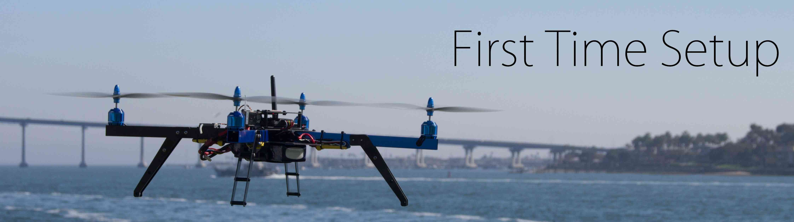

.. _initial-setup:

================
First Time Setup
================

First-time setup of the autopilot includes downloading and installing a Ground Control Station (GCS), 
mounting the flight controller to the frame,
connecting it to the receiver, power and motors, 
and then performing initial configuration and calibration.

.. note::

   This section assumes that you've already :ref:`chosen and built a frame <choosing-a-frame>` and have
   :ref:`selected your flight controller <common-choosing-a-flight-controller>`.

For more information on each of these tasks (sorted by flight controller
within the sections) see the topics below:

.. toctree::
    :maxdepth: 1

    Install Ground Station Software <common-install-gcs>
    Assembly <assembly-instructions>
    Loading Firmware to Pixhawk boards <common-loading-firmware-onto-pixhawk>
    Loading Firmware to ChibiOS-only boards <common-loading-firmware-onto-chibios-only-boards>
    common-loading-chibios-firmware-onto-pixhawk
    Connect Mission Planner to AutoPilot <common-connect-mission-planner-autopilot>
    Configuring Hardware <configuring-hardware>
    
    
.. tip::

    The next section (:ref:`First Flight <flying-arducopter>`)
    explains how to start flying using Copter, and further tuning and
    configuration required for new systems.