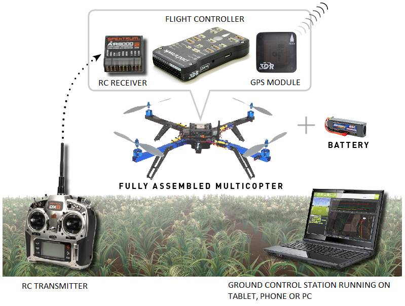

.. _introduction:

==================
Introducing Copter
==================

Copter is an advanced open-source autopilot system for multicopters, helicopters, and other rotor vehicles.  It offers a :ref:`wide variety of flight modes <flight-modes>` from fully manual to fully autonomous.

As part of the wider ArduPilot software platform it works seamlessly with a variety of :ref:`Ground Control Station programs <common-choosing-a-ground-station>`
that are used to setup the vehicle, monitor the vehicle's flight in real-time and perform powerful mission planning activities.
It also benefits from other parts of the Ardupilot ecosystem, including simulators, log analysis tools, and higher level APIs for vehicle control.

ArduPilot is already a preferred platform for numerous commercially available autopilot systems but you can also use it to enhance the abilities of your own DIY multirotor.

Key features
============

Key features include:

-  High precision :ref:`acrobatic mode <acro-mode>`: perform agressive maneuvers including flips!
-  :ref:`Auto-level <stabilize-mode>` and :ref:`Altitude Hold <altholdmode>` modes: Fly level and straight with ease or add :ref:`simple <simpleandsuper-simple-modes>` mode which removes the need for the pilot to keep track of the vehicle's heading. Just push the stick the way you want the vehicle to go, and the autopilot figures out what that means for whatever orientation the copter is in.
-  :ref:`Loiter <loiter-mode>` and :ref:`PosHold <poshold-mode>` modes: the vehicle will hold its position using its GPS, accelerometers and barometer.
-  :ref:`Return to launch <rtl-mode>`: Flip a switch to have Copter fly back to the launch location and land automatically.
-  :ref:`Ad-hoc commands in Flight <ac2_guidedmode>` : With a two-way telemetry radio installed, just click on the map and the vehicle will fly to the desired location.
-  :ref:`Autonomous missions <auto-mode>`: Use the ground station to define complex missions with up to hundreds of GPS wapoints.  Then switch the vehicle to "AUTO" and watch it take-off, execute the mission, then return home, land and disarm all without any human intervention.
-  :ref:`Failsafes <failsafe-landing-page>`: The software monitors the state of the system and triggers an autonomous return-to-home in case of loss of contact with the pilot, low battery or the vehicle strays outside a defined geofence.
-  **Flexible and customizable**: Copter can fly :ref:`all shapes and sizes of vehicles <common-all-vehicle-types>` just how you want it to because the user has access to hundreds of parameters that control its behaviour.  You won't need to touch most of them but they are there if you need them.
-  **No vendor lock-in**: ArduPilot is fully open source with a diverse community of developers behind it.  You remain in full control of what software is on your vehicle and how it performs.

Getting started
===============

The first thing that you will need is a multicopter with an :ref:`ArduPilot compatible flight controller <common-autopilots>`.
Here is a list of :ref:`ready-to-fly vehicles <common-rtf>` to get started with quickly or you may choose to build your own.

If you're using Copter on a :ref:`ready-to-fly vehicle <common-rtf>` then it should come pre-configured and tuned, ready for your first flight.
We recommend you read the manufacturer's instructions before flying especially the sections concerning safety.
Then after :ref:`installing the ground station <common-install-gcs>` you can likely jump forward to the :ref:`First Flight <flying-arducopter>` instructions.

.. tip::

   Whether using an RTF or DIY vehicle, autonomous vehicles are
   potentially dangerous! Always follow :ref:`best safety practices <safety-multicopter>` and pay close attention to all safety
   warnings.

If you plan on building your own multicopter, the following pages will get your started.
Please start by reading this section in order to understand what a multicopter can do, and how to select a frame, flight controller board,
and other essential components.
Then proceed to :ref:`First Time Setup <initial-setup>` to learn how to assemble your Copter and then :ref:`First Flight <flying-arducopter>` to learn how to configure and tune it.

Learn more about Copter
=======================

To find out more about Copter and your main configuration decisions,
please see the topics below:

.. toctree::
    :maxdepth: 1

    How Multicopters Work <what-is-a-multicopter-and-how-does-it-work>
    Choosing a MultiCopter Frame <choosing-a-frame>
    Choosing a Flight Controller <common-choosing-a-flight-controller>
    Choosing a Ground Station <common-choosing-a-ground-station>
    Building Your Own Frame <what-you-need>
    MultiCopter Safety <safety-multicopter>
    Ready to Fly vehicles <common-rtf>
    Supported vehicle types <common-all-vehicle-types>
    Use-Case Overview <copter-use-case-overview>
