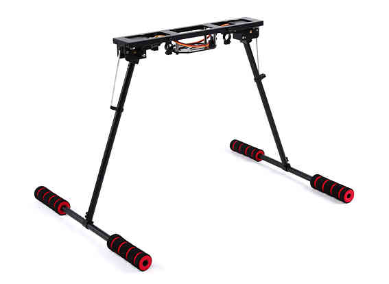

.. _landing-gear:

.. note:: This information is superceded by :ref:`common-landing-gear`

======================
Archived: Landing Gear
======================

Copter supports retractable Landing Gear activated by a servo mechanism
(like these sold by `Hobby King <https://hobbyking.com/en_us/quanum-600-class-quick-release-universal-retractable-gear-set-680uc-pro-hexa-copter.html?___store=en_us>`__).
The gear can be manually retracted/deployed with an auxiliary switch.
The gear will also automatically deploy during landing.

There is some simple logic controlling the operation beyond simply
responding to retract/deploy commands from the controller.  If the
system is booted up and the landing gear control switch is in
the retract position, the landing gear will not retract.  This is done
to prevent damage to the landing gear or airframe should the switch be
accidentally left in the retract position on start-up.  In this case,
the landing gear will not retract until the switch is first moved to the
deploy position, and then back to the retract position.

The landing gear will automatically deploy when the flight mode is changed to Land,
during the final landing phase of RTL mode, and when a Land command is executed in AUTO mode.

.. note::

   Support for landing gear was introduced in AC 3.3

Connecting to the Pixhawk
=========================

Most retractable landing gear will require just a single PWM cable to
connected to one of the AUX outputs on the back of the Pixhawk (AUX1 ~
AUX4).

.. image:: ../images/LandingGear_Pixhawk.jpg
    :target: ../_images/LandingGear_Pixhawk.jpg

.. note::

   The signal wire (usually white) should be connected to the lower most "S" pin.

Setup through the Mission Planner
=================================

Use the Mission Planner's Full Parameter List (or equivalent) to set the
following parameters:

-  If using AC3.5 (or higher) set ``SERVOn_FUNCTION to 29`` "Landing Gear", where **n** is the number for
   the connected servo (e.g. :ref:`SERVO9_FUNCTION <SERVO9_FUNCTION>` for AUX1, :ref:`SERVO10_FUNCTION <SERVO10_FUNCTION>` for AUX2 etc.)
-  If using AC3.4.6 (or lower) set ``RCn_FUNCTION to 29`` "Landing Gear", where **n** is the number for the connected servo (e.g. ``RC9_FUNCTION <RC9_FUNCTION>`` for AUX1, ``RC10_FUNCTION <RC10_FUNCTION>`` for AUX2 etc.)
-  ``LGR_SERVO_DEPLOY <LGR_SERVO_DEPLOY>``
   — servo PWM value required to deploy the landing gear.
-  ``LGR_SERVO_RTRACT <LGR_SERVO_RTRACT>``
   — servo PWM value required to retract the landing gear.

   MissionPlanner: Landing Gear Configuration

Set an :ref:`auxiliary switch <channel-7-and-8-options>` to "Landing Gear" in order to enable manual control (i.e. set CH7_OPT or CH8_OPT to "29")

When the switch is in the "low" position the gear will be deployed, "high" will be retracted, "middle" is a neutral position that will not change the gear's state.

   Mission Planner: Setting Manual Landing Gear Control
