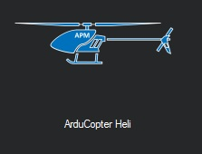

.. _loading-the-code:

=============================================
Traditional Helicopter – Loading the Firmware
=============================================

It is recommended to load the firmware in your Pixhawk and calibrate the
accelerometer before installing it in the frame. This is not absolutely
necessary, however, some helicopters are large and heavy. It is hard to place it
in all the orientations necessary for accel calibration, and is much easier to
do on the bench before installation. For desktop PC's the following ground
station software applications can be used to load firmware:

1. `Mission Planner (Windows only)
<https://ardupilot.org/planner/>`_

2. `APM Planner2 (Windows, Mac or Linux)
<https://ardupilot.org/planner2/>`_

3. `QGroundControl (Windows, Mac or Linux)
<http://qgroundcontrol.com/>`_

Be sure to select the current stable version for Traditional Helicopters and
follow the instructions in your ground station.

Developers may also want to build the code and upload their own
firmware. See the :ref:`Developer wiki <dev:home>` for
more information.

Calibrating the accelerometer is identical to the procedure for other vehicles.
:ref:`See this topic <common-accelerometer-calibration>`.
