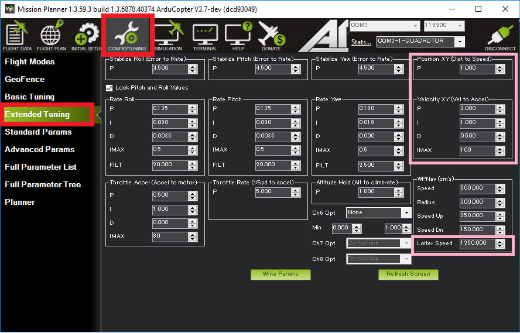
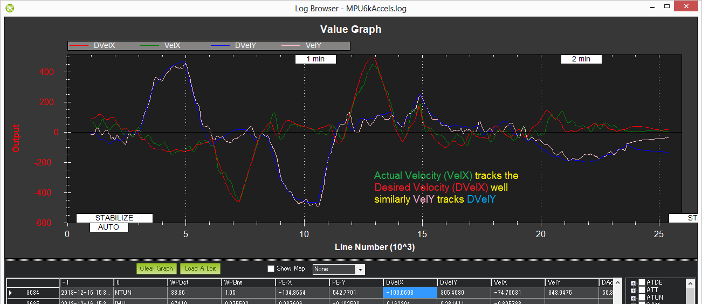

.. _loiter-mode:

===========
Loiter Mode
===========

Loiter Mode automatically attempts to maintain the current location, heading and altitude. The pilot may fly the copter in Loiter mode as if it were in a more manual flight mode but when the sticks are released, the vehicle will slow to a stop and hold position.

A good GPS lock, :ref:`low magnetic interference on the compass <common-diagnosing-problems-using-logs_compass_interference>` and :ref:`low vibrations <common-diagnosing-problems-using-logs_vibrations>` are all important in achieving good loiter performance.

..  youtube:: iGA6D2GBFIc?start=20&end=81
    :width: 100%

Controls
========

The pilot can control the copter's position with the control sticks.

-  Horizontal location can be adjusted with the the Roll and Pitch
   control sticks with the default maximum horizontal speed being 5m/s
   (see Tuning section below on how to adjust this).  When the pilot
   releases the sticks the copter will slow to a stop.
-  Altitude can be controlled with the Throttle control stick just as in
   :ref:`AltHold mode <altholdmode_controls>`
-  The heading can be set with the Yaw control stick

The vehicle can be armed in Loiter mode but only once the GPS has 3D lock and the HDOP has dropped below 2.0.  :ref:`More details on LED patterns here <common-leds-pixhawk>`.

.. _loiter-mode_tuning:

Tuning
======

Loiter mode incorporates the altitude controller from AltHold mode. 
Details for tuning :ref:`AltHold are on this wiki page <altholdmode_tuning>`.

:ref:`WPNAV_LOIT_SPEED <WPNAV_LOIT_SPEED>` : max horizontal speed in cm/s.  I.e. 500 = 5m/s.  By default, the maximum acceleration is 1/2 of the Loiter speed (i.e. 2.5m/s/s).

:ref:`WPNAV_LOIT_MAXA <WPNAV_LOIT_MAXA>` : max acceleration in cm/s/s.  Higher values cause the copter to accelerate and stop more quickly.

:ref:`WPNAV_LOIT_MINA <WPNAV_LOIT_MINA>` : min acceleration in cm/s/s.  Higher values stop the copter more quickly when the stick is centered, but cause a larger jerk when the copter stops.

:ref:`WPNAV_LOIT_JERK <WPNAV_LOIT_JERK>`: max change in acceleration in cm/s/s/s.  Higher numbers will make the vehicle more responsive, lower numbers will make it smoother.

:ref:`POS_XY_P <POS_XY_P>` : (shown as "Loiter PID P" at the top right of the screen shot above) converts the horizontal position error (i.e difference between the desired position and the actual position) to a desired speed towards the target position.  **It is generally not required to adjust this.**

:ref:`VEL_XY_P <VEL_XY_P>` (shown as "Rate Loiter P, I and D") converts the desired speed towards the target to a desired acceleration.  The resulting desired acceleration becomes a lean angle which is then passed to the same angular controller used by :ref:`Stabilize mode <stabilize-mode>`.  **It is generally not required to adjust this.**

Common Problems
===============

#. The vehicle slows to a stop very slowly after the pilot releases the sticks (aka "freight train stop").  This can be resolved by increasing :ref:`WPNAV_LOIT_MAXA <WPNAV_LOIT_MAXA>` (to perhaps 500), :ref:`WPNAV_LOIT_MINA <WPNAV_LOIT_MINA>` (to perhaps 100) and :ref:`WPNAV_LOIT_JERK <WPNAV_LOIT_JERK>` (to perhaps 4000).
#. The vehicle `circles (aka "toiletbowls") <https://www.youtube.com/watch?v=a-3G9ZvXHhk>`__.  This
   is normally caused by a compass problem the most likely being
   :ref:`magnetic interference <common-diagnosing-problems-using-logs_compass_interference>`
   from the power cables under the flight controller.  Running
   :ref:`compassmot <common-compass-setup-advanced_compassmot_compensation_for_interference_from_the_power_wires_escs_and_motors>`
   or purchasing a :ref:`GPS+compass module <common-installing-3dr-ublox-gps-compass-module>` normal
   resolves this.  Other possibilities include bad compass offsets set
   during the :ref:`live calibration process <common-compass-calibration-in-mission-planner>` or
   incorrect compass orientation.
#. The vehicle takes off in the wrong direction as soon as loiter is engaged.  The cause is the same as #2 except that the compass error is greater than 90deg.  Please try the suggestions above to resolve this.
#. The vehicle is loitering normally and then suddenly takes off in the
   wrong direction.  This is generally caused by a :ref:`GPS Glitch <gps-failsafe-glitch-protection>`.  
   There is no 100% reliable protection
   against these which means the pilot should always be ready to
   take-over manual control.  Beyond that ensuring a good GPS HDOP
   before take-off is always good and it may help to reduce the
   GPSGLITCH_RADIUS and/or GPSGLITCH_ACCEL parameters (see :ref:`GPS glitch wiki page <gps-failsafe-glitch-protection>` 
   for details) to tighten up on the glitch detection.

Display HDOP on Mission Planner
===============================
The HDOP value can be made clearly visible through the mission planner's Quick screen by double clicking and then selecting "gpshdop" from the large grid of checkboxes.

.. image:: ../images/Loiter_DisplayHDOP.jpg
    :target: ../_images/Loiter_DisplayHDOP.jpg

Verifying Loiter performance with dataflash logs
================================================

Viewing the loiter's horizontal performance is best done by :ref:`downloading a dataflash log <common-downloading-and-analyzing-data-logs-in-mission-planner>` from your flight, then open it with the mission planner and graph the NTUN message’s DesVelX vs VelX and DesVelY vs VelY.  In a good performing copter the actual velocities will track the desired velocities as shown below.  X = latitude (so positive = moving North, negative = South), Y = longitude (positive = East, negative = West).

Checking altitude hold performance is the same as for :ref:`AltHold <altholdmode_verifying_althold_performance_with_dataflash_logs>` mode.

OF_LOITER Mode (Deprecated)
===========================

OF_LOITER has been deprecated.  In older version of Copter (i.e. 3.2.1 and earlier) it was a special version of Loiter mode used the Optical Flow device to maintain position.  Newer versions of Copter (3.3.3 and higher) use the PX4Flow sensor in regular Loiter.
