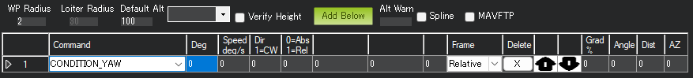
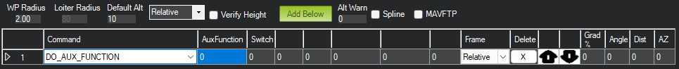
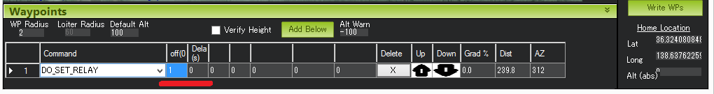

.. _mission-command-list:

===========================
Copter Mission Command List
===========================

This page provides details of all the mission commands 
(i.e. `MAVLink commands <https://mavlink.io/en/messages/common.html#MAV_CMD_NAV_WAYPOINT>`__) supported by Copter that can be run as part of a mission (see :ref:`AUTO flight mode <auto-mode>`).

Each of the commands below is either a "Navigation" command or a "Do" command.  Navigation commands (e.g. "TakeOff" and "Waypoint") affect the
location of the vehicle while "Do" commands (e.g. "Do-Set-Servo" and "Do-Cam-Trigg-Dist") are for auxiliary functions and do not affect the
vehicle's position.

During a mission at most one "Navigation" command and one "Do" command can be running at one time.  The "Do" commands will
be run in order as soon as the preceding navigation command before them completes.  For more information on setting up missions please refer to the
:ref:`Planning a Mission with Waypoints and Events <common-planning-a-mission-with-waypoints-and-events>` page.

Takeoff
~~~~~~~

.. image:: ../../../images/TakeOff.jpg
    :target: ../_images/TakeOff.jpg

The vehicle will climb straight up from its current location to the
altitude specified (in meters). This should be the first command of
nearly all missions. If the mission is begun while the copter is already
flying, the vehicle will climb straight up to the specified altitude, if
the vehicle is already above the specified altitude the takeoff command
will be ignored and the mission will move onto the next command
immediately.

Waypoint
~~~~~~~~

.. image:: ../../../images/WayPoint.jpg
    :target: ../_images/WayPoint.jpg

The vehicle will fly a straight line to the location specified as a lat,
lon and altitude (in meters).

**Delay** - the amount of time to wait (in seconds) at the waypoint
before proceeding to the next command

**Hit Rad** - not supported - meant to hold the distance (in meters)
from the target point that will qualify the waypoint as complete. This
command is not supported. Instead, the :ref:`WPNAV_RADIUS<WPNAV_RADIUS>` parameter should be
used (see "WP Radius" field in the above screenshot or adjust through the
Standard Parameters List).  Even the :ref:`WPNAV_RADIUS<WPNAV_RADIUS>` is only used when the
waypoint has a Delay. With no delay specified the waypoint will be
considered complete when the virtual point that the vehicle is chasing
reaches the waypoint. This can be 10m (or more) ahead of the vehicle
meaning that the vehicle will turn towards the following waypoint long
before it actually reaches the current waypoint

**Yaw Ang** - not supported - meant to hold the resulting yaw angle in
degrees (0=north, 90 = east). Instead use a
:ref:`CONDITION_YAW <mission-command-list_condition-yaw>` command.

**Lat, Lon** - the latitude and longitude targets.  If left as zero, current location will be substituted for waypoint location, making it appear as if the waypoint is simply skipped.

**Alt** - the target altitude above home in meters.  If left as zero it
will hold the current altitude.

Spline Waypoint
~~~~~~~~~~~~~~~

.. image:: ../../../images/MissionList_SplineWaypoint.jpg
    :target: ../_images/MissionList_SplineWaypoint.jpg

`Spline <https://en.wikipedia.org/wiki/Spline_%28mathematics%29>`__ waypoints take all the same arguments as regular waypoints (lat, lon, alt, delay) but when executed the vehicle will fly smooth paths (both vertically and horizontally) instead of straight lines.  Spline waypoints can be mixed with regular straight line waypoints as shown in the image above.

The Mission Planner shows the path the vehicle will take.  The image
above shows some characteristics of the spline

-  The 1 second delay at the end of Waypoint #1 causes the vehicle to
   stop so Spline command #2 begins by taking a sharp 90degree turn
-  The direction of travel as the vehicle passes through Spline Waypoint
   #3 is parallel to an imaginary line drawn between waypoints #2 and #4
-  Waypoint #5 is a straight line so the vehicle lines itself up to
   point towards waypoint #5 even before reaching waypoint #4.

Loiter_Time
~~~~~~~~~~~

.. image:: ../../../images/MissionList_LoiterTime.png
    :target: ../_images/MissionList_LoiterTime.png

The vehicle will fly to and then wait at the specified location for the
specified number of seconds.  This is the same as a Waypoint command.

**Times** - the number of seconds to remain at the location.

**Lat, Lon** - the latitude and longitude targets. If left as zero it
will hold at the current location.

**Alt** - the target altitude above home in meters. If left as zero it
will hold at the current altitude.

Loiter_Turns
~~~~~~~~~~~~

The mission equivalent of the :ref:`Circle flight mode <circle-mode>`.  Loiter (circle) the specified location for at least the specified number of complete turns, and then proceed to the next command upon intersection of the course to it with the circle's perimeter. If zero is specified for a latitude/longitude/altitude parameter then the current location value
for the parameter will be used. Fractional turns between
0 and 1 are supported, while turns greater than 1 must be integers.

The radius of the circle is controlled by the command parameter. A radius of 0 will result in the copter loitering at the location and pirouetting the specified number of turns. Negative radius values result in counter-clockwise turns instead of clockwise turns. Radius values over 255 meters will be rounded down to the nearest 10 meter mark
.

**Turn** - the number of full rotations to complete around the point.

Fractional turns between 0 and 1 are supported, while turns greater than 1 must be integers.

**Radius** - Loiter radius around waypoint. Units are in meters.

**Lat, Lon** - the latitude and longitude targets.  If left as zero it
will circle around the current location.

**Alt** - the target altitude above home in meters.  If left as zero it
will circle at the current altitude.

Loiter_Unlimited
~~~~~~~~~~~~~~~~

.. image:: ../../../images/MissionList_LoiterUnlimited.png
    :target: ../_images/MissionList_LoiterUnlimited.png

The vehicle will fly to and then wait at the specified location
indefinitely.  The mission will not proceed past this command.

**Lat, Lon** - the latitude and longitude targets. If left as zero it
will wait at the current location.

**Alt** - the target altitude above home in meters. If left as zero it
will wait at the current altitude.

Return-To-Launch
~~~~~~~~~~~~~~~~

.. image:: ../../../images/MissionList_RTL.png
    :target: ../_images/MissionList_RTL.png

Mission equivalent of the :ref:`RTL flight mode <rtl-mode>`.  As
described on the RTL flight mode wiki page, the vehicle will first climb
to the :ref:`RTL_ALT<RTL_ALT>` parameter's specified altitude (default is 15m) before
returning home.  The home location is where the vehicle was last armed.

This command takes no parameters and generally should be the last
command in the mission.

Land
~~~~

.. image:: ../../../images/MissionList_Land.png
    :target: ../_images/MissionList_Land.png

The vehicle will land at its current location or at the lat/lon coordinates
provided.  This is the mission equivalent of the :ref:`LAND flight mode <land-mode>`.

**Lat, Lon** - the latitude and longitude targets. If left as zero it
will land at the current location.

Delay
~~~~~

The vehicle will remain at its current location until the specified number of seconds has passed or the absolute time is reached.
The first column ("Seconds") holds the number of seconds to delay.  Set to -1 if this field should be ignored.
The "hour UTC", "minute UTC" and "second UTC" fields can be used to specify an absolute time (`UTC <https://en.wikipedia.org/wiki/Coordinated_Universal_Time>`__).  The example above will cause the vehicle to take-off at 1:30pm UTC.  Note that the hour and/or minute field can also be ignored by setting them to -1.

This is a video made during the development of this feature.  Note in the video CONDITION_DELAY command is used but in its final version, this DELAY command should be used.

..  youtube:: 9VK3yjIyCSo
    :width: 100%

Payload Place
~~~~~~~~~~~~~

The vehicle flies to the specified location and descends until it senses (using motor output) that the package has reached the ground.  The gripper is then released to unload the package and ascend back to the waypoint altitude.
The first column ("Max Desc") holds the maximum descent (in meters) that the vehicle should descend.  If the package has still not reached the ground despite this descent, the package will not be released and the vehicle will return to  the waypoint altitude and advance to the next mission command.
Parameters controlling this operation (besides :ref:`Gripper parameters <common-gripper-landingpage>`) are:

- :ref:`PLDP_SPEED_DN<PLDP_SPEED_DN>`: Descent speed, once the waypoint is reached, is either :ref:`LAND_SPEED<LAND_SPEED>` or this value, if non-zero.
- :ref:`PLDP_THRESH<PLDP_THRESH>`: The percentage of thrust decrease that indicates payload touch-down. The reference thrust is measured over the first two seconds of descent.
- :ref:`PLDP_RNG_MAX<PLDP_RNG_MAX>`: If non-zero, the maximum release height over ground obtained from a downward facing rangerfinder. Automatic gripper release can occur only if below this altitude above ground in addition to thrust reduction being obtained. If this value is non zero and no rangefinder is present, the place will be aborted and the vehicle will ascend and proceed to the next waypoint. 
- :ref:`PLDP_DELAY<PLDP_DELAY>`: Delay in seconds after release the vehicle will remain in position after release before ascending. This allows payload replacement if the gripper is set to re-engage after a delay (see :ref:`GRIP_AUTOCLOSE<GRIP_AUTOCLOSE>`)

..  youtube:: m4GK4ALqluc
    :width: 100%

Attitude Time
~~~~~~~~~~~~~

Vehicle maintains the specified roll, pitch, yaw angle and climb rate for the specified time.  GPS is not required while this command is being executed

- **Roll**: positive is lean right, negative is lean left
- **Pitch**: positive is lean back, negative is lean forward
- **Yaw**: 0 is North, 90 is East, 180 is South, 270 is West
- **ClimbRate**: in m/s but most ground stations incorrectly scale this parameter so it is best to leave at 0m/s

..  youtube:: cli1zmPoz3U
    :width: 100%

Script Time
~~~~~~~~~~~

Lua script runs for the specified time after which it will move onto the next command.  "command", "arg1" and "arg2" arguments are interpreted by the script.
The demonstration below used this SCRIPT_TIME command to execute the "fast descent" script from within Auto mode.

..  youtube:: YD50BxeQm84
    :width: 100%

.. _mission-command-list_do-set-roi:

Do-Set-ROI
~~~~~~~~~~

.. image:: ../../../images/MissionList_DoSetRoi.jpg
    :target: ../_images/MissionList_DoSetRoi.jpg

Points the nose of the vehicle or :ref:`camera gimbal <common-cameras-and-gimbals>` at the "region of interest".  In the example above the nose or camera would be pointed at the red marker.

The nose will continue to point at the red marker until the end of the mission OR "clear" the do-set-roi and cause the vehicle to return to its default behaviour (i.e. pointing at the next waypoint) by adding a second DO_SET_ROI command later in the mission with all zero for Lat, Lon, and Alt.

**Lat, Lon** - the latitude and longitude targets.

**Alt** - the target altitude above home in meters.

..  youtube:: W8NCFHrEjfU
    :width: 100%
    
Condition-Delay
~~~~~~~~~~~~~~~

.. image:: ../../../images/MissionList_ConditionDelay.png
    :target: ../_images/MissionList_ConditionDelay.png

Delays the start of the next "Do" command for the specified number of
seconds. In the example above, Command #4 (Do-Set-Roi) is delayed so
that it only starts 5 seconds after the vehicle has passed Waypoint #2.
Note: this command does not stop the vehicle. Also note that the delay
timer is only active until the next waypoint is reached, so if the "Do"
command hasn't been triggered by then it never will be.

**Time (sec)** - the time to delay the next "Do" command in seconds.

Condition-Distance
~~~~~~~~~~~~~~~~~~

.. image:: ../../../images/MissionList_ConditionDistance.png
    :target: ../_images/MissionList_ConditionDistance.png

Delays the start of the next "Do" command until the vehicle is within
the specified number of meters of the next waypoint. In the example
above, Command #4 (Do-Set-Roi) is delayed so that it only starts once
the vehicle is within 50m of waypoint #5. Note: this command does not
cause the vehicle to stop or pause during the mission, it only affects
"Do" commands.

**Dist (m)** - how close the vehicle should be to the next waypoint (in
meters) before beginning the next "Do" command.

.. _mission-command-list_condition-yaw:

Condition-Yaw
~~~~~~~~~~~~~

Point the nose of the vehicle to the specified heading by a specified
amount.

**Deg** - the desired heading in degrees (0 = North, 90 = East, etc)
when "rel/abs" field is "0" (meaning absolute)

OR the change in heading (in degrees) when "rel/abs" field is "1"
(meaning relative)

**Speed deg/s** - the rotation speed (in deg/sec)
as the vehicle turns to the desired heading

**Dir 1=CW** - Used to denote the direction of rotation to achieve the target angle (1=CW, -1=CCW, 0= the vehicle will always turn in direction that most quickly gets it to the new target heading, but only when "rel/abs" = "0",).

**rel/abs (0=Abs, 1=Rel)** - allows specifying the heading (i.e "Deg" field) as an
absolute heading (if "0") or relative to the current heading (if "1")

Do-Jump
~~~~~~~

.. image:: ../../../images/MissionList_DoJump.png
    :target: ../_images/MissionList_DoJump.png

Jump to the specified mission command the specified number of times
before continuing with the mission.  In the example above the vehicle
would fly back-and-forth between waypoints #1 and #2 a total of 3 times
before flying on to waypoint #4.

**WP #** - the mission command to jump to.

**Repeat** - the maximum number of times we should perform the jump. -1
means always jump

Despite the name, Do-Jump is really a "Nav" command rather than a "Do"
command, so conditional commands like CONDITION_DELAY won't affect
Do-Jump, it will always perform the jump as soon as it hits that
command.

.. warning::

   No more that one hundred (100) Do-Jump commands can be used in a mission. This value is further reduced to fifteen (15) Do-Jump commands for boards with less than 500kb of ram. Subsequent Do-Jumps will be ignored.

Do-Aux-Function
~~~~~~~~~~~~~~~

Allows any :ref:`auxiliary function <common-auxiliary-functions>` to be executed from within a mission without setting up an auxiliary switch.  The "AuxFunction" field should be set to the "RCx_OPTION value" from the linked page.  The "Switch" fields corresponds to the auxiliary function switch position with "0" meaning "low", "1" meaning "middle" and "2" meaning high.

Do-Change-Speed
~~~~~~~~~~~~~~~

.. image:: ../../../images/MissionList_DoChangeSpeed.png
    :target: ../_images/MissionList_DoChangeSpeed.png

Change the desired maximum speed (in meters/sec) of the vehicle.  Normally the "Type" field is left at 0 meaning the horizontal speed is set.

**Type** - 0:ground speed, 1:airspeed(if available) 2:climb rate, 3:descent rate

**Speed m/s** - the desired maximum speed in meters/second.

Do-Set-Home
~~~~~~~~~~~

.. image:: ../../../images/MissionList_DoSetHome.png
    :target: ../_images/MissionList_DoSetHome.png

This command should be avoided if possible and instead use :ref:`Rally Points <common-rally-points>` which can also control the position used for Return-To-Launch.

**Current(1)/Spec(0)** - if "1" use the current location as the new home, if "0" use the specified Lat and Lon coordinate (not labelled yet!)

**Lat, Lon** - the latitude and longitude targets.

Do-Set-Cam-Trigg-Dist
~~~~~~~~~~~~~~~~~~~~~

.. image:: ../../../images/MissionList_DoSetCamTriggDist.png
    :target: ../_images/MissionList_DoSetCamTriggDist.png

Trigger the :ref:`camera shutter <common-camera-shutter-with-servo>`
at regular distance intervals. For example the command above will cause
the camera shutter to trigger after every 5m that the vehicle travels.

**Dist (m)** - distance interval in meters.

To stop the camera from triggering, add a DO_SET_CAM_TRIGG_DIST later in the mission with Dist = 0

.. _mission-command-list_do-set-relay:

Do-Set-Relay
~~~~~~~~~~~~

Set a :ref:`Relay <common-relay>` pin's voltage high or low.  The
columns are mislabeled in the Mission Planner (issue here).

**First column is Relay number** : 0 = First Relay, 1 = Second Relay

**Second column is On/Off** : 0 = Off (i.e. 0V), 1 = On (i.e. 3.3V on
most autopilots)

Do-Repeat-Relay
~~~~~~~~~~~~~~~

.. image:: ../../../images/MissionList_DoRepeatRelay.png
    :target: ../_images/MissionList_DoRepeatRelay.png

Toggle the :ref:`Relay <common-relay>` pin's voltage a specified number of
times. In the example above, assuming the relay was off to begin with,
it would be set high and then after 3 seconds it would be toggled low
again.

**First column is Relay number** : 0 = First Relay, 1 = Second Relay

**Repeat #** : how many times the relay should be toggled

**Delay(s)** - Number of seconds between each toggle.

Do-Set-Servo
~~~~~~~~~~~~

.. image:: ../../../images/MissionList_DoSetServo.png
    :target: ../_images/MissionList_DoSetServo.png

Move a :ref:`servo <common-servo>` to a particular PWM value. In the
example above, the servo attached to output channel 8 would be moved to
PWM 1700 (servo's generally accept PWM values between 1000 and 2000).

**Ser No** : the output channel the servo is attached to

**PWM** : PWM value to output to the servo

Do-Repeat-Servo
~~~~~~~~~~~~~~~

.. image:: ../../../images/MissionList_DoRepeatServo.png
    :target: ../_images/MissionList_DoRepeatServo.png

Repeatedly move a :ref:`servo <common-servo>` back and forth between
its mid position and a specified PWM value. In the example above, the
servo attached to output channel 8 would be moved to PWM 1700, then
after 4 seconds, back to mid (default is 1500 which is held in the
:ref:`RC8_TRIM<RC8_TRIM>` parameter), after another 4 seconds it would be moved to 1700
again, then finally after 4 more seconds it would be moved back to mid.

**Ser No** : the output channel the servo is attached to

**PWM** : PWM value to output to the servo

**Repeat #** : Number of times to move the servo to the specified PWM
value

**Delay (s)** : the delay in seconds between each servo movement

Do-Digicam-Control
~~~~~~~~~~~~~~~~~~

.. image:: ../../../images/MissionList_DoDigicamControl.png
    :target: ../_images/MissionList_DoDigicamControl.png

Trigger the :ref:`camera shutter <common-camera-shutter-with-servo>` once.  The "Shutter Cmd" field should be set to "1".

Do-Fence-Enable
~~~~~~~~~~~~~~~~~~

Enable(1) or Disable(0) the Copter :ref:`common-ac2_simple_geofence` and/or Copter :ref:`common-polygon_fence`. This command takes no additional arguments.

Do-Gimbal-Manager-PitchYaw
~~~~~~~~~~~~~~~~~~~~~~~~~~

Moves the :ref:`camera gimbal <common-cameras-and-gimbals>` to the desired pitch and yaw angles (in degrees).  Positive pitch angles are up, Negative are down.  Positive yaw angles are clockwise, negative are counter clockwise.   If the "Flags" field is "0" the yaw angle is in "body frame" (e.g. 0 is forward).  If "Flags" is "16" the yaw angle is in "earth frame" (e.g. 0 is North).

Alternatively Pitch Rate and Yaw Rate fields can be used to move the gimbal at a specified rate in deg/sec.  A Condition-Delay for a few seconds followed by another Do-Gimbal-Manager-PitchYaw should be used to eventually stop the gimbal from rotating.

Do-Mount-Control
~~~~~~~~~~~~~~~~

.. image:: ../../../images/MissionList_DoMountControl.png
    :target: ../_images/MissionList_DoMountControl.png

Controls the roll, pitch and yaw angle of the :ref:`camera gimbal <common-cameras-and-gimbals>`. This can be used to point the camera in specific directions at various times in the mission.

Do-Gripper
~~~~~~~~~~

.. image:: ../../../images/MissionList_DoGripper.png
    :target: ../_images/MissionList_DoGripper.png

This command allows opening and closing a :ref:`servo gripper <common-gripper-servo>` or :ref:`EPM gripper <common-cameras-and-gimbals>`.
Set the "drop/grab" column to 0 to close the gripper, 1 to open the gripper.  The first column, "Gripper No" is ignored because we currently only support a single gripper per vehicle.

Do-Winch
~~~~~~~~

This command allows controlling a :ref:`winch <common-daiwa-winch>` to raise or lower a package.

- "winch no" is not used
- "action" should be 0 to relax the winch, 1 for Length control, 2 for Rate control
- "length" should be filled in with the meters of line to release.  Positive numbers release the line, negative retract the line.  Note "action" should be "1".
- "rate" should be filled in with the speed (in m/s) to release the line.  Positive numbers release the line, negative retract the line.  Note "action" should be "2".
