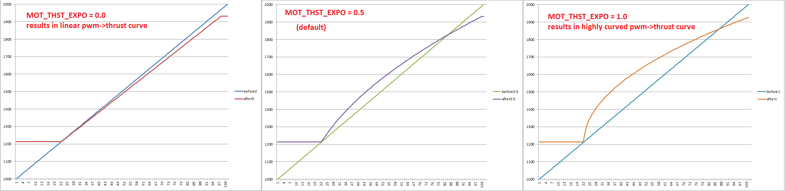

.. _motor-thrust-scaling:

====================
Motor Thrust Scaling
====================

Copter includes *motor thrust scaling* which compensates for the
non-linear thrust output of most ESCs and motors. 

.. tip::

    The default curve should work for nearly all ESC/motor combinations. 
    Normally the parameters should not be adjusted unless the vehicle’s actual 
    thrust curve has been measured.

.. note::

    Motor thrust scaling was introduced in Copter 3.3.

Thrust Curves
=============

The curve is controlled by two parameters:

-  **MOT_THST_EXPO** controls the shape of the thrust curve with "0"
   meaning a completely linear curve and "1.0" being very curved (see
   pictures below).  The default is "0.65" (the image below incorrectly
   states the default is 0.5).

-  **MOT_THST_MAX** controls the point at which the thrust flattens
   out near it's maximum.  By default this is 0.95 meaning 95% of full
   throttle.

MatLab example code
===================

This MatLab example code can be used to calculate the appropriate value
for ``MOT_THST_EXPO`` based on measured thrust values.

Fill in the ``thrust`` array with the actual measured thrust values from
the vehicle.  When Run, the ``MOT_THST_EXPO`` value will be printed.

::

    throttle_pwm = [1000; 1100; 1200; 1300; 1400; 1500; 1600; 1700; 1800; 1900; 2000];
    thrust = [0; 68.9; 203.1; 441.0; 785.8; 1177.3; 1655.0; 2118.8; 2673.0; 3153.8; 3490.2];
    % Set MOT_THST_MAX to 90% to remove saturated top end
    working_range = 1:9;
    thrust = thrust(working_range);

    % Normalise the throttle and thrust
    throttle_normalised = (throttle_pwm(working_range) - min(throttle_pwm(working_range)))./(max(throttle_pwm(working_range))-min(throttle_pwm(working_range)));
    thrust_normalised = thrust./max(thrust);
    % Perform a least squares fit to solve for a in thrust = (1-a)*throttle + a*throttle^2
    mdl = @(a,x)((1-a(1))*x + a(1)*x.^2);
    startingVals = [0.5];
    coefEsts = nlinfit(throttle_normalised, thrust_normalised, mdl, startingVals);
    disp(['MOT_THST_EXPO is : ', num2str(coefEsts)]);
    figure(2)
    hold on;
    plot(throttle_normalised, thrust_normalised, '*');
    xgrid = linspace(0,1,100);
    line(xgrid, mdl(coefEsts, xgrid), 'Color','g','LineWidth',4);
    xlabel('Normalised Throttle');
    ylabel('Normalised Thrust');

