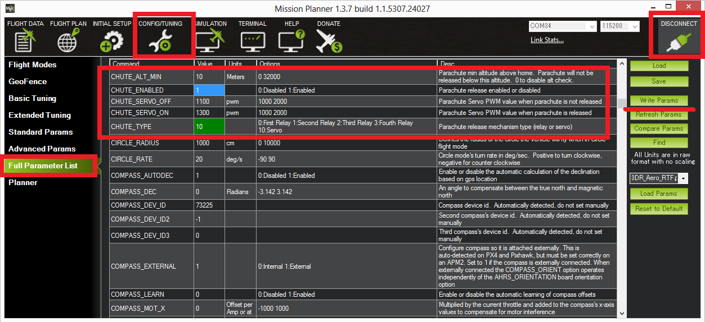
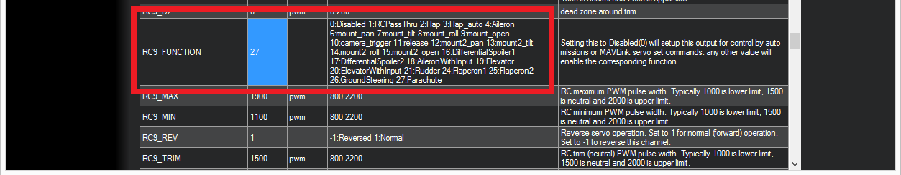
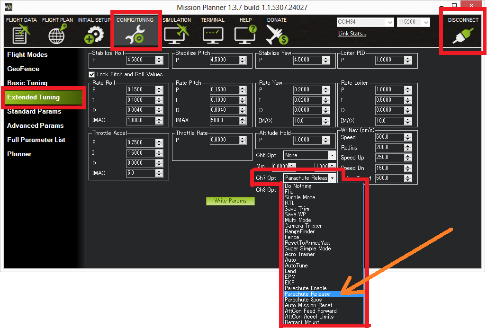

.. _parachute:

=========
Parachute
=========

This topic describes how to set up manual and automatic parachute
release.

.. warning::

   A parachute ejection can be dangerous.  This feature should be used with caution

..  youtube:: KmjPZIQ9c0A
    :width: 100%

Video above is from Henri's `DIYDrones discussion that led to this feature being added to Copter <https://diydrones.com/forum/topics/diy-parachute-deployment-mechanism-for-multicopter>`__.

What you will need
==================

A complete parachute mechanism like one of these:

-  `SkyCat <https://www.skycat.pro/shop/>`__
-  `CAD Drones <http://store.caddrones.com/products>`__

OR if you prefer a DIY solution, parachute release mechanism that can be
triggered by a PWM signal (i.e. a Servo) and a parachute large enough to
slow your multicopter's decent to less than 5m/s. Some recommended
parachute vendors:

-  `Fruity Chutes <https://fruitychutes.com/uav_rpv_drone_recovery_parachutes.htm>`__
-  `Opale Paramodels <https://www.opale-paramodels.com/fr/57-parachutiste-rc>`__
-  `Mars Mini <http://1uas.com/Gears/Parachutes-Protection-System/Mars-Mini>`__

Connecting to the Autopilot
===========================

The parachute release mechanism can be triggered from either a Relay or a PWM (i.e. Servo) but because of `an issue with the Relay pins being pulled high at start-up <https://github.com/ArduPilot/ardupilot/issues/1239>`__, 
we recommend using PWM, in particular any of the Pixhawk's AUX OUT 1 to 4 pins.

.. image:: ../images/Parachute_Pixhawk.jpg
    :target: ../_images/Parachute_Pixhawk.jpg

Setup through the mission planner
=================================

To configure the parachute release please first connect with the Mission
Planner and then open the Config/Tuning >> Full Parmeter List page and
set the following parameters.

-  :ref:`CHUTE_ENABLED <CHUTE_ENABLED>` = "1"
-  :ref:`CHUTE_TYPE <CHUTE_TYPE>` = "10" to release with a servo
-  :ref:`CHUTE_SERVO_ON <CHUTE_SERVO_ON>` should be set to the servo position required to release the parachute
-  :ref:`CHUTE_SERVO_OFF <CHUTE_SERVO_OFF>` should be the "resting" servo position.  I.e. the position the servo is in before the parachute is released
-  set :ref:`SERVO9_FUNCTION <SERVO9_FUNCTION>` = "27".  `SERVO9_` refers to the Pixhawk's AUX OUT 1.  To use AUX OUT2 instead set :ref:`SERVO10_FUNCTION <SERVO10_FUNCTION>` to 27, etc.
-  :ref:`CHUTE_CRT_SINK<CHUTE_CRT_SINK>` should be set to the sink rate in m/s that will trigger the chute release.

.. note:: :ref:`CHUTE_CRT_SINK<CHUTE_CRT_SINK>` has a bug that will be fixed in future releases which prevents the parachute from being triggered if the vehicle falls in a level attitude, no matter how fast.

Setup Ch7 to manually deploy the parachute from the Mission Planner's
Extended Tuning page.

When will the parachute deploy?
===============================

When the "Crash Check" feature determines that the vehicle has lost
attitude control and has begun falling, the motors will be stopped and
the parachute will deploy automatically.  The following must all be true
for a full 2 seconds for the crash checker to trigger the parachute
release:

-  The motors are armed
-  The vehicle is not "landed" (the vehicle will consider itself landed
   if the output throttle is less than 25%, the motors have hit their
   lower limit, the vehicle is not rotating by more than 20deg/sec and
   the pilot is not requesting a climb.  All this must be true for 1
   second for the vehicle to consider itself landed)
-  The vehicle is not in FLIP or ACRO flight mode
-  the roll and/or pitch angle of the vehicle is 20 degrees off from the
   target lean angle
-  the barometer shows the vehicle is not climbing
-  the vehicle is above the :ref:`CHUTE_ALT_MIN <CHUTE_ALT_MIN>` altitude

..  youtube:: xaw3-oSahtE
    :width: 100%

Testing the chute
=================

Depending upon the release mechanism a parachute deployment can be
dangerous so please take care when performing these tests, removing the
parachute and vehicle propellers as is appropriate.

To test manual deployment:

-  Set the :ref:`CHUTE_ALT_MIN <CHUTE_ALT_MIN>` parameter to zero to disable the minimum
   altitude check
-  Arm the vehicle in stabilize mode and raise the throttle above
   minimum
-  move the Ch7 switch to the high position

You should see the motors stop, the parachute servo move and if
telemetry is attached, "Parachute: Released!" should appear on the
Flight Data screen's HUD.

To test the automatic deployment:

-  Set the :ref:`CHUTE_ALT_MIN <CHUTE_ALT_MIN>` parameter to zero to disable the minimum
   altitude check
-  Arm the vehicle in stabilize mode and raise the throttle above
   minimum
-  somehow tilt the vehicle over by at least 20 degrees

After 2 seconds, the motors should stop, the parachute servo will move
and if telemetry is attached, "Parachute: Released!" should appear on
the Flight Data screen's HUD.

After the test is complete, return the :ref:`CHUTE_ALT_MIN <CHUTE_ALT_MIN>` to the desired
altitude (default is 10m)
