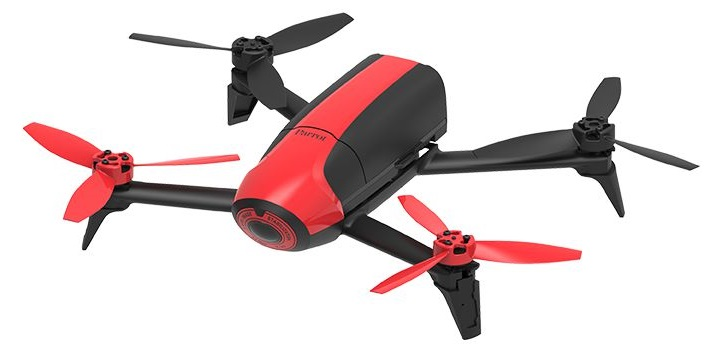

.. _parrot-bebop-autopilot:

======================
Parrot Bebop Autopilot
======================

The Parrot `Bebop2 <https://www.parrot.com/global/drones/parrot-bebop-2-fpv>`__ is a Wifi controlled quadrotor UAV that uses a Linux autopilot which can run ArduPilot firmware.  
Instructions for converting a Bebop to run ardupilot are :ref:`here <dev:building-for-bebop-2>`.  
We recommend the Bebop2 over the original Bebop because of its much improved GPS.

.. note::

   Copter support was added in Copter-3.3.

Specifications
==============

-  **Processor**

   -  Parrot P7 dual-core CPU Cortex 9 with quad core GPU
   -  8GB flash

-  **Sensors**

   -  MPU6050 for accelerometers and gyroscope (I2C)
   -  AKM 8963 compass
   -  MS5607 barometer
   -  `Furuno GN-87F GPS <https://www.furuno.com/en/products/gnss-module/GN-87>`__
   -  Sonar
   -  Optical-flow
   -  HD camera

-  **Interfaces**

   -  1x UART serial ports
   -  USB
   -  Built-in Wifi

-  **Dimensions**

   -  33x38x3.6cm (with hull)
   -  400g (with hull)

-  **OS**

   -  Linux (Busybox)

.. note::

   Some of this information was taken from the `Paparazzi UAV wiki page on the Bebop <http://wiki.paparazziuav.org/wiki/Bebop>`__.

Video of Bebop flying Copter-3.3
================================

..  youtube:: IUzM7Ln_MZE
    :width: 100%

Firmware upload process
=======================

..  youtube:: Ir0DyvlbTM0
    :width: 100%
