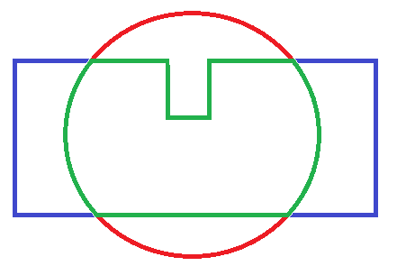

.. _polygon_fence:

===============
Polygon Fence
===============

Overview
========

Copter 3.4 (and higher) include support for a polygon fence with up to 84 points.  The purpose of this fence is to attempt to stop your vehicle from flying out of the polygon by initiating an RTL or, if flying in Loiter mode, the vehicle will normally stop before breaching the fence.  This feature is an extension of the simpler :ref:`circular fence <ac2_simple_geofence>`.

.. note::

   The Polygon fence was introduced in Copter 3.4.

..  youtube:: U3Z8bO3KbyM
    :width: 100%

Enabling the Fence in Mission Planner
=====================================

..  youtube:: SEm4nVfbg00
    :width: 100%

-  Connect your Flight controller to the Mission Planner
-  Go to the **Config/Tuning \| GeoFence** screen
-  Click "Enable" and set Type to "All" or another option that includes "Polygon"

   .. image:: ../images/polygon_fence_enable.png
       :target: ../_images/polygon_fence_enable.png
       :width: 500px

-  Leave the Action as "RTL or Land"
-  Go to the **Flight Plan** screen
-  Right-mouse-button click on the map and select "Draw Polygon" >> "Add Polygon Point"
-  Click on other points on the map to define the polygon

   .. image:: ../images/polygon_add_point.png
       :target: ../_images/polygon_add_point.png
       :width: 500px

-  After the polygon has been defined you must Right-mouse-button click and "Draw Polygon" >> "Set Return Location".  This location is not actually used by copter but it must be set because the same underlying library is used as Plane.

   .. image:: ../images/polygon_add_return_point.png
       :target: ../_images/polygon_add_return_point.png
       :width: 500px

-  Upload the polygon fence to the vehicle using Right-mouse-button click and "Geo Fence" >> "Upload"

   .. image:: ../images/polygon_upload.png
       :target: ../_images/polygon_upload.png
       :width: 500px

Combining with the Circular and Altitude fences
===========================================

The polygon fence can be used in combination with the :ref:`circular and altitude fences <ac2_simple_geofence>` and the failsafe behaviour (i.e. stop at the fence or RTL) will trigger at whichever barrier the vehicle reaches first (i.e. the green line shown below)

Please see the :ref:`circular fence <ac2_simple_geofence>` page for additional warnings and instructions including how to enable/disable the fence with the ch7/ch8 auxiliary switches.

