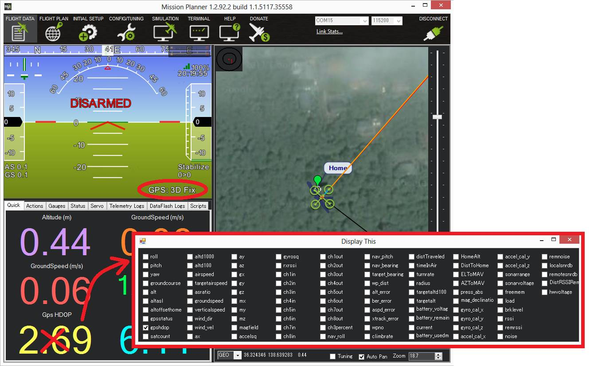

.. _poshold-mode:

============
PosHold Mode
============

The PosHold flight mode is similar to Loiter in that the vehicle maintains a constant
location, heading, and altitude but is generally more popular because
the pilot stick inputs directly control the vehicle's lean angle
providing a more "natural" feel.

Overview
========

When switched on, PosHold mode will automatically attempts to maintain
the current location, heading and altitude. Good GPS position, :ref:`low magnetic interference on the compass <common-diagnosing-problems-using-logs_compass_interference>`\ and
:ref:`low vibrations <common-diagnosing-problems-using-logs_vibrations>`
are all important in achieving good loiter performance.

..  youtube:: O5lEUo7w0bY#t=117
    :width: 100%

Controls
========

The pilot can control the copter's location horizontally and vertically
with the control sticks.

-  Horizontal location can be adjusted with the the Roll and Pitch
   control sticks with the default maximum lean angle being 45 degrees
   (angle can be adjusted with the :ref:`ANGLE_MAX<ANGLE_MAX>` parameter). When the pilot
   releases the sticks the copter will lean back to bring the vehicle to
   a stop.
-  Altitude can be controlled with the Throttle control stick just as in
   :ref:`AltHold mode <altholdmode_controls>`
-  The heading can be set with the Yaw control stick
-  You may arm in PosHold mode but only once the GPS has 3D lock and the
   HDOP has dropped to 2.0 or lower.

On a Pixhawk the LED will become green (:ref:`more details on LED patterns here <common-apm-board-leds>`).

The HDOP value can be made clearly visible through the mission planner's
Quick screen by double clicking and then selecting "gpshdop" from the
large grid of checkboxes.

-  The maximum brake-angle can be set with the :ref:`PHLD_BRAKE_ANGLE<PHLD_BRAKE_ANGLE>`
   parameter (i.e. 3000 = the vehicle will lean back up to 30degrees)
-  The speed the vehicle rotates back to the maximum angle can be set
   with the :ref:`PHLD_BRAKE_RATE<PHLD_BRAKE_RATE>` parameter (i.e. 8 = rotates back at 8
   degrees per second))
