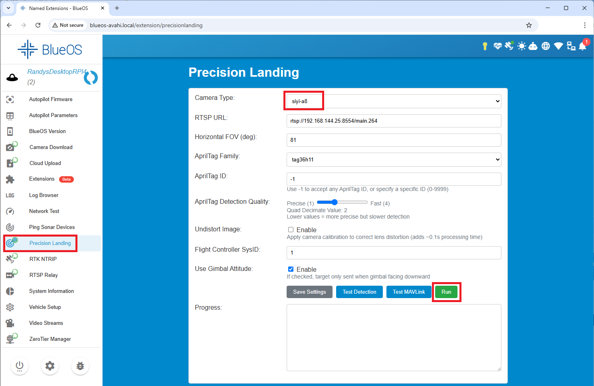

.. _precision-landing-blueos:

==================================
BlueOS Precision Landing Extension
==================================

`BlueOS's Precision Landing Extension <https://github.com/BlueOS-community/blueos-precision-landing>`__ allows a downward facing camera gimbal to be used to land precisely on a landing pad identified with an April Tag

..  youtube:: O0CkmTN1q5A
    :width: 100%

.. note::

   Support for this extension was added in ArduPilot-4.7

Hardware Required
-----------------

Please see :ref:`ArduPilot's BlueOS installation instructions <dev:companion-computer-blueos>` which also includes hardware recommendations.

Any :ref:`supported camera gimbal <common-cameras-and-gimbals>` with ethernet connectivity should work including the :ref:`Siyi <common-siyi-zr10-gimbal>`, :ref:`ViewPro <common-viewpro-gimbal>` and :ref:`XFRobot <common-xfrobot-gimbal>` camera gimbals.

The camera gimbal should be mounted on the underside of the vehicle and precision landing will only operate when the camera gimbal is pointing downwards.

Print an AprilTag for the landing pad.  `This online AprilTag generator <https://chaitanyantr.github.io/apriltag.html>`__ using the "tag36h11" tag family has been used successfully.

A :ref:`rangefinder <common-rangefinder-landingpage>` is also required.

BlueOS Extension Installation
-----------------------------

Once BlueOS has been :ref:`installed <dev:companion-computer-blueos>` on the companion computer:

- Ensure the companion computer is connected to the internet
- From the left menu, select "Extensions"
- Search for "precision landing" and push the "GET" and "INSTALL" buttons 

- From the left menu, select "Precision Landing"
- Select the "Camera Type" being used
- Optionally adjust the "Horizontal FOV" to match the camera gimbal's lens
- Set the "AprilTag Family" and "AprilTag ID" to the values used when printing the AprilTag
- Optionally reduce the "AprilTag Detection Quality" to improve detection speed at the cost of range (2 is normally a good value)
- Leave "Undistort Image" unchecked unless a very high powered companion computer is being used
- "Flight Controller SysID" should match the vehicle's :ref:`MAV_SYSID <MAV_SYSID>` parameter (normally 1)
- Press "Save Setting" buttons

- Place the tag infront of the camera and press the "Test Detection" button.  Within a few seconds an image from the camera should be displayed with the AprilTag highlighted in red.
- Press the "Run" button to run the precision landing algorithm continuously.  This is persistent meaning the algorithm will start automatically if the companion computer is rebooted.

AutoPilot Configuration
-----------------------

- Set :ref:`PLND_ENABLED <PLND_ENABLED>` = 1 (Enabled)
- Set :ref:`PLND_TYPE <PLND_TYPE>` = 1 (MAVLink)
- To improve performance set the :ref:`PLND_CAM_POS_X <PLND_CAM_POS_X>`, :ref:`PLND_CAM_POS_Y <PLND_CAM_POS_Y>`, and :ref:`PLND_CAM_POS_Z <PLND_CAM_POS_Z>` parameters.  For more details see the :ref:`sensor position offsets <common-sensor-offset-compensation>` page.

Flying and Testing
==================

Setup the vehicle with one of the flight modes set to RTL or Land mode.

Place the AprilTag on the ground and take-off to approximately 10m
above the target. Switch the vehicle to Land. If everything is working
properly, the copter should move toward the AprilTag.

.. tip::

   Be prepared to retake control in Stabilize, AltHold or Loiter if there are sudden unexpected movements

If the vehicle does not behave appropriately, download the dataflash logs and examine the PL messages.

-  If the "Heal" (meaning health) field is not "1" then there may be a communication issue between the autopilot and BlueOS
-  If the "TAcq" (meaning Target Acquired) field is not "1" then the sensor is not seeing the target.
-  The pX, pY values show the horizontal distance to the target from the vehicle.
-  The vX, vY values show the estimated velocity of the target relative to the vehicle.
