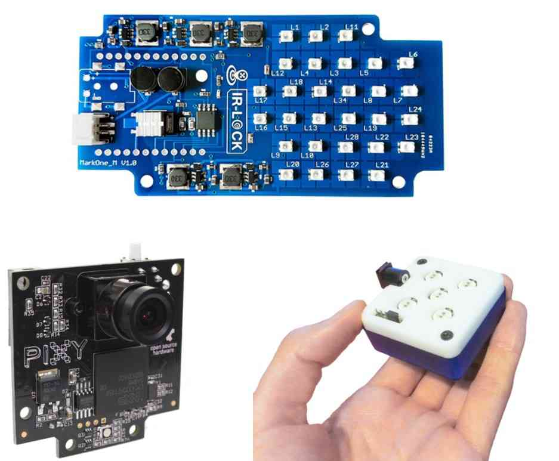

.. _precision-landing-with-irlock:

============================
Precision Landing and Loiter
============================

Overview
========

Copter supports Precision Landing using the `IR-LOCK sensor <https://irlock.com/collections/frontpage/products/ir-lock-sensor-precision-landing-kit>`__ and a :ref:`sonar or lidar <common-rangefinder-landingpage>`, or via `MAVLink LANDING_TARGET messages <https://mavlink.io/en/messages/common.html#LANDING_TARGET>`__ from a companion computer providing position differences from a target such as an `April tag <https://docs.wpilib.org/en/stable/docs/software/vision-processing/apriltag/apriltag-intro.html>`__.

Using this system, when the vehicle enters LAND mode (and has a position aiding source, such as GPS or Optical Flow) it is possible to reliably land within 30cm of an IR beacon that is moving at less than 1m/s (unless :ref:`PLND_OPTIONS<PLND_OPTIONS>` bit 0 is set to allow a moving landing target) .

Copter also supports Precision Loiter which allows a vehicle to maintain its position above a target while in Loiter mode.  The Pilot can enable this using one of the transmitter's :ref:`auxiliary function switches<common-auxiliary-functions>`.

..  youtube:: rGFO73ZxADY
    :width: 100%

Precision Loiter demonstration:

..  youtube:: KoLZpSZDfII
    :width: 100%

Operation
=========
Precision Landing, when enabled and active, will provide final positioning during the landing rather than via GPS data only.
If the landing target is lost (ie position updates with respect to it do not occur), if :ref:`PLND_STRICT<PLND_STRICT>` has been set appropriately, it will try and climb up to a location decided by :ref:`PLND_RET_BEHAVE<PLND_RET_BEHAVE>`. It will then try and come down again in hopes of seeing the landing target. It will keep doing this until :ref:`PLND_RET_MAX<PLND_RET_MAX>` retries have occurred. Then, depending on :ref:`PLND_STRICT<PLND_STRICT>`, it will either just land, or it will stay in the air hovering (useful for, say, landing on boats where you don’t really want to land on water).

Repositioning manually by the pilot during the landing will abort the landing unless :ref:`PLND_OPTIONS<PLND_OPTIONS>` bit 1 is set. Final landing speed may be reduced below :ref:`LAND_SPEED<LAND_SPEED>` as necessary to assure a precise touchdown. This can be disabled for a faster final land speed by setting :ref:`PLND_OPTIONS<PLND_OPTIONS>` bit 2.

..  youtube:: plM5BJY34Bc
    :width: 100%

Parameters
==========

- :ref:`PLND_ENABLED <PLND_ENABLED>` set to 1 to enable this feature, refresh parameters to see following:
- :ref:`PLND_TYPE <PLND_TYPE>` sets the type of landing position source, IR-LOCK, MAVLink LaANDING_TARGET messages,SITL, or GAZEBO sims. 0 disables.
- :ref:`PLND_XY_DIST_MAX<PLND_XY_DIST_MAX>` The vehicle will not start descending if the landing target is detected and it is further than this many meters away. Set 0 to always descend.
- :ref:`PLND_STRICT<PLND_STRICT>` How strictly should the vehicle land on the target if target is lost
- :ref:`PLND_TIMEOUT<PLND_TIMEOUT>` Time for which vehicle continues descend even if target is lost. After this time period, vehicle will attempt a landing retry depending on :ref:`PLND_STRICT<PLND_STRICT>` parameter.
- :ref:`PLND_RET_BEHAVE<PLND_RET_BEHAVE>` how the moves to last valid landing target report on a retry
- :ref:`PLND_ALT_MIN<PLND_ALT_MIN>` Vehicle will continue landing vertically even if target is lost below this height. This needs a rangefinder to work. Set to zero to disable this.
- :ref:`PLND_ALT_MAX<PLND_ALT_MAX>` Vehicle will continue landing vertically until this height if target is not found. Below this height if landing target is not found, landing retry/failsafe might be attempted. This needs a rangefinder to work. Set to zero to disable this.
- :ref:`PLND_OPTIONS<PLND_OPTIONS>` set bit 0 if landing target is moving, set bit 1 to allow the precision landing to continue after a manual reposition, and setting but 2 makes the landing descent profile similar to the normal land mode (i.e land mode without precision landing enabled usually has faster final descent)

Other ``PLND_`` parameters are provided to adjust for landing detector position on the vehicle, if needed.

MAVLink LANDING_TARGET Message Based Systems
============================================

Using a companion computer vision system with a system like `April tag <https://docs.wpilib.org/en/stable/docs/software/vision-processing/apriltag/apriltag-intro.html>`__, the position errors to the landing location can be be sent to the autopilot using `MAVLink LANDING_TARGET messages <https://mavlink.io/en/messages/common.html#LANDING_TARGET>`__ . 

`Here is an example system description: <https://discuss.ardupilot.org/t/precision-landing-with-realsense-t265-camera-and-apriltag-part-1-2/48978>`__

IR-LOCK Systems
===============

Where to get it
---------------

The `IR-LOCK sensor <https://irlock.com/collections/frontpage/products/ir-lock-sensor-precision-landing-kit>`__
can be purchased from `irlock.com <https://irlock.com/>`__.  The IR-LOCK
sensor is a modified version of the `Pixy camera <https://pixycam.com/pixy-cmucam5/>`__, which comes
pre-configured to work as an IR beacon detector. There are multiple IR
beacons which are compatible with the sensor. The `MarkOne Beacon <https://irlock.com/collections/markone>`__
can be reliably detected in **all** **lighting conditions**, with a
detection range of **15 meters**. `Beacon (V1.1) <https://irlock.com/collections/shop/products/beacon>`__ is a more
cost-effective option which can be reliably detected in **most lighting
conditions**.

   IR-LOCK Sensor and IR Beacons

Connecting to Autopilot
-----------------------

The IR-LOCK sensor can be connected directly to the autopiot via an `I2C cable <https://irlock.com/collections/shop/products/pixhawk-cable>`__. If
you are using multiple I2C sensors, then you will need an \ `I2C splitter <https://store.mrobotics.io/mRo-DF13-I2C-Bus-Splitter-for-Pixhawk-p/mro-df13-i2c-split-5-mr.htm>`__.
More detailed instructions are included in the `irlock.com Documentation <https://irlock.readme.io/docs>`__. 

Other ``PLND_`` parameters are provided to adjust for landing detector position on the vehicle, if needed.

.. figure:: ../images/precision_landing_connect_irlock_to_pixhawk.jpg
   :target: ../_images/precision_landing_connect_irlock_to_pixhawk.jpg

   IRLock sensor/Autopilot Wiring

Mounting to the frame
---------------------

The IRLOCK sensor should be mounted to the underside of the frame with
the camera lens pointing directly down toward the ground.  A mounting
bracket for IRIS is sold
`here <https://irlock.com/collections/frontpage/products/sensor-bracket-for-iris>`__
(and pictured below).  The sensor board should be oriented so that the
white button on the board points towards the front of the vehicle (or to
put it another way, the side closest to the camera lens should be
towards the front of the vehicle).

The image below shows the camera mounted on the *bottom* of a 3DR
IRIS+. It is probably best to mount the sensor as close as possible to
the autopilot, but successful tests have also been performed with
various mounting locations.

.. figure:: ../images/IRISbracket03.jpg
   :target: ../_images/IRISbracket03.jpg

   IR-LOCK Sensor Mounted onBottom of Iris+

..  youtube:: I8QF313F3bs
    :width: 100%

Setup through Mission Planner
-----------------------------

Set the following parameters through the Mission Planner (or other GCS)
to enable the precision landing feature and then Reboot the autopilot.

-  :ref:`PLND_ENABLED <PLND_ENABLED>` = 1
-  :ref:`PLND_TYPE <PLND_TYPE>` = 2

To enable Precision Loiter, an :ref:`Auxiliary Function Switch <common-auxiliary-functions>` must be set to 39 to enable "Precision Loiter"

-  in versions prior to  Copter-4.0, a CHx_OPT parameter could be set via Mision Planner to 39 for this enable.

Flying and Testing
------------------

Setup the vehicle with one of the flight modes set to LAND (as of the
time this wiki page was written, the precision landing function only
operates in LAND mode).

Place the IR beacon on the ground and take-off to approximately 10m
above the target.  Switch the vehicle to LAND.  If everything is working
properly, the copter should move toward the IR beacon.  A successful
demo is shown below (using an older firmware).

.. tip::

   Be prepared to retake control if there are sudden unexpected
   movements (Change mode to Stabilize, AltHold or Loiter).

If the vehicle does behave appropriately, download the dataflash logs
and examine the PL messages.

-  If the "Heal" (meaning health) field is not "1" then there may be a communication issue between the autopilot and IR-LOCK sensor.
-  If the "TAcq" (meaning Target Acquired) field is not "1" then the sensor is not seeing the target.
-  The pX, pY values show the horizontal distance to the target from the vehicle.
-  The vX, vY values show the estimated velocity of the target relative to the vehicle.

..  youtube:: IRfo5GcHniU
    :width: 100%
