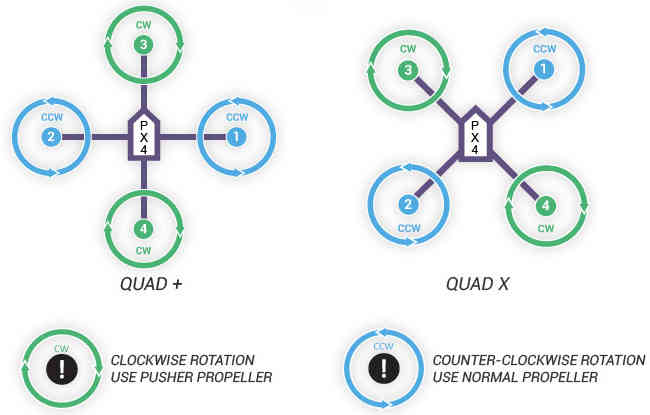

.. _px4fmu-only-wiring:

===============================================
Archived: Installing the PX4FMU on a QuadCopter
===============================================

.. warning::

   **ARCHIVED ARTICLE**

   This article is for creating a quadcopter using the PX4FMU
   only, which is one approach for creating a very small autopilot.
   `Arsovtech <http://arsovtech.com/?p=1447>`__ have created a small
   Pixhawk based board that is much more popular with the community.

Overview
~~~~~~~~

**Bill Of Materials:**

-  Copter firmware version 3.1 and later supports only the combined
   system of the PX4 FMU and PX4 IO board; the FMU-only system is no
   longer supported. Purchase a PX4 FMU kit from 3DRobotics LINK_BROKEN
   and a PX4 I/O board LINK_BROKEN
-  A special cable that fits into the PX4's main "Multi" connector will
   allow you to perform the primary wiring and it is available from
   3DRobotics LINK_BROKEN
-  If you choose, you can cut off the single pin connectors and solder
   directly to the necessary locations and trim back the excess wires.
-  Use the 4 supplied nylon standoffs to mount the PX4FMU to a piece of
   scrap plastic or fiberglass sheet the same size as the FMU.

   -  Mount the board to your copter with four 3/4" squares of Kyosho
      Zeal gel or double sided foam tape to provide vibration isolation.

**Mount your PX4-FMU board in a central location on top of your
QuadCopter.**

-  The PX4FMU board Normally has the SD card on top.
-  It can sometimes be advantageous to mount the PX4FMU with the other
   side up for better LED observation.
-  If you do mount the PX4FMU board with the Component side up it will
   be necessary to set the "Board Orientation (AHRS_ORIENTATION)"
   parameter to "Roll 180" in the Advanced Parameter List in Mission
   Planner.
-  The arrow labeled "FRONT" should be facing to the front of the
   aircraft (also the large black board interconnect connector).
-  If you use the vibration dampers suggested above it is best to put a
   small O-ring on top of the damper and under the PX4 Board before
   fastening it "gently" down with the supplied nuts to prevent damage
   to the board.
-  In fact, these dampers may not provide adequate damping and you
   should review the Wiki section on vibration control.

**Mount the GPS facing up with an unobstructed "view" of the sky**.

-  The GPS can be mounted on a short riser to give it the widest
   satellite access.

PX4-FMU Only Wiring Diagram for QuadCopters using a PPM-SUM receiver
~~~~~~~~~~~~~~~~~~~~~~~~~~~~~~~~~~~~~~~~~~~~~~~~~~~~~~~~~~~~~~~~~~~~

Wiring the PX4FMU Board to Your QuadCopter
~~~~~~~~~~~~~~~~~~~~~~~~~~~~~~~~~~~~~~~~~~

-  **Use heavy gauge wire to interconnect the ESC's Ground and power
   leads to a Battery Connector.**

   -  A Power Distribution board can also be used.

-  **Connect your BEC (5 volt power supply) power in leads to the
   battery input leads.**
-  

   -  Connect the the BEC Ground output to the PX4's Ground (Multi
      connector pin 15).
   -  Connect the BEC Power output to the PX4's power In (Multi
      connector pin 1).
   -  **NOTE!** Instead of a separate BEC as shown, the power and ground
      leads (signal side) from one of your ESCs that contains a BEC can
      be wired to the Multi connectors pins 1 and 15 to provide PX4
      board power.

-  **The PPM-SUM receiver may be wired with a connecting cable as shown
   in the diagram above.**

   -  Or the PPM-SUM signal and power and ground leads from the 15 pin
      DF13 "Multi" connector may be directly wired to a 3 pin
      servo/receiver connector.
   -  Connect your PPM-Sum RC receivers signal wire to pin 6 of the
      Multi connector on the PX4 board.
   -  Connect the PPM-SUM RC Receivers Ground lead to pin 15 of the
      Multi connector on the PX4 board.
   -  Connect the PPM-SUM RC Receivers Power lead to pin 1 of the Multi
      connector on the PX4 board.

-  **Wire the PX4FMU board's 4 servo out signals to the ESC control
   inputs.**

   -  The wires can be put together with connectors as shown in the
      diagram or solder and heat shrink tubing can be used.
   -  Wire PX4FMU PWM control 4 (Multi Connector pin 9) to The ESC signal
      in for Motor 4.
   -  Wire PX4FMU PWM control 2 (Multi Connector pin 10) to The ESC signal
      in for Motor 2.
   -  Wire PX4FMU PWM control 1 (Multi Connector pin 11) to The ESC signal
      in for Motor 1.
   -  Wire PX4FMU PWM control 3 (Multi Connector pin 12) to The ESC signal
      in for Motor 3.

-  **Run a wire from the PX4FMU's Battery Monitor connection (Multi
   Connector pin 5) to the positive battery power lead.**
-  **Note! The cable that is supplied in the plastic envelope with the
   UBLOX GPS which has white 6 pin connectors on both ends is NOT the
   correct cable for the PX4**.

   -  The correct longer cable is provided in a separate envelope and
      has a 5 pin "beige" connector on one end and a 6 pin white
      connector on the other end.
   -  Plug the correct GPS cable's white 6 pin connector into the 6 pin
      socket on the GPS.
   -  Plug the beige 5 pin connector into the PX4's 5 pin GPS socket
      which is next to the 15 pin DF13 Mini connector.

-  **Plug the 2 pin connector attached to the lead supplied with the
   buzzer into the buzzer socket on the side of the PX4FMU board that
   has the SD card holder on it.**
-  In Mission Planner in the Complete Parameter List it will be
   necessary for you to set the **BRD_SAFETYENABLE** parameter to 0 =
   off.

   -  This is because the safety switch connects to the IO board's on
      board microcontroller and there is no switch for the PX4FMU only.

PX4-FMU Only Wiring Schematic for QuadCopters using a PPM-SUM receiver
~~~~~~~~~~~~~~~~~~~~~~~~~~~~~~~~~~~~~~~~~~~~~~~~~~~~~~~~~~~~~~~~~~~~~~

.. image:: ../images/PX4FMUWiring1PPMSUMrec1.jpg
    :target: ../_images/PX4FMUWiring1PPMSUMrec1.jpg

Wiring your Motors for X or + mode configuration
~~~~~~~~~~~~~~~~~~~~~~~~~~~~~~~~~~~~~~~~~~~~~~~~

Using a Standard RC Radio Receiver with an 8 channel PPM Encoder
~~~~~~~~~~~~~~~~~~~~~~~~~~~~~~~~~~~~~~~~~~~~~~~~~~~~~~~~~~~~~~~~

-  **You can use a standard radio receiver with an 8 channel PPM Encoder
   in place of the PPM-SUM receiver.**

   -  An 8 Channel PPM Encoder is available from
      `jDrones here <http://store.jdrones.com/pixhawk_px4_paparazzi_ppm_encoder_v2_p/eleppmenc20.htm>`__.
   -  Solder a 3x8 Right angle connector from the top into one end of
      the 8 Channel PPM Encoder board.
   -  With the 3x8 connector up and facing away from you, solder a 3x1
      Right angle connector on the right edge of the 8 Channel PPM
      Encoder board.

-  **Connect 5-8 output channels of your receiver to the inputs of the 8
   Channel Encoder (signal wire furthest from board) with 5-8 female to
   female servo jumpers.**

   -  Connect the PPM-SUM signal output of the Encoder to the PX4FMU
      boards PPM sum signal input (Pin 6 of the 15 pin Multi connector).
   -  Connect the PPM-SUM ground input of the Encoder to the PX4FMU
      boards ground connection (Pin 1 of the 15 pin Multi connector).
   -  Connect the PPM-SUM power input of the Encoder to the PX4FMU
      boards power connection (Pin 15 of the 15 pin Multi connector).

3DRobotics 8 Channel PPM-Sum Encoder
^^^^^^^^^^^^^^^^^^^^^^^^^^^^^^^^^^^^

.. image:: ../../../images/PPMEncoderDesc.jpg
    :target: ../_images/PPMEncoderDesc.jpg

There are Several Radio systems that support PPM-Sum or S-Bus directly
~~~~~~~~~~~~~~~~~~~~~~~~~~~~~~~~~~~~~~~~~~~~~~~~~~~~~~~~~~~~~~~~~~~~~~

.. image:: ../images/FRSkySystem.jpg
    :target: ../_images/FRSkySystem.jpg

FRSky transmitter adapter module and PPM-Sum receiver
^^^^^^^^^^^^^^^^^^^^^^^^^^^^^^^^^^^^^^^^^^^^^^^^^^^^^

.. image:: ../../../images/FRSkyTaranis.jpg
    :target: ../_images/FRSkyTaranis.jpg

FRSky PPM-Sum compatible transmitter
^^^^^^^^^^^^^^^^^^^^^^^^^^^^^^^^^^^^

.. image:: ../../../images/Turnigy9XR.jpg
    :target: ../_images/Turnigy9XR.jpg

Turnigy transmitter compatible with FRSky transmitter module
^^^^^^^^^^^^^^^^^^^^^^^^^^^^^^^^^^^^^^^^^^^^^^^^^^^^^^^^^^^^

