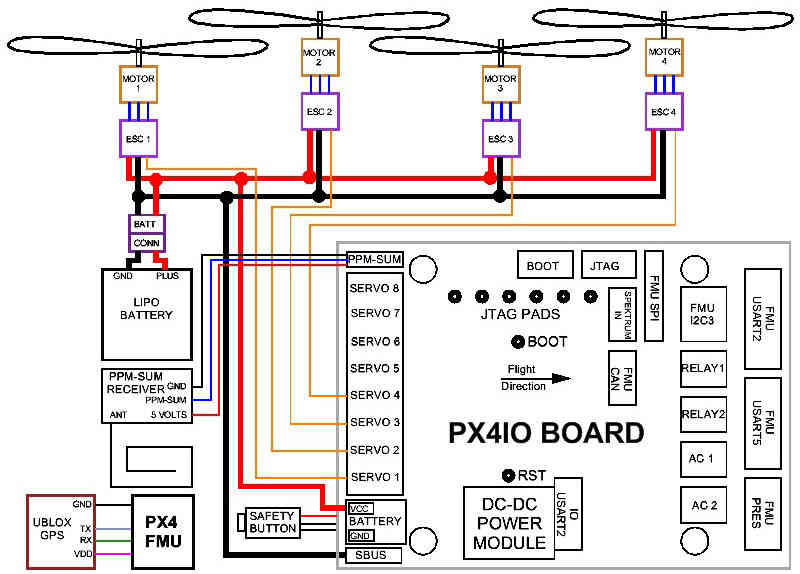
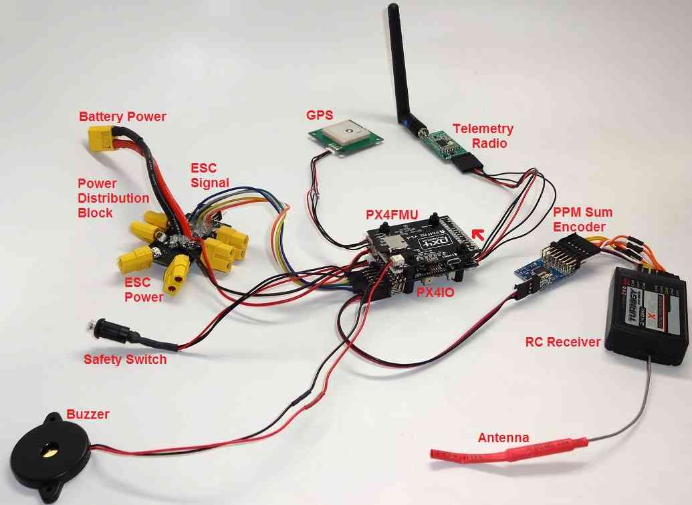
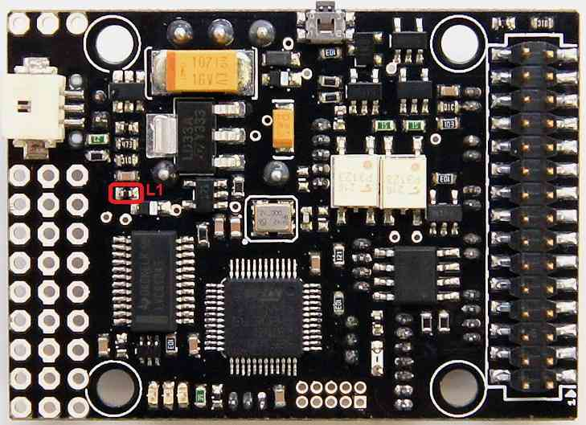

.. _px4fmu-plus-px4io-wiring:

=================================
Archived:PX4FMU Wiring QuickStart
=================================

.. warning::

    **ARCHIVED**
    
    The PX4FMU is end of life and is not generally available for purchase. 
    This article is made available for existing users.

This article provides an overview of the :ref:`PX4FMU <common-px4fmu-overview>` and
:ref:`PX4IO <common-px4io-overview>` Board Copter Wiring/Installation.

PX4FMU plus PX4IO Wiring Diagrams
=================================

   Wiring: PX4FMU plus PX4IO with 3DR 8 channel encoder and 3DR Telemetry radio

Assembly
========

#. **Solder the right angle 9x3 pin connector that was included with
   your PX4FMU kit to the side of the PX4IO board that has "PX4 autopilot"
   printed on it.**

   #. When you insert the 9 x 3 connector into the PX4IO board put it in
      with the plastic spacer on the connector facing to the back of the
      board, NOT down against the board.

#. Solder the small white PAP-02-VS 2 pin connector into the 2 holes
   directly behind the battery pads on the PX4IO board.
#. **Install the PX4IO board on top of the PX4FMU board.**

   #. To protect the barometer from wind, gusts, motion effects and prop
      wash:

      #. Cut a piece of 1/2" thick soft foam to the size of the PX4FMU
         board minus the inter-board connector.
      #. Place place the piece of 1/2" foam between the PX4FMU board and
         the PX4IO board before you connect them.
      #. An enclosure could mitigate barometer problems too, but ensure
         that it does not interfere with the compass (magnetometer).

   #. Connect the PX4FMU board to the PX4IO board and ensure all of the
      connector pins are straight and insertion is complete.
   #. Mount the PX4-FMU + PX4-IO board stack in a central and level
      location on top of your Copter.
   #. The PX4FMU board is normally on top.
   #. It can be advantageous to mount the PX4IO board on top to provide
      for better Connector access.
   #. If you do mount the PX4IO board on top it will be necessary to set
      the "Board Orientation (AHRS_ORIENTATION)" parameter to **8** i.e
      "Roll 180", in the Advanced Parameter List in Mission Planner.
   #. The arrow labeled "FRONT" should be facing to the front of the
      aircraft.
   #. The Micro SD memory card holder should face to the back of the
      Aircraft.

#. **Use the included standoffs and hardware.**

   #. Which ever side of which ever board is going to be on top but a
      black standoff through one of the mounting holes from the bottom
      and thread a black plastic nut onto it from the top.
   #. Repeat the above for the remaining 3 holes.
   #. Connect the PX4FMU and PX4IO board insuring no pins are bent on
      the board interconnection connector.
   #. Thread 4 more of the black standoffs into the already installed
      black standoffs.

#. **In order to reduce DC EMF effect on the compass see** :ref:`Magnetic Interference <common-magnetic-interference>`.
#. You will need additional vibration damping and should review
   :ref:`Vibration Damping <common-vibration-damping>`.

   #. At a minimum you should mount the standoffs to an intermediate
      plate.
   #. Mount the plate to your airframe with 4 small (<1")square pads of
      Kyosho "Zeal" gel or "Moon Gel" in the corners.

#. **Mount the GPS facing up with an unobstructed "view" of the sky.**

   #. Connect the GPS cable to the GPS connector on the PX4FMU board.
   #. The GPS must be positioned so that its cable will connect without
      strain to the PX4FMU's GPS connector.
   #. The GPS can be mounted on a short riser to give it the widest
      satellite access.

Wire the PX4FMU and PX4IO boards to Your Copter
===============================================

#. **Wire the PX4-IO board.**

   #. The PX4IO board has a built in Power Supply which can connect to
      up to 18 volts.
   #. Insert the white PAP-02-VS 2 pin connector with the black and red
      wires coming out of it into the mating power connector you
      soldered in previously on the PX4IO board.
   #. Battery Plus is the(red wire) and should be soldered to your
      battery red power lead / connector.
   #. Battery Ground is the(black wire) and should be soldered to your
      battery black battery (Ground) lead / connector.
   #. The main power inputs of your ESC's will also need to connect to
      these wires and to a battery connector.
   #. A Power Distribution board can also be used.

#. **Connect your PPM-Sum RC receiver's 3 wire cable to the end of the 9
   x 3 angle connector that is nearest the edge of the PX4IO board with
   the signal wire furthest from the board and the ground closest to the
   board.**
#. **Wire the PX4FMU board's servo out signals to your ESC control inputs.**

   #. Run the Signal wires ONLY from the ESCs to the 3 x 9 Servo
      Connector on the PX4IO board.
   #. The PX4IO board connector for Motor 1 is at the edge of the
      connector next to the Battery power in wires.
   #. Insert the Motor ESC wires arranged progressively from that edge,
      (1,2,3,4,etc) for 4 to 8 motors depending on your copter type.
   #. You can put the ESC Signal wires into a single inline connector
      with the correct number of pins for your copter.
   #. The ESC Signal Wires / connector should be plugged into the top
      row (furthest from the board) of the PX4IO boards 3 x 9 Servo
      Connector.

#. **Note, the cable that is supplied in the plastic envelope with the
   UBLOX GPS which has white 6 pin connectors on both ends is not the
   correct cable for the PX4FMU board.**

   #. The correct longer cable is provided in a separate envelope and
      has a 5 pin "beige" connector on one end and a 6 pin white
      connector on the other end.
   #. Plug the correct GPS cable's white 6 pin connector into the 6 pin
      socket on the GPS.
   #. Plug the beige 5 pin connector into the PX4FMU board's 5 pin GPS
      socket which is next to the 15 pin DF13 Mini connector.

#. **Plug the 2 pin connector attached to the lead supplied with the
   buzzer into the buzzer socket on the side of the PX4FMU board that
   has the SD card holder on it.**
#. **Connect the "Safety Button" to the Safety connector on the PX4IO
   board on the opposite side of the board from the Battery pads.**

Using a 3DR telemetry radio with your PX4FMU plus PX4IO system.
===============================================================

#. You will need a :ref:`3DR Radio <common-sik-telemetry-radio>`.
#. Plug the telemetry adapter cable's large black connector into the 3DR
   radio as shown above.
#. The telemetry radio is shown above **incorrectly** connected to the
   FMU USART2 socket at the corner of the PX4IO board.

   #. **Correctly** plug the telemetry adapter cable's beige connector
      into the PX4IO boards **FMU UART5** socket.
   #. FMU UART5 is the middle socket on the end of the PX4IO board as
      indicated by the **red arrow** above.
   #. (FMU UARTx) means a port that is pass through connected directly
      from the PX4IO board to the PX4FMU.

Separate Servo power for high power applications
================================================

#. **Using a separate power supply to provide power to the center servo
   power pins of the PX4IO board.**

   #. If you are driving high power servos with your PX4IO board you
      will want to provide servo power separately.
   #. In order to do this, remove the L1 Ferrite device circled in red
      on the image above.
   #. Then run power from your separate power supply to one of the
      center pins of the Servo Connector.
   #. And run the ground from your separate power supply to one of the
      servo connector pins nearest the edge of the board.

Wiring your Motors and ESCs
===========================

Motor wiring and order for different frame shapes is covered in the
topic :ref:`Connect ESCs and Motors <connect-escs-and-motors>`.

Using a Standard RC Radio Receiver with an 8 channel PPM Encoder
================================================================

You can use a standard radio receiver with an 8 channel PPM Encoder in
place of the PPM-SUM receiver.

-  An 8 Channel PPM Encoder is 
   `available from jDrones <http://store.jdrones.com/pixhawk_px4_paparazzi_ppm_encoder_v2_p/eleppmenc20.htm>`__.
-  Solder a 3x8 Right angle connector from the top into one end of the 8
   Channel PPM Encoder board.
-  With the 3x8 connector up and facing away from you, solder a 3x1
   Right angle connector on the right edge of the 8 Channel PPM Encoder
   board.

Connect 5-8 output channels of your receiver to the inputs of the 8
Channel Encoder (signal wire furthest from board) with 5-8 female to
female servo jumpers.

-  Connect the PPM-SUM output of the Encoder with a 3 wire cable to the
   PX4IO boards PPM sum input (1x3 connector).

.. note::

   If you are using a 3DR PPM Encoder it is important to know that
   when you are calibrating your transmitter you will quite likely need to
   hook up your flight battery to the PX4IO because the USB port alone
   can't supply enough power.

Compatible remote control (RC) receivers
========================================

PX4FMU is compatible with PPM remote control (RC) receivers, Futaba S.Bus
receivers, and Spektrum DSM,DSM2, and DSM-X Satellite receivers. For
traditional single-wire-per-channel (PWM) receivers a PPM encoder can be
used to convert the receiver outputs to PPM-SUM.  Information about
compatible receivers and how they are connected can be found in :ref:`this wiki page <common-rc-systems>`.

.. figure:: ../../../images/FRSkyTaranis.jpg
   :target: ../_images/FRSkyTaranis.jpg

   FRSky Taranis Transmitter
