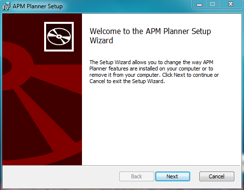
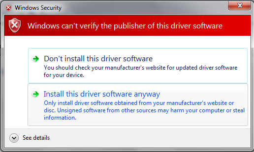
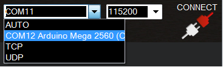
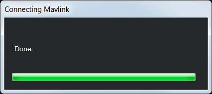
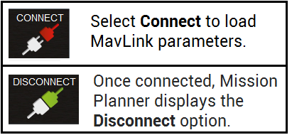
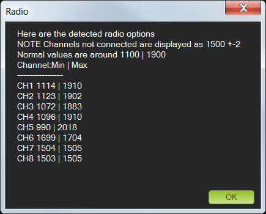
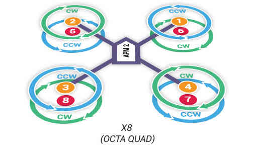
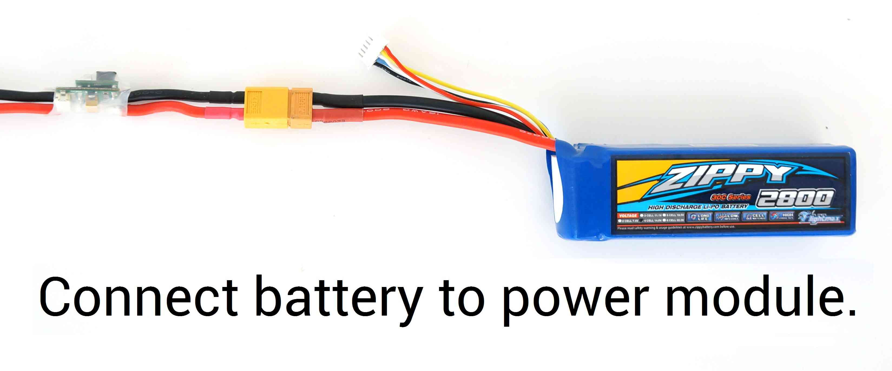

.. _quick-start-guide:

=====================================================
Archived: Quick Start Guide for Ready-to-Fly Vehicles
=====================================================

.. warning::

   **ARCHIVED ARTICLE**

   The article is out of date (3DR replaced APM2.x with Pixhawk
   and the kits come with everything configured out of the box). 
   In addition, 3DR no longer supplies hardware described in this article (including Iris+, Solo, X8, Aero-M).

This page is a quick start guide for users who have purchased a *3DRobotics Ready-to-Fly (RTF) multicopter*
including a Pixhawk preloaded with the latest Copter firmware.  
All other users should skip to the :ref:`First Time Setup <initial-setup>` section which
includes the full autopilot set-up and calibration instructions.

Install Mission Planner
=======================

`Download the most recent Mission Planner MSI from here <https://firmware.ardupilot.org/Tools/MissionPlanner/MissionPlanner-latest.msi>`__.

Open the Microsoft installer file (.msi) and select **Run** to run the
installation utility.

Follow the instructions to complete the setup process (accept the
license terms, choose a location for the installation etc.)

The installation utility will automatically install any necessary software drivers. 
If you receive a DirectX installation error, please update your DirectX plug-in from the `Windows Download Center <https://www.microsoft.com/en-us/download/windows.aspx>`__.
If you receive the warning pictured here, select **Install this driver software anyway** to continue.

Once installation is complete, open Mission Planner. Mission Planner
automatically notifies you about available updates. Please always run
the most current version of Mission Planner.

Connect RC receiver
===================

Is your RC receiver already connected and configured? If not, follow
these instructions.

For RC control with \ **PWM**, connect RC receiver to APM Input Signal
pins using connectors to attach channel 1 to the APM signal pin labeled
1, channel 2 to signal pin 2, etc. You will also need to provide power
to the receiver by connecting a three-wire cable between the receiver
and the APM for one of the channels.

.. image:: ../images/PWM-wiring.jpg
    :target: ../_images/PWM-wiring.jpg

For **PPM** (all channels over one wire), use PPM jumper connectors to
connect Input signal pins 2 and 3 on APM and signal pins 3 and 4 on the
receiver. Use a 3-wire cable to connect the signal, power, and ground
pins for channel 1 on the receiver to the three pins labeled 1 on APM.
The specific pins used for the receiver may vary by model, so consult
the documentation on your receiver for PPM configuration.

.. image:: ../images/PPM-wiring.jpg
    :target: ../_images/PPM-wiring.jpg

Once you've downloaded Mission Planner onto your ground station
computer, connect APM to your computer using the micro USB connector and
APM's micro USB port. Use a direct USB port on your computer, not a USB
hub.

.. image:: ../../../images/apm_micro_usb.jpg
    :target: ../_images/apm_micro_usb.jpg

Windows will automatically detect APM and install the correct driver
software.

Next we'll let Mission Planner know which port we're using to connect to
APM. Open Mission Planner, and use the drop-down menus in the
upper-right corner of the screen (near the Connect button) to connect to
APM. Select \ **Arduino Mega 2560** and set the Baud rate to **115200**
as shown.

Select \ **Connect** (upper-right corner of the screen) to load MavLink
parameters to APM. Mission Planner will display a window showing the
progress of the MavLink download.

When the window displays **Done** and Mission Planner shows the
**Disconnect** option in place of Connect, your APM firmware has been
downloaded successfully.

Turn on transmitter. Verify that the transmitter is in Airplane mode
(APM needs airplane mode regardless of the platform type being piloted)
and all trims are centered.

   Transmitter(Mode 2): Recommended Channels

The left stick will control throttle and yaw; the right stick will
control roll and pitch. The three-position switch will control flight
modes.

In Mission Planner, select **Mandatory Hardware** and **Radio
Calibration**. Click on the green \ **Calibrate Radio** button in the
lower right of the window. Mission Planner will call a dialog window to
ensure radio control equipment is on, battery is not connected, and
propellers are not attached.

.. image:: ../images/calibrate-radio.jpg
    :target: ../_images/calibrate-radio.jpg

Select OK; move the control sticks and toggle switches on your
transmitter to their limits of travel and observe the results on the
radio calibration bars. Red lines will appear across the calibration
bars to indicate maximum and minimum values. Move the Ch 5 and 6 toggle
switches through their range of positions (Ch 7 and 8 are not used for
basic operations).

Your transmitter should cause the following control changes:

Channel 1: low = roll left, high = roll right.

Channel 2: low = pitch forward, high=pitch back.

Channel 3: low = throttle down (off), high = throttle up.

Channel 4: low = yaw left, high = yaw right.

.. image:: ../images/radio-calib-click-when-done.png
    :target: ../_images/radio-calib-click-when-done.png

When the red bars for roll, pitch, throttle, yaw, and radio 5 (and
optionally radio 6) are set at the minimum and maximum positions, select
**Click when Done**. Mission Planner will show a summary of the
calibration data. Normal values are around 1100 for minimums and 1900
for maximums.

Attach propellers
=================

Unscrew prop nuts and add propellers to motor collets with writing on
props facing up in relation to the sky. If you have a co-axial motor
configuration, make sure that the writing on the props faces up even if
the motor faces down. Add metal spacers on top of prop nuts if prop hub
measures less than 5 mm in height. Tighten prop nuts to secure
propellers in place. Try inserting a 2 mm (5/64) hex wrench into the
hole in the side of the prop nut to get better leverage when tightening
prop nuts. Select propellers based on motor directions. Find your frame
in the images below. Use pusher propellers for motors marked clockwise
and normal propellers marked counterclockwise. Pusher propellers are
usually marked "P" or "SFP" on the propeller.

Pre-flight information
======================

Safety is the key to successful flight. Please read the \ :ref:`Safety Information Page <safety-multicopter>` before
flying. Select an unpopulated area to fly your copter, away from people
and developed areas, and always run the :ref:`pre-flight checklist <checklist>`\ before
connecting the battery. 
Make sure to read the :ref:`Flying <flying-arducopter>` page for information about arming, disarming, and controlling your copter during flight.

When you're ready to fly, place copter on the ground facing away from
you. Connect fully charged LiPo battery to the power module connector
when you're ready to power on your copter. Follow the safe arming and
disarming procedure described on the :ref:`Maiden Flight <flying-arducopter>` page.

Next steps
==========

Try learning about different :ref:`autonomous flight modes <flight-modes>` to get the
most out of your Copter, including loitering and running missions.
