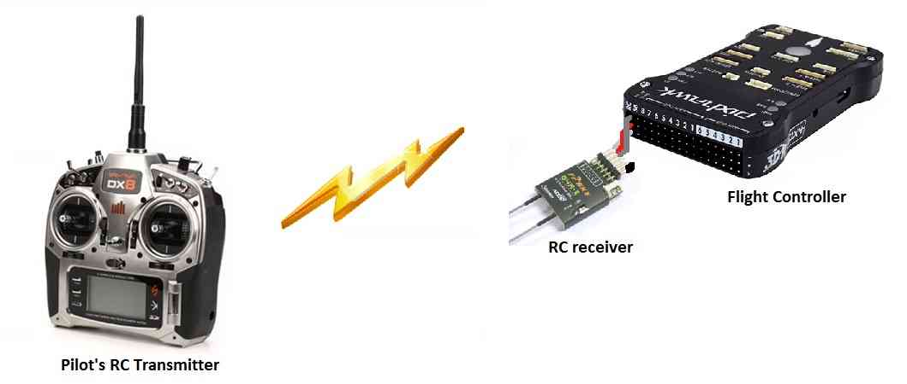
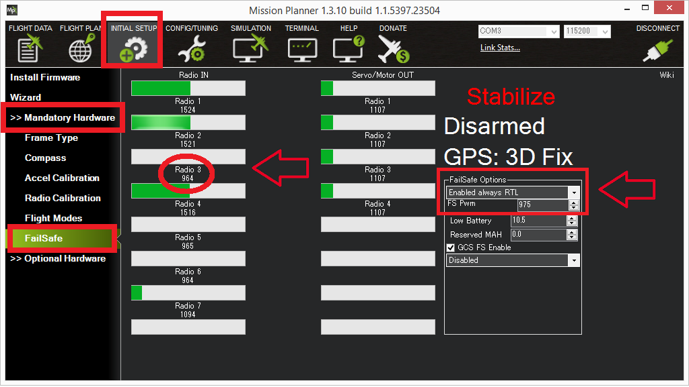
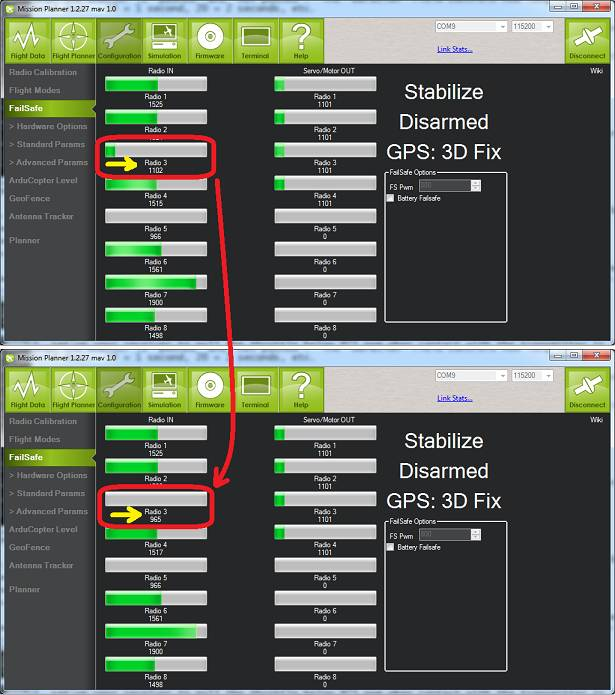

.. _radio-failsafe:

==============
Radio Failsafe
==============

Copter supports several configurable failsafe options in cases where contact between the Pilot's RC transmitter and the autopilot's receiver is lost.  This page explains this failsafe's setup and testing.  Note the "Radio failsafe" was previously called "Throttle failsafe" because of the way in which some receivers use the throttle channel to signal the loss of contact.

.. warning::

   For Single Helicopter, Dual Helicopter and Quad Helicopter frames, Copter 3.6 and earlier in any :ref:`H_RSC Mode<H_RSC_MODE>` or Copter 4.0 in the RC Passthrough :ref:`H_RSC_Mode<H_RSC_MODE>` requires the RC receiver channel 8 to hold last value when transmitter signal is lost.  If the receiver sends no signal or does not hold the RC channel 8 value, the motor will be shutdown and the helicopter will crash.  

.. note::

   Copter also supports other failsafes, including: :ref:`Battery <failsafe-battery>`, :ref:`Ground Station <gcs-failsafe>` and :ref:`EKF/DCM failsafes <ekf-inav-failsafe>`. See the :ref:`failsafe-landing-page` for more details.

When the failsafe will trigger
==============================

If enabled and set-up correctly the radio failsafe will trigger if:

-  The pilot turns off the RC transmitter for more than 0.5 second
-  The vehicle travels outside of RC range and signal is lost for more than 0.5 second
-  The pilot forces the throttle channel below :ref:`FS_THR_VALUE<FS_THR_VALUE>` from the transmitter
-  The receiver loses power (unlikely)
-  The wires connecting the receiver to the autopilot are broken
   (unlikely).

What will happen
================

When a radio failsafe is triggered, the copter can be configured via parameters to do nothing, land immediately, RTL, or SmartRTL.  It can also be configured to bypass the failsafe in an Auto Mode mission, or to continue landing if already in a landing phase.

- If the copter is disarmed, no failsafe will take place.
- If the copter is armed but has landed, the copter will immediately disarm.
- If the copter is armed in Stabilize or Acro modes, and the throttle input is at minimum, the copter will immediately disarm.
- Otherwise, the copter will take the actions as configured in the parameters described below.

If the failsafe clears (i.e. transmitter and receiver regain contact) the copter will remain in its failsafe mode. It will **not** automatically return to the flight mode that was active before the failsafe was triggered. This means that if, for example, the vehicle was in Loiter when the failsafe occurred and the flight mode was automatically changed to RTL, even after the transmitter and receiver regained contact, the vehicle would remain in RTL.  If the pilot wished to re-take control in Loiter he/she would need to change your flight mode switch to another position and then back to Loiter.

Receiver Configuration
======================

By default, most newly purchased receivers will simply not output pulses if contact with the transmitter is lost. However, some low end receivers will be set-up to simply hold all channels at their last known position.  This is not good because the autopilot has no way to know that the Pilot has lost control of the vehicle.  Instead the receiver must be set-up to signal to the autopilot it has lost contact and there are two ways that it can do this (the method depends upon the receiver). Each brand of Transmitter/Receiver is slightly different so please refer to your transmitter's user manual to determine which method is available and how to set it up.

Receiver configuration for low-throttle method
----------------------------------------------
The **"Low-Throttle" method** pulls the throttle channel (normally channel 3) to a value below the bottom of its normal range (normally below 1000us).  This method is used by Futaba systems and many older systems.  Below is the setup method for a Futaba T7C Transmitter with R617FS or TFR4-B receiver which uses the "low throttle" method.

..  youtube:: qf8YinLKQww
    :width: 100%

Many receivers allow for the failsafe positions to be set either by simply pressing a button on the receiver, or directly from the transmitter. In this case, the transmitter is temporarily adjusted to output a throttle signal below the normal low idle position (if low idle is 1000us, then 990uS would be sent) setting this as the failsafe value for the receiver, then adjusting low stick back to normal idle position. This below throttle idle value is then set for :ref:`FS_THR_VALUE<FS_THR_VALUE>`, as discussed below.

Receiver configuration for No-Signal method
-------------------------------------------
**"No Signal" method** - the receiver stops sending signals to the autopilot.  This is the preferred method and is how most modern FrSky receivers operate. Below is the setup method for a FlySky 9 channel transmitter with FrSky D4R-II receiver which uses the "No Signal" method.

..  youtube:: FhKREgqjCpM
    :width: 100%

Parameter Configuration
========================

The :ref:`FS_THR_ENABLE<FS_THR_ENABLE>` parameter can be set in the Mission Planner full parameter list or full parameter tree, or can also be set using the Mission Planner *failsafe options* dropdown in the Initial Setup >> Mandatory Hardware >> Failsafe menu.

-  **Disabled** (Value 0) will disable the radio failsafe entirely.
-  **Enabled Always RTL** (Value 1) will switch the copter to RTL Mode.  If the GPS position is not usable, the copter will change to Land Mode instead.
-  **Enabled Continue with Mission in Auto Mode ((this value has no effect in 4.0 and later with :ref:`FS_OPTIONS<FS_OPTIONS>` parameter replacing function, see below ))** (Value 2) will ignore the failsafe in an Auto Mode mission. Otherwise, it will behave the same as *Enabled Always RTL*. This option no longer exists in ArduCopter 4.0. Instead, see the :ref:`FS_OPTIONS<FS_OPTIONS>` parameter for this function. Setting this value in Copter 4.0 and later version will automatically be converted and set to (Value 1) and the :ref:`FS_OPTIONS<FS_OPTIONS>` will be modified to include bit (0) in the bitmask for "Continue if in auto mode on Radio Failsafe".
-  **Enabled Always Land** (Value 3) will switch the copter to Land Mode.
-  **Enabled SmartRTL or RTL** (Value 4) will switch the copter to SmartRTL mode. If SmartRTL is not available, the copter will switch to RTL Mode instead.  If the GPS position is not usable, the copter will change to Land Mode instead.
-  **Enabled SmartRTL or Land** (Value 5) will switch the copter to SmartRTL mode. If SmartRTL is not available, the copter will switch to Land Mode instead.
-  Any invaild value (Such as accidentally enter 99 as a parameter value) will will behave the same as **Enabled Always LAND**

The :ref:`FS_THR_VALUE<FS_THR_VALUE>`  parameter can be set in the Mission Planner full parameter list or full parameter tree, or can also be set using the Mission Planner *FS PWM* value in the Initial Setup >> Mandatory Hardware >> Failsafe menu.
-  At least 10 PWM higher than your Channel 3's PWM value when the throttle stick is fully down and the transmitter is **off**
-  At least 10 PWM lower than your channel 3's PWM value when the throttle stick is fully down and the transmitter is **on**
-  Above 910 PWM

The :ref:`FS_OPTIONS<FS_OPTIONS>`  parameter (Copter 4.0 and later) is a bitmask parameter to select one or more options that modify the standard actions of the radio, GCS, and battery failsafe. In the Mission Planner full parameter list or full parameter tree, the handy checkbox popup window is an easy what to set this (and any other bitmask) parameter. Be sure to go to Help > Check Beta Updates to pull the latest parameter definitions first while connected to the internet. The :ref:`FS_OPTIONS<FS_OPTIONS>` bits are as follows:

- bit 0 set: Continue if in auto mode on :ref:`Radio Failsafe <radio-failsafe>`
- bit 1 set: Continue if in auto mode on :ref:`Ground Control Station Failsafe<gcs-failsafe>`
- bit 2 set: Continue if in guided mode :ref:`Radio Failsafe <radio-failsafe>`
- bit 3 set: Continue if landing on any failsafe
- bit 4 set: Continue in pilot control on :ref:`Ground Control Station Failsafe<gcs-failsafe>`
- if none of the above are set, then execute the :ref:`FS_THR_ENABLE<FS_THR_ENABLE>` option as configured.

.. note:: Only bitmask bits 0, 2, & 3 affect actions taken during radio failsafe. This parameter also works in conjunction with the battery and GCS failsafe, so ensure you are taking all options into account when setting this parameter.

Below is a screenshot of the Mission Planner Initial Setup >> Mandatory Hardware >> Failsafe menu.

Testing
=======

You can check your failsafe by performing the following tests with the
Pixhawk/APM connected to the Mission Planner either via a USB cable or
telemetry link. You can complete these tests without plugging in your
LiPo battery but if you do connect a battery you should first remove the
propellers.

**Test #1 : if using the "Low-Throttle" method, ensure the throttle
channel drops with loss of radio contact**

#. Ensure your RC transmitter is on and connected with the throttle all
   the way down and flight mode set to Stabilize
#. The throttle (channel 3) PWM value should be approximately as in
   first illustration below.  Its value may be higher or lower but it
   should definitely be at least 10 higher than the value held in the FS
   PWM field
#. Turn the transmitter off and the throttle PWM value should drop to be
   at least 10 below the FS PWM field value (as in the second
   illustration below) below

Test #2 : ensuring motors disarm if in STABILIZE or ACRO with throttle
at zero

-  Switch to stabilize mode, arm your motors but keep your throttle at
   zero. Turn off your transmitter. The motors should disarm immediately
   (red led will start flashing, DISARMED will be displayed in the
   Mission Planner's Flight Data screen).

Test #3 : ensuring flight mode changes to RTL or LAND when throttle is
above zero

-  Switch to stabilize mode, arm your motors and raise your throttle to
   the mid point. Turn off your transmitter. The Flight Mode should
   switch to RTL if you have a GPS lock or LAND if you do not have a GPS
   lock (the flight mode and GPS lock status are visible in the Mission
   Planner's flight data screen).

Test #4 : retaking control after the failsafe has cleared

-  continuing on from test #3, turn your transmitter back on
-  while the flight mode is still in RTL or LAND and armed, change the
   flight mode switch to another position and then back to stabilize
   mode.  Ensure that the flight mode displayed on the Failsafe page is
   updating appropriately.

Test #5 (optional) : removing power from the receiver

-  Switch to stabilize mode, arm your motors and keep your throttle
   above zero.
-  Carefully disconnect the power wires connecting the receiver to the
   autopilot
-  The Flight Mode should switch to RTL or LAND as described in Test #3

.. warning:: Unplug the autopilot so that it is powered down before reattaching
   the receiver's power

Using the receiver to set the flight mode (not recommended)
===========================================================

Instead of setting up the receiver and autopilot as described
above (i.e. "Low-Throttle" and "No Signal" methods) the receiver can be
set-up to set channel 5 (flight mode channel) to a :ref:`flight mode <flight-modes>` slot that has
been set to RTL.  For example the receiver could be setup to move ch5's
pwm value to 1700us which is "Flight Mode 5" which could then be set to
RTL on the Mission Planner's Initial Setup >> Mandatory Hardware >>
Flight Modes screen.

Although this mostly works it is not recommended because it will not
trigger if the receiver loses power or if the wires between the receiver
and autopilot are broken.

