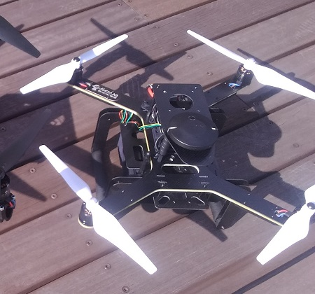

.. _reference-frames-amovlab-p200:

============
AmovLab P200
============

The AmovLab P200 is an almost-ready-to-fly quadcopter designed for education and research users especially those who wish to mount a companion computer like the :ref:`NVidia TX2 <dev:companion-computer-nvidia-tx2>`

Parts List
----------

- The frame will be available for purchase from late 2019 onwards from many `Hex retailers <http://www.proficnc.com/stores>`__
- 3300mAh to 5300mAh 3S battery
- RC transmitter with at least 6 channels like the Futaba T10J

Connection and Setup
--------------------

- Mount the RC receiver to the frame and connect to the autopilot's "RC IN" port.  Note that the white wire should be at the bottom

Firmware used: Copter-4.0

Parameter file: `amovlab-p200.param <https://github.com/ArduPilot/ardupilot/blob/master/Tools/Frame_params/amovlab-p200.param>`__

This parameter file can also be loaded using the Mission Planner's Config/Tuning >> Full Parameter Tree page by selecting "amovlab-p200" from the drop down on the middle right and then push the "Load Presaved" button.
