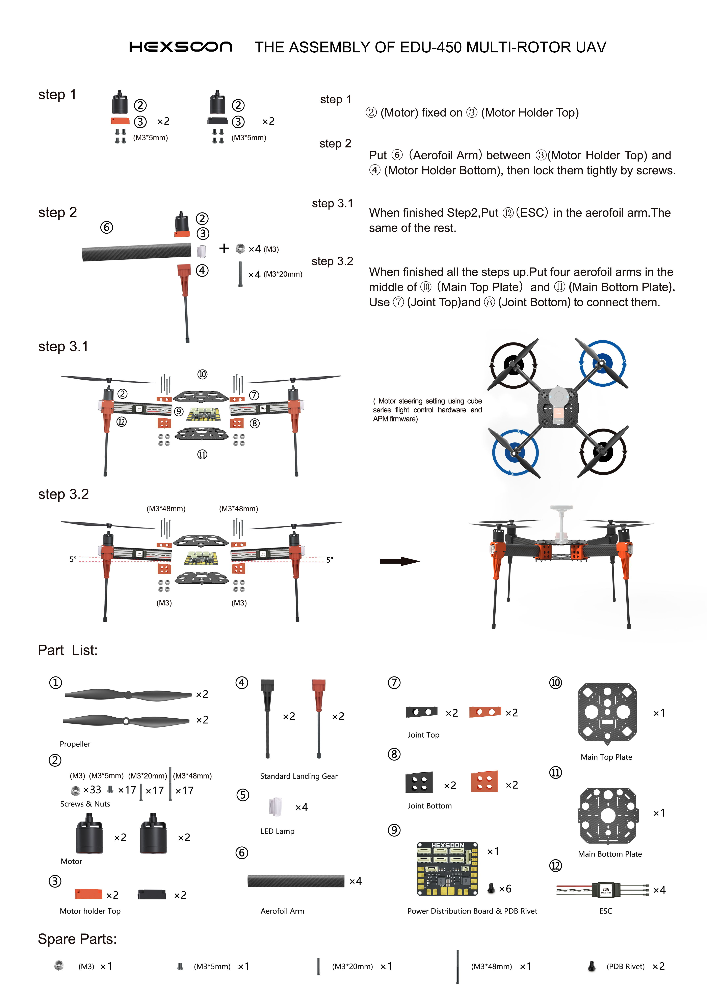
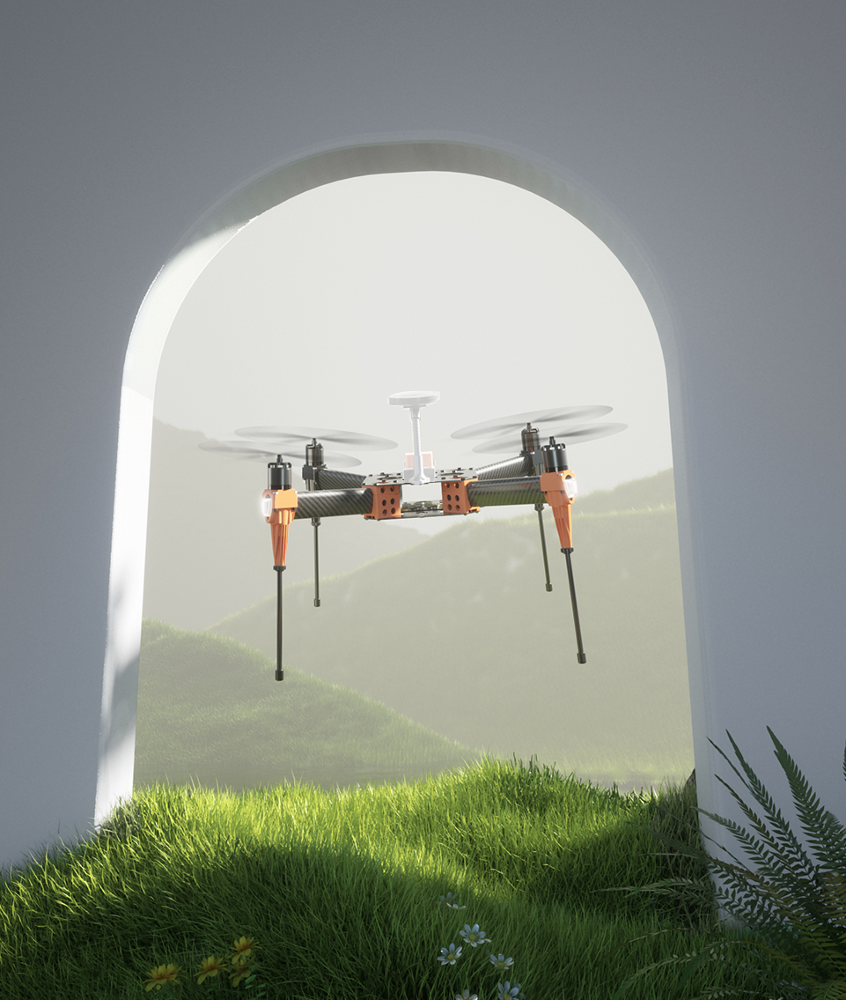

.. _reference-frames-hexsoon-edu450:

===============
Hexsoon EDU-450
===============

.. image:: ../images/reference-frames-hexsoon-edu450.jpg

The Hexsoon EDU-450 is a relatively low cost frame including motors, ESCs and propellers

This frame is available from many `CubePilot retailers <https://www.cubepilot.com/#/reseller/list>`__

Hexsoon's `EDU-450 specfications can be found here <https://docs.cubepilot.org/user-guides/cubepilot-ecosystem/cubepilot-partners/hexsoon/multirotor-frame/edu-450>`__

Box Contents
------------

- 4x Motors HS2216 920KV
- 4x Propellers T-MOTOR T1045II
- 4xESCs Hexsoon 20A
- Landing Gear
- Power Distribution Board

Additional Required Parts
-------------------------

- :ref:`Cube autopilot <common-thecube-overview>` or any other :ref:`ArduPilot compatible autopilot <common-autopilots>`
- 3300mAh to 5300mAh 3S battery
- RC transmitter with at least 6 channels like the Futaba T10J

Connection and Setup
--------------------

Connect the four ESC wires to the back of the autopilot as shown in the :ref:`QuadX configuration <connect-escs-and-motors>`

Parameter file: `hexsoon-edu450.param <https://github.com/ArduPilot/ardupilot/blob/master/Tools/Frame_params/hexsoon-edu450.param>`__

This parameter file can also be loaded using the Mission Planner's Config/Tuning >> Full Parameter Tree page by selecting "hexsoon-edu450" from the drop down on the middle right and then push the "Load Presaved" button.

