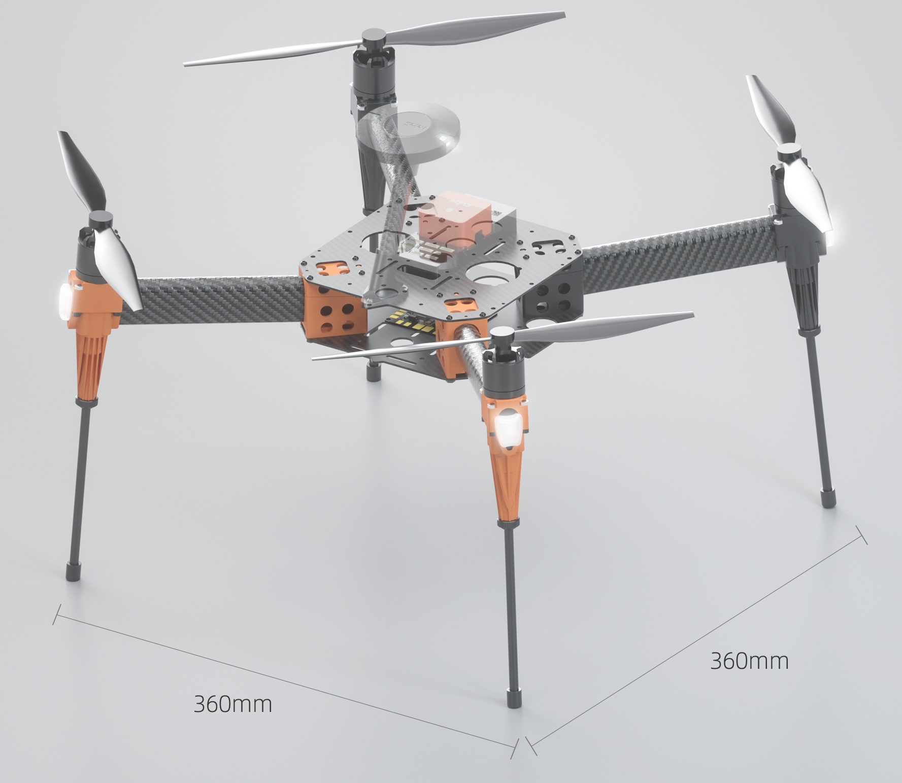

.. _reference-frames-hexsoon-edu450:

==============
Hexsoon EDU450
==============

The Hexsoon EDU450 is a relatively low cost frame including motors, ESCs and propellers

Parts List
----------

- The frame will be available for purchase from late 2019 onwards from many `Hex retailers <http://www.proficnc.com/stores>`__
- :ref:`Cube autopilot <common-thecube-overview>` or any other :ref:`ArduPilot compatible autopilot <common-autopilots>`
- 3300mAh to 5300mAh 3S battery
- RC transmitter with at least 6 channels like the Futaba T10J

Connection and Setup
--------------------

- Connect the four ESC wires to the back of the autopilot as shown in the :ref:`QuadX configuration <connect-escs-and-motors>`
- Mount the GPS/compass unit on the front of the frame slight elevated if possible to increase the distance between the ESC wires

Firmware used: Copter-4.0

Parameter file: `hexsoon-edu450.param <https://github.com/ArduPilot/ardupilot/blob/master/Tools/Frame_params/hexsoon-edu450.param>`__

This parameter file can also be loaded using the Mission Planner's Config/Tuning >> Full Parameter Tree page by selecting "hexsoon-edu450" from the drop down on the middle right and then push the "Load Presaved" button.
