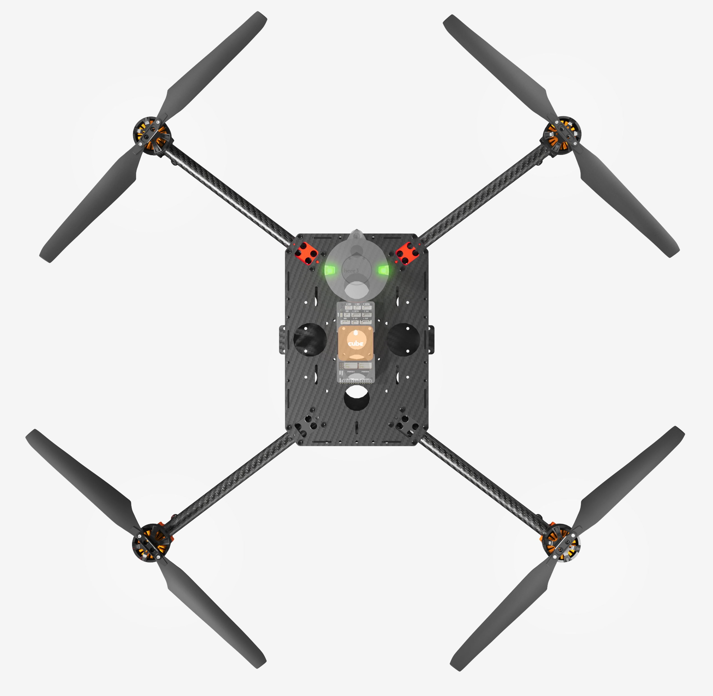
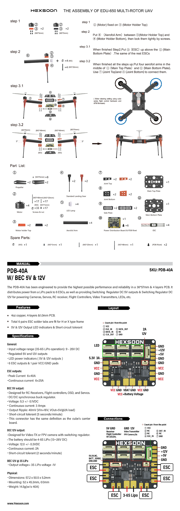
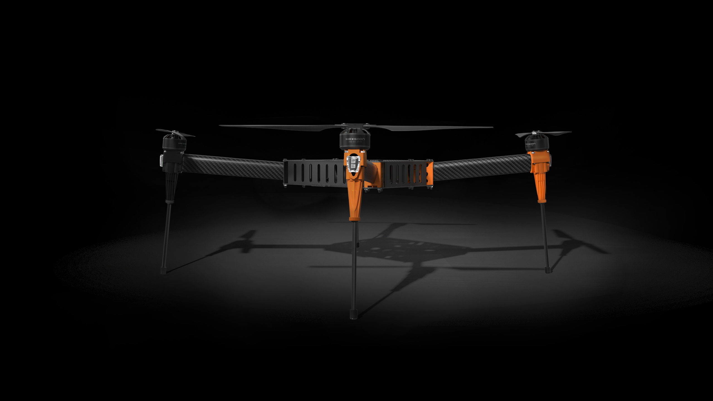

.. _reference-frames-hexsoon-td650:

===============
Hexsoon EDU-650
===============

The Hexsoon EDU-650 (formerly known as TD-650) is a carbon fiber frame including motors, PDB, ESCs and propellers

The frame is available from many `CubePilot distributors <https://cubepilot.org/#/reseller/list>`__

Hexsoon's `EDU-650 specfications can be found here <https://docs.cubepilot.org/user-guides/cubepilot-ecosystem/cubepilot-partners/hexsoon/multirotor-frame/td-650>`__

Box Contents
------------

- 650mm Carbon Fiber frame
- 4x Motors HS4012 370KV
- 4x Propellers T-Motor MF1503
- 4x ESCs Hexsoon 40A
- Landing Gear
- Power Distribution Board

Additional Parts
----------------

- Compatible with the :ref:`Cube autopilot <common-thecube-overview>` with direct mounting screws for the standard carrier board
- 8000mAh to 12000mAh 6S battery
- RC transmitter with at least 6 channels
- (Optional) four `5cm (2inch) C-clamps <https://www.amazon.com/C-Clamp-Industrial-Strength-Woodworking-Building/dp/B0BLC44XHT>`__ to ease assembly
- (Optional) `solder sleeves <https://www.amazon.com/TICONN-Connectors-Waterproof-Insulated-Electrical/dp/B07GDDKJ1D>`__ to shorten ESC wires
- (Optional) 2.5cm x 40cm velcro battery straps to replace very short straps provided

Connection and Setup
--------------------

Connect the four ESC wires to the back of the autopilot as shown in the :ref:`QuadX configuration <connect-escs-and-motors>`

Parameter file: `hexsoon-edu650.param <https://github.com/ArduPilot/ardupilot/blob/master/Tools/Frame_params/hexsoon-edu650.param>`__

This parameter file can also be loaded using the Mission Planner's Config/Tuning >> Full Parameter Tree page by selecting "hexsoon-td650" from the drop down on the middle right and then push the "Load Presaved" button.

LED connection and configuration
--------------------------------

The LED cable from each arm should be connected to the PDB's LED ports (highlighted in green below) labelled "1" to "4" (the order does not matter).
The adjacent 6-pin port (highlighted in purple below) should be connected to two of the autopilot's PWM output pins (e.g. AUX OUT 5 and 6)

  .. image:: ../images/reference-frames-hexsoon-edu650-assembly-LEDs.png
      :target: ../_images/reference-frames-hexsoon-edu650-assembly-LEDs.png
      :width: 450px

Then set the following parameters on the autopilot, assuming the autopilot's AUX OUT 5 and 6 pins have been connected as shown above

- :ref:`SERVO13_FUNCTION <SERVO13_FUNCTION>` = 129 (ProfiLED1)
- :ref:`SERVO14_FUNCTION <SERVO14_FUNCTION>` = 132 (ProfiLEDClock)
- :ref:`NTF_LED_LEN <NTF_LED_LEN>` = 8
- Check the :ref:`NTF_LED_TYPES <NTF_LED_TYPES>` bit for "ProfiLED"

  .. image:: ../images/reference-frames-hexsoon-edu650-params1.png
      :target: ../_images/reference-frames-hexsoon-edu650-params1.png

Build issues and advice
-----------------------

Below is a list of issues and recommendations

- Assembly is difficult because both upper and lower plates are required to hold the legs in place.  Temporarily use four `5cm (2inch) C-clamps <https://www.amazon.com/C-Clamp-Industrial-Strength-Woodworking-Building/dp/B0BLC44XHT>`__ to hold the lower plate and legs together.
- The ESC wires are too long resulting in messy wiring.  These can be shortened using `solder sleeves <https://www.amazon.com/TICONN-Connectors-Waterproof-Insulated-Electrical/dp/B07GDDKJ1D>`__
- If a gimbal is to be used, the battery must be mounted on the top of the vehicle.  Two possible configurations are:

    - Use two smaller batteries mounted on the top of the frame on either side of the autopilot.  Be careful that the two batteries have the same voltage if connected in parallel
    - Mount the autopilot between the upper and lower plates allowing a single large batter to be mounted on top of the frame.  Note this will make accessing the autopilot difficult

- The 30cm battery straps included in the kit are too short.  Replace with 2cm x 50cm velcro battery straps
- The PDB has a 12V pin for "Video Transmitter" but note the 2-pin JST connector's GND and 12V pins are reversed compared to thes equivalent Herelink power cable

  .. image:: ../images/reference-frames-hexsoon-edu650-issue1.png
      :target: ../_images/reference-frames-hexsoon-edu650-issue1.png
      :width: 450px

Videos
------
.. youtube:: WSiLnHEjBlI
    :width: 100%

.. youtube:: FbzXvi3beDI
    :width: 100%

