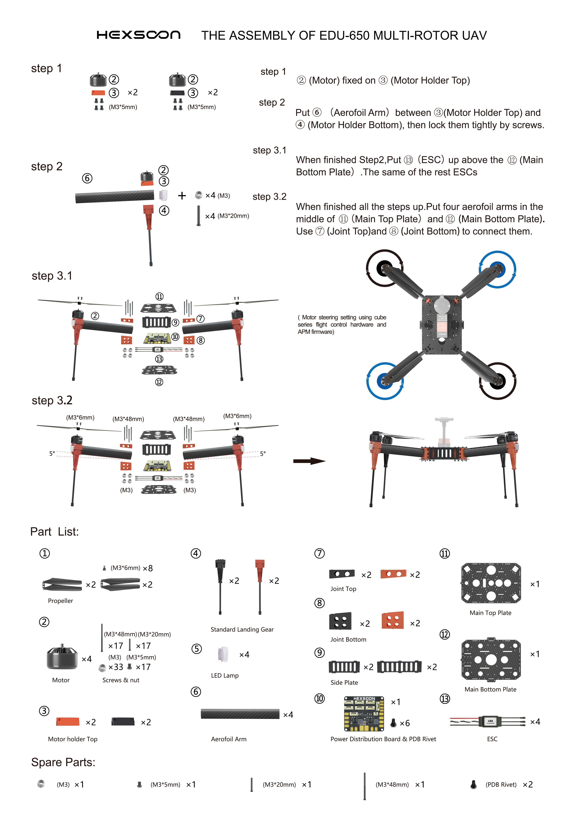

.. _reference-frames-hexsoon-td650:

===============
Hexsoon EDU-650
===============

.. image:: ../images/reference-frames-hexsoon-td650.jpg

The Hexsoon EDU-650 (formerly known as TD-650) is a carbon fiber frame including motors, ESCs and propellers

The frame is available from many `CubePilot distributors <https://cubepilot.org/>`__

Hexsoon's `EDU-650 specfications can be found here <https://docs.cubepilot.org/user-guides/cubepilot-ecosystem/cubepilot-partners/hexsoon/multirotor-frame/td-650>`__

Box Contents
------------

- 650mm Carbon Fiber frame
- 4x Motors HS4012 370KV
- 4x Propellers T-Motor MF1503
- 4x ESCs Hexsoon 40A
- Landing Gear
- Power Distribution Board

Additional Required Parts
-------------------------

- Compatible with the :ref:`Cube autopilot <common-thecube-overview>` with direct mounting screws for the standard carrier board
- 8000mAh to 12000mAh 6S battery
- RC transmitter with at least 6 channels

Connection and Setup
--------------------

Connect the four ESC wires to the back of the autopilot as shown in the :ref:`QuadX configuration <connect-escs-and-motors>`

Parameter file: `hexsoon-td650.param <https://github.com/ArduPilot/ardupilot/blob/master/Tools/Frame_params/hexsoon-td650.param>`__

This parameter file can also be loaded using the Mission Planner's Config/Tuning >> Full Parameter Tree page by selecting "hexsoon-td650" from the drop down on the middle right and then push the "Load Presaved" button.

Videos
------
..  youtube:: WSiLnHEjBlI
    :width: 100%

..  youtube:: FbzXvi3beDI
    :width: 100%

.. image:: ../images/reference-frames-hexsoon-td650-pic2.jpg
