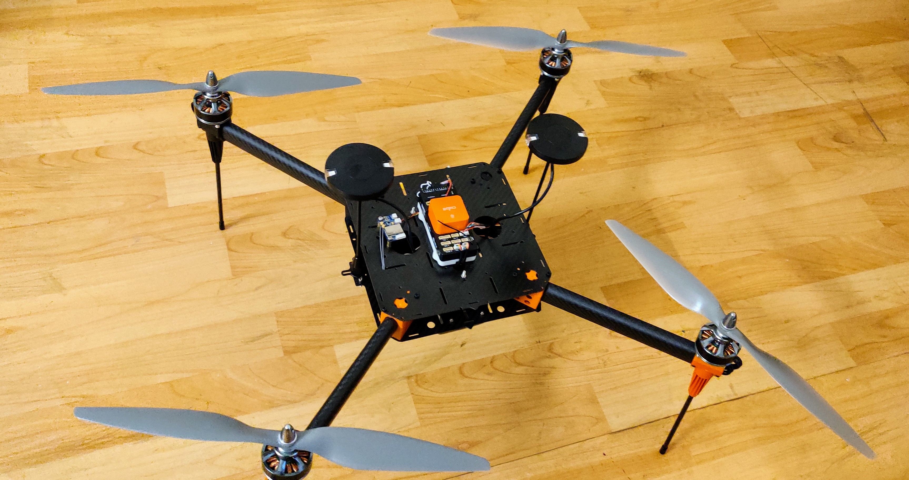

.. _reference-frames-hexsoon-td650:

==============
Hexsoon TD-650
==============

The Hexsoon TD-650 is a carbon fiber frame including motors, ESCs and propellers

Required Parts
--------------

- The frame will is available from many `CubePilot distributors <https://cubepilot.org/>`__
- Compatible with the :ref:`Cube autopilot <common-thecube-overview>` with direct mounting screws for the standard carrier board.
- 8000mAh to 12000mAh 6S battery
- RC transmitter with at least 6 channels

Box Contents
------------

- 650mm Carbon Fiber frame
- 4x Motors T-Motor 4010 370KV
- 4x Propellers APC 1455
- 4x ESCs
- Landing Gear
- Power Distribution Board

Connection and Setup
--------------------

- Connect the four ESC wires to the back of the autopilot as shown in the :ref:`QuadX configuration <connect-escs-and-motors>`
- Mount the GPS/compass unit on the frame slightly elevated if possible to increase the distance between the ESC wires

Firmware used: Copter-4.1

Parameter file: `hexsoon-td650.param <https://github.com/ArduPilot/ardupilot/blob/master/Tools/Frame_params/hexsoon-td650.param>`__

This parameter file can also be loaded using the Mission Planner's Config/Tuning >> Full Parameter Tree page by selecting "hexsoon-td650" from the drop down on the middle right and then push the "Load Presaved" button.

Flight Demonstration
--------------------
..  youtube:: FbzXvi3beDI
    :width: 100%
