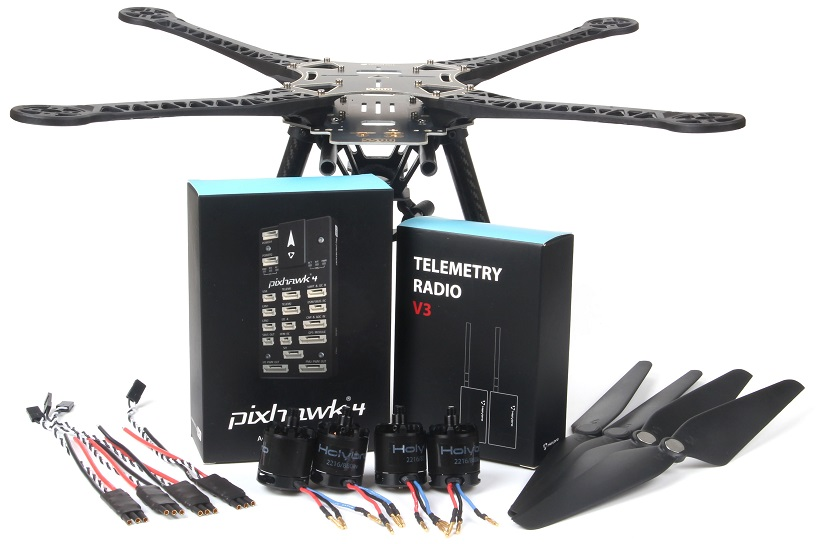

.. _reference-frames-holybro-s500:

============
Holybro S500
============

The Holybro S500 is a relatively low cost and easy to assemble frame including autopilot, GPS, motors, BLHeli ESCs and propellers

Parts List
----------

- `S500 V2 Kit-Pix32v5 (ArduPilot) <https://shop.holybro.com/s500-v2-kitmotor2216-880kv-propeller1045_p1153.html>`__ (be sure to push the, "S500 V2 Kit-Pix32v5 (ArduPilot)" button on the right side of the page) 
- 3300mAh to 5300mAh 3S or 4S battery
- RC transmitter with at least 6 channels

Connection and Setup
--------------------

- Follow the assembly instructions provided with the kit
- Use Mission Planner (or another GCS) to load the `Holybro-S600.param <https://github.com/ArduPilot/ardupilot/blob/master/Tools/Frame_params/Holybro-S500.param>`__ parameter file.  This file can also be loaded using the Mission Planner's Config/Tuning >> Full Parameter Tree page by selecting "Holybro-S500" from the drop down on the middle right and then pushing the "Load Presaved" button.
