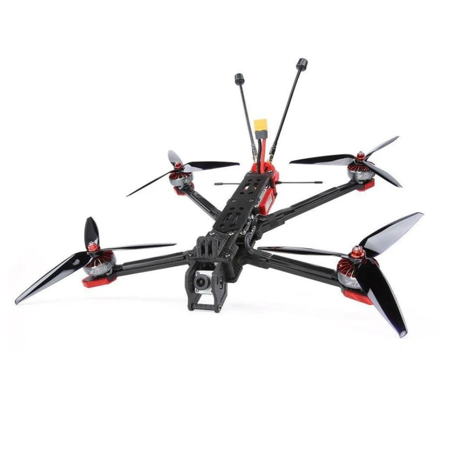

.. _reference-frames-iflight-chimera7:

=================
iFlight Chimera 7
=================

The iFlight Chimera 7 is a relatively low cost 7" LR frame which can also be bought as a BNF or RTF kit which will need some modifications

Parts List
----------

- `iFlight Titan Chimera7 LR frame <https://shop.iflight-rc.com/quad-parts-cat20/FrameKits-Parts-TPU-cat346/xl-series-cat110/Chimera7-Pro-6S-Long-Range-Frame-Kit-Pro1723>`__
- XING 2806.5 1300KV / `XING2 2809 1250KV <https://shop.iflight-rc.com/XING2-2809-FPV-Motor-Unibell-Pro1673>`__ / T-Motor F90 1300KV Motor x4
- Lumenier LUX H7 HD Ultimate / `Matek H743 Slim autopilot <http://www.mateksys.com/?portfolio=h743-slim>`__
- `TBS UNIFY 5G8 PRO32 HV <https://www.team-blacksheep.com/products/prod:unifypro32_hv>`__ VTX
- `TBS Tracer nano RX <https://www.team-blacksheep.com/products/prod:tracer_nanorx>`__
- Gemfan 7040 propellers x4
- `RunCam Phoenix 2 JB Edition <https://shop.runcam.com/runcam-phoenix-2/>`__
- `Matek M8Q-5883 <http://www.mateksys.com/?portfolio=m8q-5883>`__ GPS
- TBS Triumph Pro LR antenna
- TBS Tracer Sleeve Dipole x2
- `T-Motor F55A F3 Pro II 4-in-1 ESC <https://store.tmotor.com/goods.php?id=915>`__
- Turnigy Graphene Panther 3000mAh 6S 75C battery or similar
- RC transmitter with at least 6 channels like the Radiomaster RX16S

This frame will also take the DJI digital HD VTX system. To build an ArduPilot compatible version of the RTF kit the autopilot and ESC will need to be changed out from those shipped.

Connection and Setup
--------------------

Complete build instructions are given in the `blog <https://discuss.ardupilot.org/t/arducopter-7-long-range-standard-build/77368>`__ and `video series <https://youtube.com/playlist?list=PL_O9QDs-WAVwjoukkLInqQHmelJzSSNx3>`__

Firmware used: Copter-4.1 and Copter-4.2 of MatekH743-bdshot

Parameter file: `iflight-chimera7.param <https://github.com/ArduPilot/ardupilot/blob/master/Tools/Frame_params/iflight-chimera7.param>`__

This parameter file can also be loaded using the Mission Planner's Config/Tuning >> Full Parameter Tree page by selecting "iflight-chimera7" from the drop down on the middle right and then push the "Load Presaved" button.
