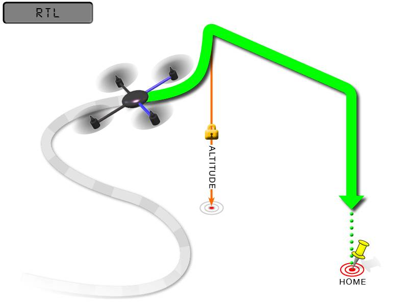

.. _rtl-mode:

========
RTL Mode
========

RTL mode (Return To Launch mode) navigates Copter from its current
position to hover above the home position. The behavior of RTL mode can
be controlled by several adjustable parameters. This page describes how
to use and customize RTL mode.

Overview
========

When RTL mode is selected, the copter will return to the home location.
The copter will first rise to
:ref:`RTL_ALT <RTL_ALT>`
before returning home or maintain the current altitude if the current
altitude is higher than ``RTL_ALT``.  The default value for ``RTL_ALT``
is 15m.

RTL is a GPS-dependent move, so it is essential that GPS lock is
acquired before attempting to use this mode. Before arming, ensure that
the APM's blue LED is solid and not blinking. For a GPS without compass,
the LED will be solid blue when GPS lock is acquired. For the
GPS+Compass module, the LED will be blinking blue when GPS is locked.

RTL will command the copter to return to the home position, meaning that
it will return to the location where it was armed. Therefore, the home
position is always supposed to be your copter's actual GPS takeoff
location, unobstructed and away from people. For Copter if you get GPS
lock and then ARM your copter, the home position is the location the
copter was in when it was armed. This means if you execute an RTL in
Copter, it will return to the location where it was armed.

.. warning::

   In RTL mode the flight controller uses a barometer which
   measures air pressure as the primary means for determining altitude
   ("Pressure Altitude") and if the air pressure is changing in your flight
   area, the copter will follow the air pressure change rather than actual
   altitude (unless you are within 20 feet of the ground and have SONAR
   installed and enabled).

Options (User Adjustable Parameters)
====================================

-  :ref:`RTL_ALT <RTL_ALT>`: The
   minimum altitude the copter will move to before returning to launch.

   -  Set to zero to return at the current altitude.
   -  The return altitude can be set from 1 to 8000 centimeters.
   -  The default return altitude Default is 15 meters (1500)

-  :ref:`RTL_ALT_FINAL <RTL_ALT_FINAL>`: The
   altitude the copter will move to at the final stage of "Returning to
   Launch" or after completing a Mission.

   -  Set to zero to automatically land the copter.
   -  The final return altitude may be adjusted from 0 to 1000
      centimeters.

-  :ref:`RTL_LOIT_TIME <RTL_LOIT_TIME>`:
   Time in milliseconds to hover/pause above the "Home" position before
   beginning final descent.

   -  The "Loiter" time may be adjusted from 0 to 60,000 milliseconds.

-  :ref:`WP_YAW_BEHAVIOR <WP_YAW_BEHAVIOR>`:
   Sets how the autopilot controls the "Yaw" during Missions and RTL.

   -  0 = Never change Yaw.
   -  1 = Face Next Waypoint including facing home during RTL.
   -  2 = Face Next Waypoint except for RTL (i.e. during RTL vehicle
      will remain pointed at it's last heading)

-  :ref:`LAND_SPEED <LAND_SPEED>`:
   The descent speed for the final stage of landing in centimeters per
   second.

   -  The landing speed is adjustable from 20 to 200 centimeters per
      second.

-  :ref:`RTL_CLIMB_MIN <RTL_CLIMB_MIN>`:
   The vehicle will climb at least this many meters at the first stage
   of the RTL.  By default this value is zero.  (only Copter-3.3 and
   above)

-  :ref:`RTL_SPEED <RTL_SPEED>`:
   The horizontal speed (in cm/s) at which the vehicle will return to
   home.  By default this value is zero meaning it will use
   :ref:`WPNAV_SPEED <WPNAV_SPEED>`. (only Copter-3.4 and higher)

-  :ref:`RTL_CONE_SLOPE <RTL_CONE_SLOPE>`:
   Defines the slope of an inverted cone above home which is used
   to limit the amount the vehicle climbs when RTL-ing from close
   to home. Low values lead to a wide cone meaning the vehicle
   will climb less, High values will lead to the vehicle climbing more.
   (supported in Copter-3.4 and higher)

Notes
=====

-  Other navigation settings also have an influence over RTL mode:

   -  :ref:`WPNAV_ACCEL <WPNAV_ACCEL>`
   -  :ref:`WPNAV_SPEED_DN <WPNAV_SPEED_DN>`
   -  :ref:`WPNAV_SPEED_UP <WPNAV_SPEED_UP>`

-  To use RTL, GPS lock needs to be achieved (Blue GPS LED and Blue APM
   LED on solid not blinking) before arming and takeoff to establish the
   home or launch position.
-  Landing and re-arming the copter will reset home, which is a great
   feature for flying at airfields.
-  If you get lock for the first time while flying, your home will be
   set at the location of lock.
-  If you set the ``RTL_ALT`` to a number at other than 0 it will go to
   and maintain that altitude while returning.
-  RTL uses :ref:`WPNAV_SPEED <WPNAV_SPEED>` to determine how fast it travels.
-  Once the copter arrives at the home location the copter will pause
   for ``RTL_LOIT_TIME`` miliseconds, timeout (AUTO_LAND), then land.
