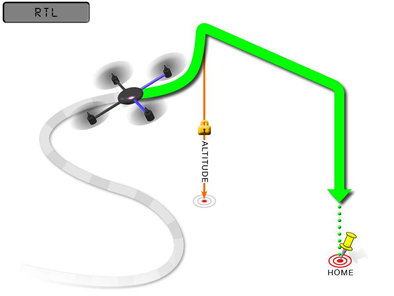

.. _rtl-mode:

========
RTL Mode
========

RTL mode (Return To Launch mode) navigates Copter from its current
position to hover above the home position. The behavior of RTL mode can
be controlled by several adjustable parameters. This page describes how
to use and customize RTL mode.

Overview
========

When RTL mode is selected, the copter will return to the home location, or if :ref:`rally points <common-rally-points>` have been setup, the closest rally point.

The copter will first rise a minimum of :ref:`RTL_CLIMB_MIN<RTL_CLIMB_MIN>` or to  :ref:`RTL_ALT_M<RTL_ALT_M>`, whichever is higher, before returning home.  The default value for :ref:`RTL_ALT_M<RTL_ALT_M>` is 15m. Under no circumstances will this altitude be below 30cm.

The altitude reference frame is set by either the rally point, if proceeding to one of those, or by :ref:`RTL_ALT_TYPE<RTL_ALT_TYPE>` to select relative to HOME, or Terrain. If :ref:`WP_RFND_USE<WP_RFND_USE>` = 1 and Terrain is selected, then rangefinder will be used.

If RTL is entered close to its return point, the altitude Copter climbs to may
be limited to avoid an unnecessary climb and descent.  The
:ref:`RTL_CONE_SLOPE<RTL_CONE_SLOPE>` parameter determines the slope of an
inverted cone centered on the return point.  The cone height is calculated as
the distance from the return point multiplied by ``RTL_CONE_SLOPE``.  For
example, if RTL is entered 10m from the return point with the default slope of
3, the cone limits the return altitude to 30m unless one of the minimums
described below is higher.  With a slope of 0.5, the cone height at the same
distance is 5m.  A value of 0 disables the cone and 0.5 is the minimum enabled
slope.

The cone only limits additional climbing; it never commands the vehicle to
descend when RTL begins.  The return altitude will not be below the vehicle's
current altitude plus :ref:`RTL_CLIMB_MIN_M<RTL_CLIMB_MIN_M>`, or below the
absolute RTL minimum of 0.3m.  For example, a vehicle entering RTL at 1.5m
with ``RTL_CLIMB_MIN_M`` set to zero will remain at least 1.5m high even if the
calculated cone height is lower.

If an :ref:`altitude fence <common-geofencing-landing-page>` has been enabled, the RTL climb/return altitude will be limited to be below the fence's maximum altitude.

By default RTL flies a direct, straight-line path back to the return point, which can breach a polygon/circular :ref:`fence, inclusion or exclusion zone <common-geofencing-landing-page>` if the direct path happens to cross one. To have RTL instead plan a path around these horizontal fence boundaries, enable path planning with :ref:`OA_TYPE<OA_TYPE>` = 2 (Dijkstra's) or 3 (Dijkstra's with BendyRuler, which also avoids proximity sensor obstacles); see :ref:`common-oa-dijkstras` and :ref:`common-oa-dijkstrabendyruler` for setup. This applies to AUTO and GUIDED modes as well as RTL.

RTL mode requires a reliable position estimate to work properly, most commonly provided by GPS and compass. Default prearm checks will ensure a 3D GPS lock with sufficient HDOP is acquired and your mag is working as expected prior to arming, if required by the selected mode and configuration during arming (ie STABILIZE could be armed without a reliable position and a switch into RTL would be refused without it). When using non-default arming checks, make sure you do have a sufficient GPS lock and / or a reliable position estimate for RTL to perform as expected.

RTL will command the copter to return to the home position, meaning that
it will return to the location where it was armed. Therefore, the home
position is always supposed to be your copter's actual GPS takeoff
location, unobstructed and away from people. For Copter if you get GPS
lock and then ARM your copter, the home position is the location the
copter was in when it was armed. This means if you execute an RTL in
Copter, it will return to the location where it was armed.

.. warning::

   In RTL mode the autopilot uses a barometer which
   measures air pressure as the primary means for determining altitude
   ("Pressure Altitude") and if the air pressure is changing in your flight
   area, the copter will follow the air pressure change rather than actual
   altitude (unless you are within 20 feet of the ground and have SONAR
   installed and enabled).

Options (User Adjustable Parameters)
====================================

-  :ref:`RTL_ALT_M<RTL_ALT_M>`: The
   minimum altitude the copter will move to before returning to launch.

   -  Set to zero to return at the current altitude.
   -  The return altitude can be set from 0.3 to 3000 meters.
   -  The default return altitude Default is 15 meters.

-  :ref:`RTL_ALT_FINAL_M<RTL_ALT_FINAL_M>`: The
   altitude the copter will move to at the final stage of "Returning to
   Launch" or after completing a Mission.

   -  Set to zero to automatically land the copter. See :ref:`land-mode`.
   -  The final return altitude may be adjusted from 0 to 10
      meters.

-  :ref:`RTL_LOIT_TIME <RTL_LOIT_TIME>`:
   Time in milliseconds to hover/pause above the "Home" position before
   beginning final descent.

   -  The "Loiter" time may be adjusted from 0 to 60,000 milliseconds.

-  :ref:`WP_YAW_BEHAVIOR <WP_YAW_BEHAVIOR>`:
   Sets how the autopilot controls the "Yaw" during Missions and RTL.

   -  0 = Never change Yaw.
   -  1 = Face Next Waypoint including facing home during RTL.
   -  2 = Face Next Waypoint except for RTL (i.e. during RTL vehicle
      will remain pointed at its last heading)

-  :ref:`RTL_OPTIONS <RTL_OPTIONS>`:
   A bitmask of options that modify RTL mode behaviour.

   -  Bit 2 (value "4"), "Ignore Pilot Yaw", stops the pilot's yaw stick
      from overriding the autopilot's yaw control while RTL is flying back
      to the return point. During the final descent/landing stage of RTL,
      pilot yaw control instead follows the :ref:`LAND_REPOSITION<LAND_REPOSITION>`
      setting (see :ref:`land-mode`) regardless of this option.

-  :ref:`LAND_SPD_MS<LAND_SPD_MS>`:
   The descent speed for the final stage of landing in centimeters per
   second.

   -  The landing speed is adjustable from 0.3 to 2 meters per
      second.

-  :ref:`RTL_CLIMB_MIN <RTL_CLIMB_MIN>`:
   The vehicle will climb at least this many meters at the first stage
   of the RTL.  By default this value is zero.

-  :ref:`RTL_SPEED <RTL_SPEED>`:
   The horizontal speed (in cm/s) at which the vehicle will return to
   home.  By default this value is zero meaning it will use
   :ref:`WP_SPD<WP_SPD>`.

-  :ref:`RTL_CONE_SLOPE <RTL_CONE_SLOPE>`:
   Defines the slope of an inverted cone above home which is used
   to limit the amount the vehicle climbs when RTL-ing from close
   to home. Low values lead to a wide cone meaning the vehicle
   will climb less, High values will lead to the vehicle climbing more.

Notes
=====

-  Other navigation settings also have an influence over RTL mode:

   -  :ref:`WP_ACC<WP_ACC>`
   -  :ref:`WP_SPD_DN<WP_SPD_DN>`
   -  :ref:`WP_SPD_UP<WP_SPD_UP>`

-  To use RTL, GPS lock needs to be achieved (Blue GPS LED and Blue APM
   LED on solid not blinking) before arming and takeoff to establish the
   home or launch position.
-  Landing and re-arming the copter will reset home, which is a great
   feature for flying at airfields.
-  If you get lock for the first time while flying, your home will be
   set at the location of lock.
-  If you set the :ref:`RTL_ALT_M<RTL_ALT_M>` to a number at other than 0 it will go to
   and maintain that altitude while returning.
-  RTL uses :ref:`WP_SPD<WP_SPD>` to determine how fast it travels.
-  Once the copter arrives at the home location the copter will pause
   for ``RTL_LOIT_TIME`` milliseconds, timeout (AUTO_LAND), then land.
