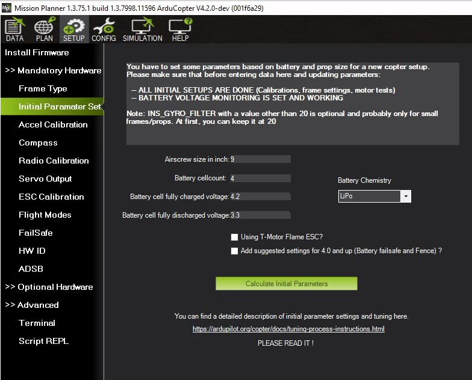

.. _setting-up-for-tuning:

Setting the Aircraft Up for Tuning
==================================

The following parameters should be set correctly based on the specifications of your aircraft.
Each one impacts the quality of the tuning process.

Battery setting
^^^^^^^^^^^^^^^
It is very important to ensure that the thrust curve of your VTOL
motors is as linear as possible. A linear thrust curve means that
changes in the actual thrust produced by a motor is directly
proportional to the thrust being demanded by ArduPilot. If your thrust
curve is badly non-linear then you will never produce a good tune, and
in some cases may end up with such a bad tune that your vehicle can
become completely unstable and crash.

There are 3 common causes of a non-linear thrust curve.

 - voltage sag as throttle is increased.
 - incorrect end-point setup in the PWM range you use to your ESCs (see "Motors setup" below)
 - non-linearity in the thrust produced by your propeller, ESC and motor combination

Start with setting up the voltage range to cope with voltage sag.
Parameters used to linearise your motor thrust curve.

- :ref:`MOT_BAT_VOLT_MAX <MOT_BAT_VOLT_MAX>`: 4.2v x No. Cells
- :ref:`MOT_BAT_VOLT_MIN <MOT_BAT_VOLT_MIN>`: 3.3v x No. Cells
- :ref:`MOT_OPTIONS<MOT_OPTIONS>` = 0 (default). The default is to use sag compensated voltage for the above and during tuning computations. It can be set to 1 to use raw voltage instead of sag compensated voltage, which may improve tuning results for light vehicles.

Next setup the thrust expo. If you are setting up a professional
aircraft then you should invest in a thrust stand so you can
accurately measure the true thrust for your motor/ESC/propeller
combination as you vary the throttle. Then you will adjust the expo
value along with the endpoints (given by motors setup below) so that the thrust between the endpoints is as linear as possible. Do not trust manufacturer data for the thrust curve as they are frequently inaccurate. See :ref:`motor-thrust-scaling` for details on thrust scaling.

If you are setting up a hobby grade vehicle then you can use the graph below to estimate the correct :ref:`MOT_THST_EXPO <MOT_THST_EXPO>` value for your aircraft.

- :ref:`MOT_THST_EXPO <MOT_THST_EXPO>`: 0.55 for 5 inch props, 0.65 for 10 inch props, 0.75 for 20 inch props  (or larger). This parameter should be derived by thrust stand measurements for best results (don’t trust manufacturer data).

.. image:: ../images/tuning-process-instructions-1.hires.png
    :target: ../_images/tuning-process-instructions-1.hires.png

Motors setup
^^^^^^^^^^^^

The motor parameters define the PWM output range sent to the
ESCs. This is critical to ensure that the entire range of throttle
values used in flight is within the linear range of your propulsion
system.

Parameters used to define the output range sent to the ESC.

- :ref:`MOT_PWM_MAX <MOT_PWM_MAX>`: Check ESC manual for fixed range or 2000us
- :ref:`MOT_PWM_MIN <MOT_PWM_MIN>`: Check ESC manual for fixed range or 1000us
- :ref:`MOT_SPIN_ARM <MOT_SPIN_ARM>`: use the :ref:`motor test feature <connect-escs-and-motors_testing_motor_spin_directions>` to determine a value which will reliably start the motors spinning at a low rpm as an indication of the armed state.
- :ref:`MOT_SPIN_MAX <MOT_SPIN_MAX>`: 0.95
- :ref:`MOT_SPIN_MIN <MOT_SPIN_MIN>`: use the :ref:`motor test feature <connect-escs-and-motors_testing_motor_spin_directions>` and motor test data, if available, to set the lower range of linear thrust. The default value is usually adequate for hobby uses.
- :ref:`MOT_THST_HOVER <MOT_THST_HOVER>`: 0.25 or below the expected actual hover thrust percentage (lower is safe)

PID Controller Initial Setup
^^^^^^^^^^^^^^^^^^^^^^^^^^^^

The settings below are meant to get your PID controller acceleration
and filter settings into the right approximate range for your
vehicle. These parameters are critical to the tuning process.
The PID controller default values for axis P/D/I values are usually safe for first test hovers of most vehicles.

- :ref:`INS_ACCEL_FILTER <INS_ACCEL_FILTER>`:  10Hz
- :ref:`INS_GYRO_FILTER <INS_GYRO_FILTER>`: 80Hz for 5 inch props, 40Hz for 10 inch props, 20Hz for 20 inch props (or larger)
- :ref:`ATC_ACCEL_P_MAX <ATC_ACCEL_P_MAX>`: 110000 for 10 inch props, 50000 for 20 inch props, 20000 for 30 inch props
- :ref:`ATC_ACCEL_R_MAX <ATC_ACCEL_R_MAX>`: 110000 for 10 inch props, 50000 for 20 inch props, 20000 for 30 inch props
- :ref:`ATC_ACCEL_Y_MAX <ATC_ACCEL_Y_MAX>`: 27000 for 10 inch props, 18000 for 20 inch props, 9000 for 30 inch props

For Copter-4.1 (and later):

- :ref:`ATC_RAT_PIT_FLTD <ATC_RAT_PIT_FLTD__AC_AttitudeControl_Multi>`: :ref:`INS_GYRO_FILTER <INS_GYRO_FILTER>` / 2
- :ref:`ATC_RAT_PIT_FLTT <ATC_RAT_PIT_FLTT__AC_AttitudeControl_Multi>`: :ref:`INS_GYRO_FILTER <INS_GYRO_FILTER>` / 2
- :ref:`ATC_RAT_RLL_FLTD <ATC_RAT_RLL_FLTD__AC_AttitudeControl_Multi>`: :ref:`INS_GYRO_FILTER <INS_GYRO_FILTER>` / 2
- :ref:`ATC_RAT_RLL_FLTT <ATC_RAT_RLL_FLTT__AC_AttitudeControl_Multi>`: :ref:`INS_GYRO_FILTER <INS_GYRO_FILTER>` / 2
- :ref:`ATC_RAT_YAW_FLTE <ATC_RAT_YAW_FLTE__AC_AttitudeControl_Multi>`: 2
- :ref:`ATC_RAT_YAW_FLTT <ATC_RAT_YAW_FLTT__AC_AttitudeControl_Multi>`: :ref:`INS_GYRO_FILTER <INS_GYRO_FILTER>` / 2

.. image:: ../images/tuning-process-instructions-2.hires.png
    :target: ../_images/tuning-process-instructions-2.hires.png

.. image:: ../images/tuning-process-instructions-3.hires.png
    :target: ../_images/tuning-process-instructions-3.hires.png

.. image:: ../images/tuning-process-instructions-4.hires.png
    :target: ../_images/tuning-process-instructions-4.hires.png

Mission Planner Helper
======================

A tab under SETUP/Mandatory Hardware/Initial Parameter Setup is provided in Mission Planner to setup the above parameters easily.

