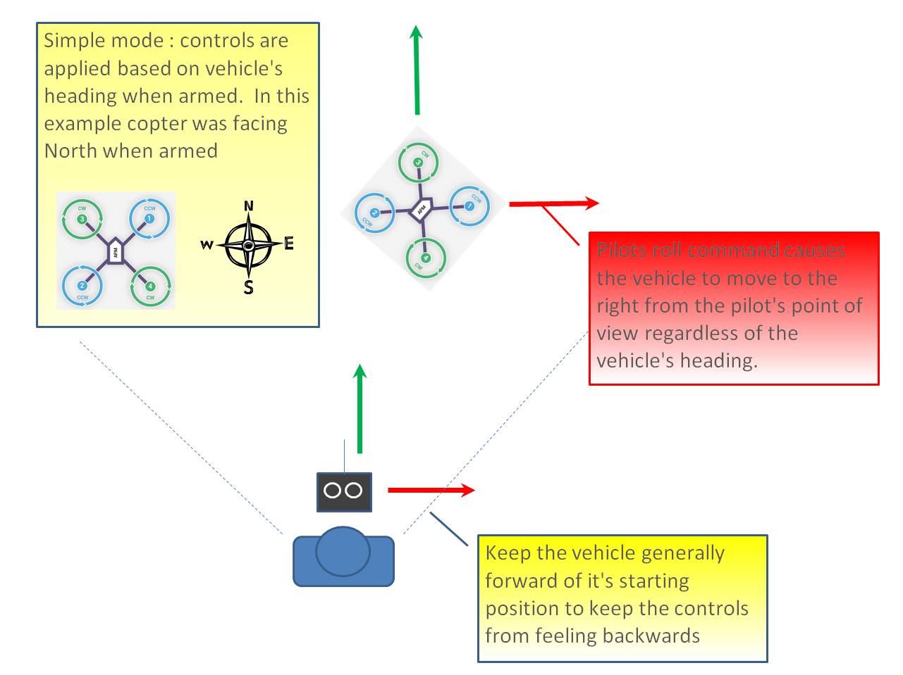

.. _simpleandsuper-simple-modes:

=============================
Simple and Super Simple Modes
=============================

This article describes the behaviour of the *Simple* and *Super Simple*
modes and explains how you can set up selection of these modes from your
RC Transmitter.

Overview
========

"Simple" and "Super Simple" modes allow the pilot to control the
movement of the copter from the pilot's point of view regardless of
which way the copter is facing. This is useful for new pilots who have
not mastered adjusting their roll and pitch inputs depending upon which
way the vehicle is facing and for cases when the copter is far enough
away that it's heading is not apparent.

-  "Simple" and "Super Simple" modes can be used in combination with
   nearly all flight modes except the Acro and Drift (in these flight
   modes the setting is ignored).
-  Simple Mode allows you to control the copter relative to the copters
   heading at take off and relies only on a good compass heading.
-  Super Simple Mode allows you to control the copter relative to it's
   direction from home (i.e. where it was armed) but requires a good GPS
   position.
-  Either mode can be assigned to a particular flight mode switch
   position or can be enabled/disabled from the :ref:`Ch7/Ch8 switches <channel-7-and-8-options>`.

..  youtube:: iGA6D2GBFIc#t=82
    :width: 100%

Normal Mode
===========

.. image:: ../images/NormalControls.jpg
    :target: ../_images/NormalControls.jpg

Without Simple or Super Simple enabled, the pilot's transmitter stick
inputs are applied in the orientation of the copter.  For example in the
diagram above when the pilot applies roll input right (red) the vehicle
rolls to it's right.

With the copter is facing in the same direction as the pilot, it is
relatively easy to control the vehicle but when the vehicle is facing
towards the pilot an inexperienced pilot will feel that the controls are
all reversed.  I.e. if the pilot inputs right roll, the vehicle will
move to the left from the pilot's point of view.

.. _simpleandsuper-simple-modes_simple_mode:

Simple Mode
===========

Similar to the "care free" mode on other systems, this mode allows you
to fly your copter as though it were pointed in the direction it was
pointed when it was armed regardless of its current heading
orientation.  So if you hold the pitch stick forward the copter will fly
away from you, pull the pitch stick back and it will come back towards
home.  You can even apply yaw to spin the copter in any direction but
the movement of the copter's position relative to the stick inputs will
behave exactly as it did at take off.

Generally when arming you should stand behind the vehicle with it's nose
pointing directly away from you.  While flying you should try to keep
the vehicle flying in front of it's starting position because if it
flies behind you all the controls will feel reversed.

As mentioned above simple mode is also very useful in emergency
situations where the copter is far enough away that it is very difficult
to determine it's heading.

.. _simpleandsuper-simple-modes_super_simple_mode:

Super Simple Mode
=================

.. image:: ../images/SuperSimpleControls.jpg
    :target: ../_images/SuperSimpleControls.jpg

Super Simple mode is the same as simple mode except that it uses the
vehicle's position relative to home instead of the vehicle's initial
heading when it was armed. This means that no matter where the vehicle
is, pulling the pitch back will cause it to return towards home
regardless of the vehicle's actual heading.

The advantage over simple mode is that the controls are applied from the
pilot's point of view even when the copter flies behind the pilot/home
location.

If the pilot holds full right roll the vehicle will fly a circle
clockwise around the pilot (although the circle's radius may tend to
grow slightly with each orbit due to "lag").

The disadvantage is that mode require a GPS lock because so you should
ensure you have GPS lock before take-off.

The orientation is not updated when the vehicle is within 10m of home
meaning close fly-bys of the home location should be avoided.

To ensure the controls are correct right at take-off, as with simple
mode, you should arm with the pilot standing behind the vehicle and with
both pilot and vehicle pointing in the same direction.

Selecting the modes from a transmitter
======================================

The transmitter’s :ref:`auxiliary channels <channel-7-and-8-options>` can
be set-up to enable selection of Simple mode, Super Simple mode or both.
Only one auxiliary channel should be set for these modes, and this
channel will override the simple/super-simple options selected on the
Flight Modes screen.

.. figure:: ../images/MissionPlanner_MPchan7options_Simple_SuperSimple_Modes.jpg
   :target: ../_images/MissionPlanner_MPchan7options_Simple_SuperSimple_Modes.jpg

   Mission Planner: Channel 7 options for Simple andSuperSimple modes

To support selection of just one of the modes from the transmitter,
assign the mode to a channel that is mapped to a 2-position switch (high
= enables the selected mode, low disables it). To enable both modes from
the same switch, select *Super Simple mode* for a channel that is mapped
to a 3-position switch (high position = Super Simple mode, middle
position = Simple mode, low position = disabled).
