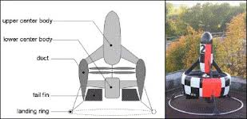

.. _singlecopter-and-coaxcopter:

===========================
SingleCopter and CoaxCopter
===========================

SingleCopter with vertically mounted flight controller.  Image courtesy of "droner"

Single and Coax copters have one or two propellers to provide thrust and 2 to 4 individual flaps to provide roll, pitch and yaw control.  The difference between a SingleCopter and a CoaxCopter is:

*SingleCopter*

- has a single motor and 4 independent flaps.
- the vehicle's yaw is controlled by adjusting all four fins to point slightly clockwise or counter-clockwise.

*CoaxCopter*

- has two counter-rotating motors and at least 2 independent flaps (4 individual servos/flaps can be used but fins on opposite sides of the vehicle will move together)
- the vehicle's yaw is controlled by adjusting the speeds of the two motors.  I.e. speeding up the clockwise motor while slowing down the counter-clockwise motor will cause the vehicle to rotate counter-clockwise

Mounting and Connecting the flight controller
---------------------------------------------

.. image:: ../images/single-copter-layout.png
    :target: ../_images/single-copter-layout.png

By default the flight controller should be mounted similar to a "plus" quad.  The board should be horizontal with the white arrow pointing towards the forward flap.
As with other vehicles the board should be placed close to the center of gravity of the vehicle.
If it is more convenient to mount the flight controller pointing up, set :ref:`AHRS_ORIENTATION <AHRS_ORIENTATION>` to 25 (Pitch270).

Connect the servos to the flight controller's RC Outputs:

- RC Output 1 : Forward Flap
- RC Output 2 : Right Flap
- RC Output 3 : Back Flap (optional for CoaxCopter)
- RC Output 4 : Left Flap (optional for CoaxCopter)
- RC Output 5 : Upper (CCW) Motor
- RC Output 6 : Lower (CW) Motor (CW, only for CoaxCopter)

Loading the Firmware
--------------------

As of Copter-3.5.x all of the multicopter firmware (quad, hexa, octa, octaquad, y6, tri, single, coax) including single and coax copter have been consolidated into a single firmware.
This means the quad (or other multicopter) firmware should be loaded onto the flight controller and then please set:

- :ref:`FRAME_CLASS <FRAME_CLASS>` to 8 for SingleCopter or 9 for CoaxCopter

Setting up the flaps
====================

The neutral position, direction of movement, minimum and maximum deflection of each flap can be configured with the SERVOX_TRIM, SERVOX_REVERSED, SERVOX_MIN and SERVOX_MAX parameters (where "X" is the RC output number).  For example these are the parameters for the forward flap/servo which is connected to RC output 1:

- :ref:`SERVO1_MIN <SERVO1_MIN>`: the forward flap/servo's lowest PWM value before it hits its physical limits.
- :ref:`SERVO1_MAX <SERVO1_MAX>`: the forward flap/servo's highest PWM value before it hits its physical limits.
- :ref:`SERVO1_TRIM <SERVO1_TRIM>`: the forward flap/servo's PWM value close to what is required to keep the vehicle from spinning.
- :ref:`SERVO1_REVERSED <SERVO1_REVERSED>`: the forward flap/servo's reverse setting.  0 = servo moves in default direction, 1 to reverse direction of movement.

Testing the flap movement
=========================

- Remove the propellers
- Place the vehicle on a flat surface in front of the pilot
- Arm the vehicle in Stabilize mode
- Raise the throttle on the transmitter and move the roll, pitch and yaw sticks and confirm the flaps move as described below

*SingleCopter*

- transmitter roll right makes forward and back fins move right
- transmitter pitch forward causes left and right fins to move forward
- transmitter yaw right causes forward fin to move left, right fin to move forward, back fin to move right, left fin to move back

*CoaxCopter*

- transmitter roll right makes forward and back fins move right
- transmitter pitch forward causes left and right fins to move forward
- transmitter yaw right causes no change in fin movement but motor speed changes.  Top (ccw) motor should speed up, bottom (cw) should slow down.

Video of the first ArduPilot powered SingleCopter
=================================================

https://vimeo.com/77850133

Below are non-ArduPilot single copters and coax copters to provide inspiration:

The vehicle shown below uses a counter-rotating motor pair with both propellers above the motors and the shaft of the bottom motor passes up through the hollow shaft of the top motor.

The vehicle below has two motors mounted back to back with one propeller above and the other below with appropriate support struts.

.. image:: ../images/mav_electric.jpg
    :target: ../_images/mav_electric.jpg

.. image:: ../images/vtolcustom2.jpg
    :target: ../_images/vtolcustom2.jpg

.. image:: ../images/P1060929.jpg
    :target: ../_images/P1060929.jpg

..  youtube:: FFiPbyigxVI#t=40
    :width: 100%
