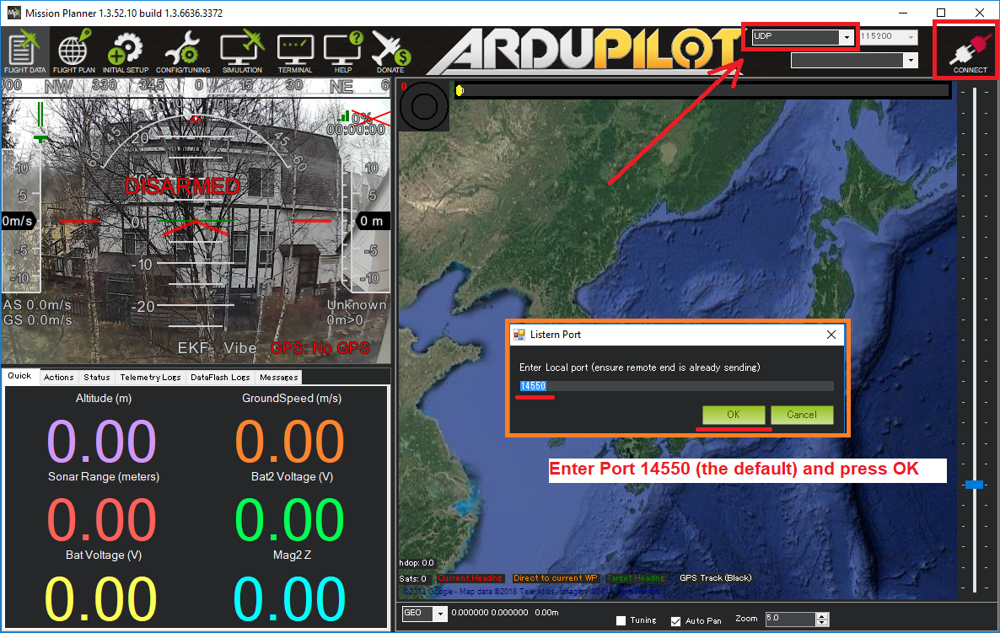

.. _skyrocket-gcs:

====================================
SkyRocket with other Ground Stations
====================================

The SkyViper has its own app that runs on android or iOS, but to access the full capabilities of the ArduPilot firmware you may prefer to use another ground station package. The SkyViper can work with any of the :ref:`ArduPilot compatible ground stations <common-choosing-a-ground-station>` including :ref:`Mission Planner <planner:install-mission-planner>`.  For any of them:

- connect your PC/tablet/phone to the drone's wifi access point
- on the ground station set the connection type to "UDP" and press connect.  If asked, set the port to "14550"

If using Mission Planner, the video from the skyrocket should appear in the "HUD" (the Heads Up Display which normally shows the blue and green attitude display)

As the SkyViper uses UDP broadcasts you can connect from multiple devices at once.

.. warning::

      The SkyViper uses MAVLink2 by default, which does not work with some older GCS software (such as Tower) that only use MAVLink1. To use these older GCSs you may need to change the :ref:`SERIAL1_PROTOCOL <SERIAL1_PROTOCOL>` parameter to 1 from the default of 2.
