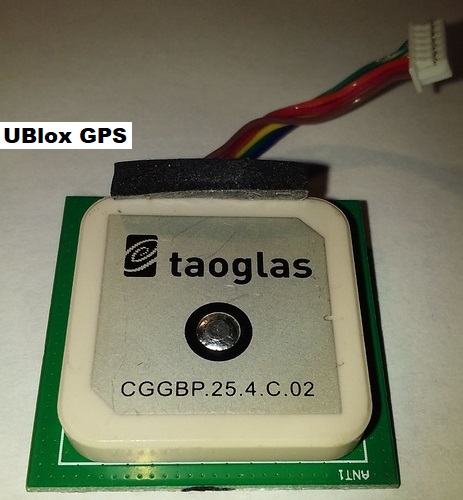

.. _skyrocket-hardware:

==================
SkyRocket Hardware
==================

- STM32 Autopilot
- Sonix board containing the WIFI, SD card, APWeb, and OmniVision OV9732 video sensor
- UBlox M8 GPS

Skyviper Teardown Pictures
--------------------------

 

    
.. image:: ../images/Skyviper_STM32.jpg
    :width: 70%
    

    
