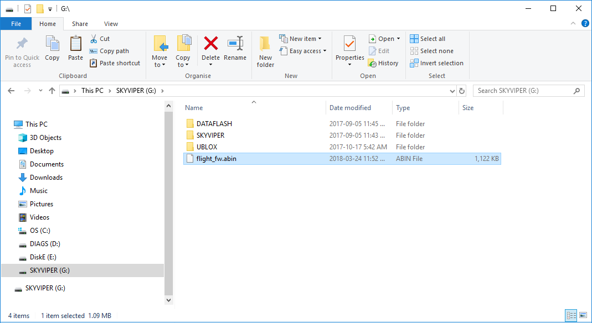
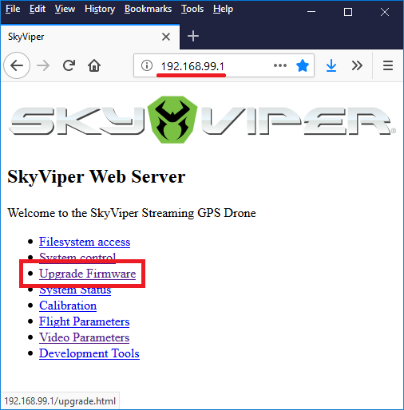
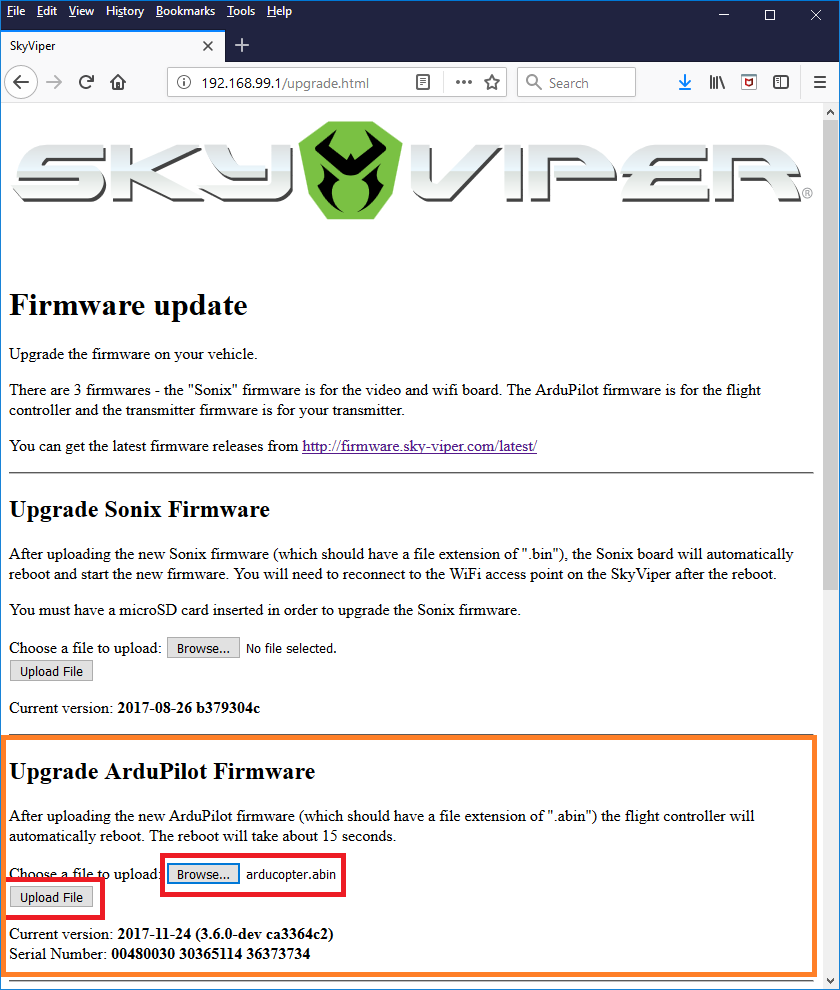

.. _skyrocket-software:

==================
SkyRocket Software
==================

- the drone ships with a custom version of ArduPilot (Copter) which is close to Copter-3.5 but has additional features that will be coming back into master in the near future (notch filter, etc).  `GitHub repo is here <https://github.com/SkyRocketToys/ardupilot>`__ in the skyviper-stable branch.
- firmware source for the video board is `here <https://github.com/SkyRocketToys/Sonix>`__
- `APWeb <https://github.com/ArduPilot/APWeb>`__ (a tiny open source web server) runs on the drone and allows easy calibration, modification of parameters, uploading firmware to both the drone and transmitter, downloading log files, pictures and videos.
- the transmitter has a relatively low powered STM8 processor running open source software written by Tridge (incorporates some code from Paparazzi).  `Github repo is here <https://github.com/SkyRocketToys/STM8TX>`__.
- live video can be viewed through a SkyRocket app or Mission Planner.

Uploading alternative firmware
------------------------------

..  youtube:: fDuU8CjhxkE
    :width: 100%

The instructions below describe how to uploading alternative firmware to the drone.  Normally we recommend users stick with the official firmware from SkyRocket but for those interested in trying the very latest features from ArduPilot, participating in beta testing or for those who wish to create their own custom firmware, these instructions are useful.

Note that alternative firmwares are use **at your own risk** and probably void your warranty.

**Which firmware to use?**

As of early 2018 there are two versions of the firmware available:

- the `official firmware from skyrocket <http://firmware.sky-viper.com/latest/>`__ (see file ending with ".abin") is the safest firmware to use.
- the `latest firmware from ArduPilot <https://firmware.ardupilot.org/Copter/latest/skyviper-v2450/>`__ includes some new features (i.e. :ref:`SmartRTL <smartrtl-mode>`) but is also missing some features (i.e. ability to control vehicle during RTL).

**Uploading using the SD card**

- powerdown the drone and remove the SD card from the back of the skyviper and insert into your PC (an SD card adapter may be required)
- copy the firmware into the top directory of the SD card and then rename it to "flight_fw.abin"

- place the sd card back into the drone and power up the vehicle
- after about a minute the LEDs should flash and the vehicle should reconnect to the transmitter

**Uploading using APWeb**

- from your PC, connect to the SkyViper wifi access point (normally called "SKYVIPERGPS-xxxxxx", password is "vipergps")
- open a web browser to ``http://192.168.99.1`` and click the **Upgrade Firmware** link

- in the "Upgrade ArduPilot Firmware" section, push the "Browse" button and select the \*.abin file downloaded above
- push the "Upload File" button and wait a minute or two.  The green bar at the top of the web page should crawl from left to right and then the autopilot should reboot and reconnect to the transmitter

.. note::

      After a firmware upgrade it may be necessary to perform an accelerometer calibration.  This can be done from the web interface's "Calibration" page.

**When things go wrong**

If the drone becomes unresponsive or will not connect to the transmitter or the wifi access point does not appear, don't worry, it is nearly impossible to "brick" the skyviper.  Try these steps:

- download the official skyrocket firmware from `here <http://firmware.sky-viper.com/latest/>`__ (look for the file ending with ".abin").
- use the "Uploading using the SD card" method above to upload the firmware to the drone
- if this does not work, try asking for help in the `SkyViper section of the ArduPilot forum <https://discuss.ardupilot.org/c/arducopter/skyviper>`__