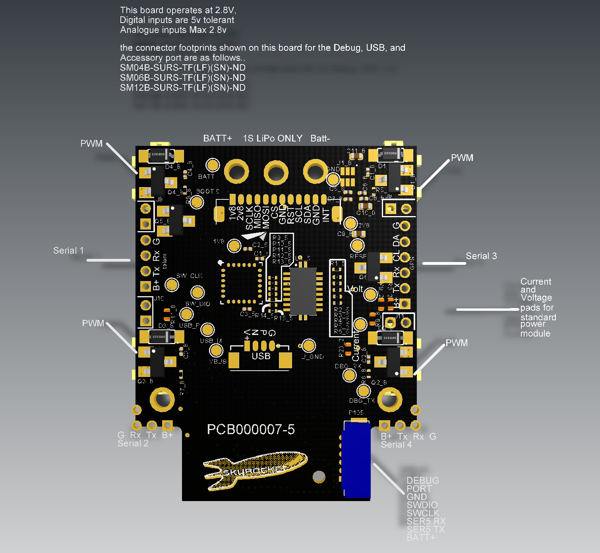
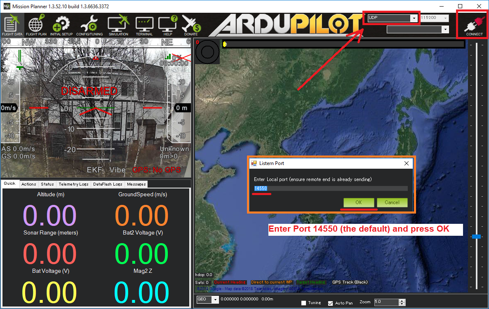

.. _skyrocket:

=========
SkyRocket
=========

   .. image:: ../images/skyrocket-skyvipergpsdrone.png
       :target: ../_images/skyrocket-skyvipergpsdrone.png

The SkyRocket SkyViper GPS streaming drone uses ArduPilot as its main flight control software.  This page provides details for advanced users and potential developers on this RTF drone.

Where to Buy
------------

The `SkyViper GPS Streaming drone <http://sky-viper.com/product/info/V2450GPS-sd>`__ (`version with FPV headset <http://sky-viper.com/product/info/V2450GPS-fpv>`__) is on sale through `Amazon <https://www.amazon.com/Sky-Viper-v2450GPS-Streaming-Autopilot/dp/B072HH13VQ/ref=lp_13203361011_1_6>`__, `ToysRUs <https://www.toysrus.com/product?productId=125702746>`__ (`with FPV headset <https://www.toysrus.com/buy/video-drones/sky-viperr-v2450-gps-streaming-video-drone-with-fpv-headset-816322018322-134534546>`__), `Target <https://www.target.com/p/sky-viper-streaming-video-drone-v2450hd/-/A-52136996>`__ and Costco in the US, Australia, Canada, Chile, France, German, Holland, Lithuania, Mexico, New Zealand, Serbia, UK since October 2017.

SkyRocket sells a variety of different drones, be sure to get the GPS Streaming drone which should have a white shell and usually sells for around $150 US.

Hardware
--------

- STM32 CPU
- 5x serial ports
- 1x I2C
- 1x SPI
- ICM20789 IMU including 3-axis accelerometer, gyro and barometer
- Ublox M8 GPS
- 1S battery (4.2V max, replacement batteries are readily available on Amazon and other places)
- brushed motors
- the camera can be manually adjusted to point forward, down or anywhere in between
- 2.4Ghz wifi for telemetry and video
- 145g
- flight time of about 11min
- top speed of between 8m/s ~ 10m/s
- video streaming uses a Sonix board with ARM CPU running FreeRTOS and OmniVision OV9732 chip

Software
--------

- the drone ships with a custom version of ArduPilot (Copter) which is close to Copter-3.5 but has additional features that will be coming back into master in the near future (notch filter, etc).  `GitHub repo is here <https://github.com/SkyRocketToys/ardupilot>`__ in the skyviper-stable branch.
- live video can be viewed through a SkyRocket app or Mission Planner.
- firmware source for the video board is here https://github.com/SkyRocketToys/Sonix
- APWeb (a tiny open source web server) runs on the drone and allows easy calibration, modification of parameters, uploading firmware to both the drone and transmitter, downloading log files, pictures and videos.
- the transmitter has a relatively low powered STM8 processor running open source software written by Tridge (incorporates some code from Paparazzi).  `Github repo is here <https://github.com/SkyRocketToys/STM8TX>`__.

Discussion
----------

We have a `SkyViper section <https://discuss.ardupilot.org/c/arducopter/skyviper>`__ on the ArduPilot discussion forum. Have a look there to see what people are up to and ask questions.

Using Throw Mode
----------------

..  youtube:: L8xTlBnlu9E
    :width: 100%

..  youtube:: YujYnQHEqQw
    :width: 100%

The SkyViper is such a small frame that ii is great for :ref:`Throw Mode <throw-mode>`.
If you want to try throw mode then first read the :ref:`throw mode documentation <throw-mode>`.

Here are some extra tips for throw mode on the SkyViper:

- you can assign throw mode to a button on your TX. Go to the web
  interface at http://192.168.99.1 and choose the parameters
  page. Then assign throw mode to one of the action buttons. I like
  using ACTION5, which you get by holding the MODE button, then
  pressing the right shoulder button (the one marked with the photo
  icon)
- wait till you have full GPS lock (green LED on transmitter is solid)
- with your skyviper disarmed and on the ground, select throw mode
  with the button you have setup in the first step. You will hear a
  bip-boop-bip sound from the TX
- now press the "return" button to arm your copter. The motors will
  not start spinning.
- look at your transmitter LEDs. If the green LED is flashing rapidly
  then you are ready to throw. Do not throw the copter unless the
  green LED is flashing rapidly
- pickup the copter by one of the legs, keeping fingers clear of the
  propellers
- throw it as high as you can with one smooth motion
- do NOT swing your arm back and forward to "wind up" for the throw,
  otherwise the copter may think the throw has been done and will
  start the motors
- be ready to press the power button on the TX for instant disarm if
  something goes wrong
- after the throw, the copter will take a few seconds to settle, then
  will automatically switch to LOITER mode for you to fly it

Using Other GCS Software
------------------------

The SkyViper has its own app that runs on android or iOS, but to access the full capabilities of the ArduPilot firmware you may prefer to use another ground station package. The SkyViper can work with any of the :ref:`ArduPilot compatible ground stations <common-choosing-a-ground-station>` including :ref:`Mission Planner <common-install-mission-planner>`.  For any of them:

- connect your PC/tablet/phone to the drone's wifi access point
- on the ground station set the connection type to "UDP" and press connect.  If asked, set the port to "14550"

If using Mission Planner, the video from the skyrocket should appear in the "HUD" (the Heads Up Display which normally shows the blue and green attitude display)

As the SkyViper uses UDP broadcasts you can connect from multiple devices at once.

.. warning::

      The SkyViper uses MAVLink2 by default, which does not work with some older GCS software (such as Tower) that only use MAVLink1. To use these older GCSs you may need to change the :ref:`SERIAL1_PROTOCOL <SERIAL1_PROTOCOL>` parameter to 1 from the default of 2.

Videos
------

`sUAS news <https://www.suasnews.com/>`__ interview with Tridge and Matt (from SkyRocket):

..  youtube:: 3RdEELDIeVs
    :width: 100%

Bo Lorentzen's intro video:

..  youtube:: T_ccNYEeviE
    :width: 100%

Calibration using the Web Interface

..  youtube:: VIf9eEwTKkk
    :width: 100%

SkyViper GPS web server demo

..  youtube:: vd0KGiwVd2g
    :width: 100%

Customising transmitter tunes

..  youtube:: ch4o8Rt5pB0
    :width: 100%

Mission Planner Simulator connection to SkyViper

..  youtube:: 1TmlVwTiBRg
    :width: 100%

Adjusting Transmitter Buzzer Frequency

..  youtube:: TI5arJSzYX8
    :width: 100%